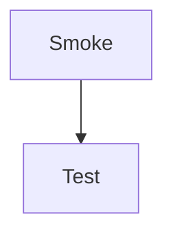

# Plugin Smoke Tests

One smoke entry per plugin under docs/_plugins.


## Core Rendering (Non-Plugin)

Quick checks for markdown/HTML/CSS behavior that should always work, even if plugins fail to load.


### Aside Styling (native HTML)

<aside note narrow>

### Aside Smoke

If this box is not styled/floated correctly, core content CSS is broken.

</aside>

Paragraph text to verify wrapping around floated aside blocks.


### Details/Summary (native HTML)

<details>
<summary>Open smoke details</summary>

Expanded details content should be indented and readable.

</details>


### Markdown Basics

> Blockquote smoke text.

- [x] Completed task
- [ ] Pending task

Inline formatting: **bold**, *italic*, ~~strike~~, and `inline code`.

---


### Basic HTML Table

<table>
    <thead>
        <tr><th>Key</th><th>Value</th></tr>
    </thead>
    <tbody>
        <tr><td>Smoke</td><td>OK</td></tr>
    </tbody>
</table>


## Content Plugins


### definitions.js ([tests](_tests/definitions.md))

Smoke testing (hover)


### lucide-icons.js ([tests](_tests/_components.md))

<i data-lucide="alarm-smoke"></i> <i data-lucide="flask-conical"></i> <i data-lucide="circle-check-big"></i>


### tooltips.js ([tests](_tests/_components.md))

<span data-tooltip="Smoke tip">hover me</span>


### callouts.js ([tests](_tests/callouts.md))

> [!NOTE]
> Smoke test.


### cards.js ([tests](_tests/cards.md))

<cards>

### Smoke

---

### Test

---

### Cards

</cards>


### tables.js ([tests](_tests/tables.md))

| S   | M   | !! O   | K   | E   |
| --- | --- | --- | --- | --- |
| 1   | 2   | 3   | 4   | 4   |
| !! T   | E   | S   | T   | ! |


## Media Plugins

### captions.js ([tests](_tests/captions.md))

<captioned>


Smoke!

</captioned>


### speech.js ([tests](_tests/speech.md))

<speak>


Smoke

</speak>


### img-notes.js ([tests](_tests/img-notes.md))


- Smoke [20, 20, 60, 60]

    Test

</img-notes>


### excalidraw.js ([tests](_tests/excalidraw.md))

<excalidraw src="_tests/_assets/smoke.excalidraw"></excalidraw>


### svg-zoom.js ([tests](_tests/mermaid.md))




### videos.js ([tests](_tests/video-embed.md))

<videoembed id="_u03uI-zCCk"></videoembed>


## Visualisation Plugins

### timelines.js ([tests](_tests/timeline.md))

<timeline>

- 1967: Smoke
- 1978: Test

</timeline>


### hierarchies.js ([tests](_tests/hierarchy.md))

<hierarchy>

- Smoke

    - Test

        - S
        - M
        - O

    - Test

        - K
        - E

</hierarchy>


### structures.js ([tests](_tests/structure.md))

<structure>

- Smoke

    - Test
    - Test
    - Test

</structure>


### file-trees.js ([tests](_tests/file-list.md))

<filetree>

- src/
  - smoke.js
  - test.md

</filetree>


### sequences.js ([tests](_tests/sequences.md))

<sequence>

1. Smoke

2. Test

</sequence>


### requests.js ([tests](_tests/requests.md))

<requests>

- Left: **Smoke**

- Right: **Test**

- Requests:

  1. L ---> R : Smoke

</requests>


### computers.js ([tests](_tests/computers.md))

<computer type="laptop">

# Smoke!

</computer>


## Activity Plugins

### slides.js ([tests](_tests/slides.md))

<slides>

# Smoke?

---

## Test!

</slides>


### flash-cards.js ([tests](_tests/flash-cards.md))

<flashcards>

- # Smoke?

    ---

    Yes

</flashcards>


### drag-drop.js ([tests](_tests/drag-drop.md))

<drag-drop>

1. Smoke

2. Test

</drag-drop>


### quizzes.js ([tests](_tests/quiz.md))


<quiz>

# Smoke Quiz

- ## Smoke?

    Yes?

    ---

    - [x] Yes
    - [ ] No

- ## Test?

    Yes?

    ---

    - [x] Yes
    - [ ] No

</quiz>


## Coding Plugins

### inline-highlight.js

Inline code `print("Smoke!")`(python) testing


### python-runner.js ([tests](_tests/python.md))

```python run
print("Smoke!")
```

### kotlin-runner.js ([tests](_tests/kotlin.md))

```kotlin run
println("smoke")
```

### pseudo-highlighter.js ([tests](_tests/pseudo.md))

```pseudo
start
  show "smoke"
end
```

### primm.js ([tests](_tests/primm.md))

<primm>

```python
print("Smoke!")
```

</primm>


### trace-table.js ([tests](_tests/trace-table.md))

```python trace
a = "Smoke"
b = "Test"
print(a + " " + b)
```


### python-test.js ([tests](_tests/coverage.md))

```python test
def smoke(x):
    if x >= 10:
        return "Smoke!"
    return "No smoke"

# Tests
# Boundary Values
10 -> "Smoke!"
9  -> "No smoke"
```

### scratch-blocks.js ([tests](_tests/scratch.md))

```scratch
when green flag clicked
say [Smoke test]
```

### scratch-stage.js ([tests](_tests/scratch.md))

```scratch-stage
stage space #1a1a2e
  sprite rocket1 0 0 100 0 1 ""
endstage
```


### logic.js ([tests](_tests/logic.md))

```logic
GATE None AND A B OUT
```

### oop-sim.js ([tests](_tests/oop-sim.md))

```oop-sim
// Step: Class
class Smoke(val type: String)
// Step: Object
val test = Smoke("Test")
```

### memory-sim.js ([tests](_tests/memory-sim.md))

```memory-sim
// Step: One var
val x = 1
// Step: Another var
val test = "Smoke"
```

### cpu-sim.js ([tests](_tests/cpu-sim.md))

```cpu-sim
LOAD R0, 1
ADD R0, 2
```


## Web Development Plugins

### web-playground.js ([tests](_tests/_components.md))

<div
    class="web-playground"
    data-html="_demos/smoke.html"
    data-css="_demos/smoke.css"
    data-js="_demos/smoke.js"
    data-height="20em"
></div>


### colours.js ([tests](_tests/colours.md))

<colours></colours>


### accessibility.js ([tests](_tests/accessibility.md))

<accessibility mode="screen-reader">

```html
<main>
    <h1>Smoke!</h1>
</main>
```

</accessibility>


## Database Plugins

### database.js ([tests](_tests/dbs.md))

<db-schema>

| smoke |      |         |
| ----- | ---- | ------- |
| PK    | id   | INTEGER |
|       | name | TEXT    |

</db-schema>


### sql-runner.js ([tests](_tests/sql.md))

```sql run
SELECT 1 AS smoke;
```


### erd.js ([tests](_tests/erd.md))

<erd>

```sql
CREATE TABLE smoke (
  id INTEGER PRIMARY KEY,
  name TEXT NOT NULL
);
```

</erd>


## Number Plugins

### calc.js ([tests](_tests/calc.md))

<calculator>01100100 + 01111011</calculator>


### convertor.js ([tests](_tests/convertor.md))

<convertor from="bin" to="hex" value="10101111" bits="8"></convertor>


### data.js ([tests](_tests/binary.md))

```data
show dec 255 as hex-bytes
```


## Complexity Plugins

### big-o-chart.js ([tests](_tests/big-o-chart.md))

<big-o-chart></big-o-chart>


### big-o.js ([tests](_tests/big-o.md))

<big-o algos="search" max="10"></big-o>


### algo-race.js ([tests](_tests/algo-race.md))

<algo-race type="search" size="20"></algo-race>


### p-np.js ([tests](_tests/p-np.md))

<p-np markers></p-np>


### tsp.js ([tests](_tests/tsp.md))

<tsp></tsp>


### knapsack.js ([tests](_tests/knapsack.md))

<knapsack></knapsack>


### bin-packing.js ([tests](_tests/bin-packing.md))

<bin-packing></bin-packing>


## Encryption Plugins

### frequency.js ([tests](_tests/frequency.md))

<frequency>

Smoke

</frequency>


### modulus.js ([tests](_tests/modulus.md))

<modulus></modulus>


### sub-cypher.js ([tests](_tests/sub-cypher.md))

<sub-cypher>
Smoke Test
</sub-cypher>


### sym-asym.js ([tests](_tests/sym-asym.md))

<sym-asym mode="asymmetric" message="Smoke Test!"></sym-asym>


### diffie-hellman.js ([tests](_tests/diffie-hellman.md))

<diffie-hellman></diffie-hellman>


### digital-sig.js ([tests](_tests/digital-sig.md))

<digital-sig></digital-sig>


### rolling-code.js ([tests](_tests/rolling-code.md))

<rolling-code></rolling-code>


### tls.js ([tests](_tests/tls.md))

<tls></tls>


### wifi.js ([tests](_tests/wifi.md))

<wifi></wifi>


### hasher.js ([tests](_tests/hasher.md))

<hasher value="smoke"></hasher>


### rainbow.js ([tests](_tests/rainbow.md))

<rainbow></rainbow>


