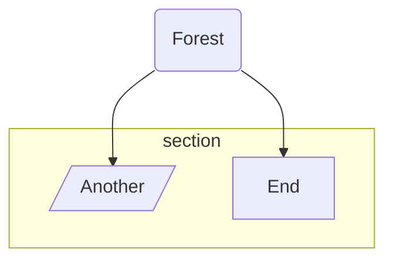

# Reveal.js Slides

Normal docs content here...

## Full Feature Test

<slides>

# Arrays... Your First Chest of Loot

Store items in order, retrieve them by index.

---

## Accessing Items

```js
const loot = ['sword', 'shield', 'potion']
console.log(loot[0]) // 'sword' - zero-indexed!
```

---

## Looping Through Loot

Use a `for...of` loop to grab everything.

---

## Hmmm

- Item One <!-- .element: class="fragment" data-fragment-index="1" -->
- Item Two <!-- .element: class="fragment" data-fragment-index="2" -->
- Item Three <!-- .element: class="fragment" data-fragment-index="2" -->

---

# Red!
<!-- .slide: data-background="#f003" -->

Testing

---


---




---


---

<speak>


Hello, Human!

</speak>

---

<excalidraw src="_tests/_assets/test.excalidraw" alt="Excalidraw test scene"></excalidraw>

---

<videoembed id="62xlzGs8LXA"></videoembed>


---

| A   | B   | C     |
| --- | --- | ----- |
| One | Two | Three |

---

<timeline>

- 1967: Steve
- 1978: Jemma
- 2011: Eva Rose
- 2017: Finn Henry

</timeline>


---

```js [0|2-3|5|10|0]
hook.doneEach(function () {
    const placeholders = document.querySelectorAll('.slides-placeholder')
    if (!placeholders.length) return

    placeholders.forEach((placeholder) => {
        const index = placeholder.getAttribute('data-index')
        placeholder.outerHTML = buildRevealHTML(index)
    })

    initDecks()
})
```

</slides>


Back to normal docs...

## Simple Test

<slides>

# Arrays... Your First Chest of Loot

Store items in order, retrieve them by index.

---

# Accessing Items

```js
const loot = ['sword', 'shield', 'potion']
console.log(loot[0]) // 'sword' — zero-indexed!
```

---

# Looping Through Loot

Use a `for...of` loop to grab everything.

</slides>

Back to normal docs...
