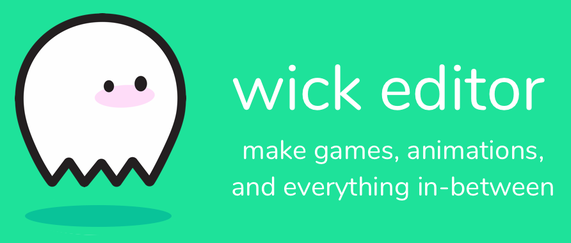
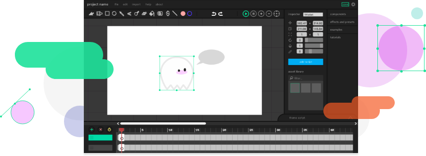

# Animation Using the Wick Editor

The Wick Editor is a free and open-source tool for creating games, animations, and everything in-between. It's designed to be the most accessible tool for creating multimedia projects on the web.

The latest version can be found at https://candlestickers.app/

