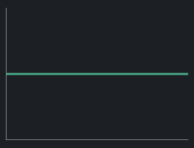
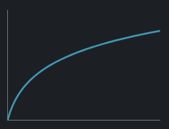
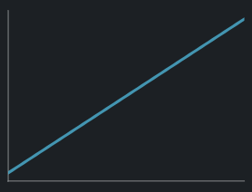
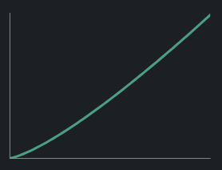
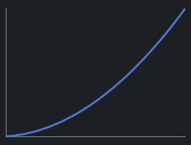
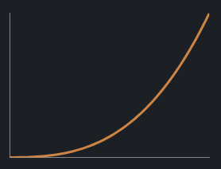
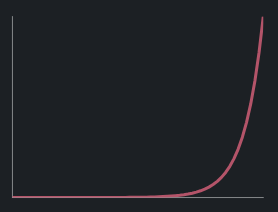
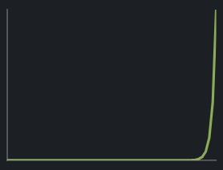

# Common Time Complexities

## The Complexity Hierarchy

Here's a practical guide to the time complexities you'll encounter most often, with real-world examples.

## **O(1)** - Constant Time

**The best possible complexity** - the algorithm takes the same time regardless of input size.

### Examples:
- Accessing the first element in an array: `arr[0]`
- Accessing an array element by index: `arr[5]`
- Checking if a number is even or odd
- Pushing/popping from a stack
- Looking up a value in a hash table (average case)

> [!NOTE]
> Constant doesn't mean "fast" - it means the time doesn't grow with N. **O(1)** could be 1 nanosecond or 1 hour, but it's the same for all input sizes.

## **O(log N)** - Logarithmic Time

**Very efficient** - grows extremely slowly. Doubling N adds only one step.

### Examples:
- Binary search in a sorted array
- Finding an element in a balanced binary search tree
- Operations on heaps (insert, extract-min)

**Growth pattern** - one extra operation for double the input:
- 1000 items = ~10 steps
- 1,000,000 items = ~20 steps

## **O(N)** - Linear Time

**Proportional to input** - if you double the input, you double the time.

### Examples:
- Linear search
- Finding the maximum value in an unsorted array
- Summing all elements in a list
- Traversing a linked list

**Growth pattern** - operations matches input size:
- 100 items = 100 ops
- 1000 items = 1000 ops

## **O(N log N)** - Log-Linear Time

**The "sweet spot" for sorting** - much better than **O(N2)** but not as good as **O(N)**.

### Examples:
- Merge sort
- Quick sort (average case)
- Heap sort

**Growth pattern** - operations rise quicker than input:
- 1000 items = ~10,000 ops
- 1,000,000 items = ~20,000,000 ops

## **O(N2)** - Quadratic Time

**Gets slow quickly** - doubling input quadruples the time. Tolerable for small N, impractical for large N.

### Examples:
- Bubble sort
- Selection sort
- Insertion sort
- Checking all pairs in a list (nested loops)

**Growth pattern** - operations are the square of the input:
- 100 items = 10,000 ops
- 1000 items = 1,000,000 ops

> [!WARNING]
> Be very careful with nested loops! Each additional nesting level adds another power of N.

## **O(N3)** - Cubic Time

**Very slow** - three nested loops. Only practical for small datasets.

### Examples:
- Matrix multiplication (naive approach)
- Triple nested loops
- Some graph algorithms

**Growth pattern** - operations are cube of input:
- 100 items = 1,000,000 ops
- 1000 items = 1,000,000,000 ops

## **O(2N)** - Exponential Time

**Impractical for all but tiny inputs** - adding one item doubles the time!

### Examples:
- Generating all subsets of a set
- Naive recursive Fibonacci

**Growth pattern** - operations rise very fast:
- 20 items = ~1,000,000 ops
- 30 items = ~1,000,000,000 ops
- 40 items = ~1,000,000,000,000 ops

> [!DANGER]
> Exponential algorithms are **only usable for tiny inputs** (usually N < 25). Beyond that, they take longer than the age of the universe!

## **O(N!)** - Factorial Time

**The worst practical complexity** - used when checking all permutations. Becomes impossible almost immediately.

### Examples:
- Brute-force Travelling Salesperson (checking all routes)
- Generating all permutations
- Some scheduling problems

**Growth pattern** - operations ride exceedingly quickly:
- 10 items = 3,628,800 ops
- 15 items = 1,307,674,368,000 ops
- 20 items = 2,432,902,008,176,640,000 ops

> [!DANGER]
> Like exponential algorithms, factorial algorithms are **only usable for tiny inputs** (usually N < 20). Beyond that, they take longer than the age of the universe!

## Quick Reference

| Complexity           | Name        | Small N (100)     | Large N (10,000)    | Practical?        |
| -------------------- | ----------- | ----------------- | ------------------- | ----------------- |
| **O(1)**             | Constant    | 1                 | 1                   | ✅ Always         |
| **O(log N)**         | Logarithmic | ~7                | ~13                 | ✅ Always         |
| **O(N)**             | Linear      | 100               | 10,000              | ✅ Always         |
| **O(N log N)**       | Log-Linear  | ~700              | ~130,000            | ✅ Usually        |
| **O(N2)** | Quadratic   | 10,000            | 100,000,000         | ⚠️ Small N only |
| **O(N3)** | Cubic       | 1,000,000         | 1,000,000,000,000   | ⚠️ Tiny N only  |
| **O(2N)** | Exponential | ~1030  | ~103000  | ❌ Almost never   |
| **O(N!)**            | Factorial   | ~10157 | ~1035659 | ❌ Never          |

> [!TIP]
> Aim for **O(N log N)** or better for any algorithm you expect to run on large datasets!

