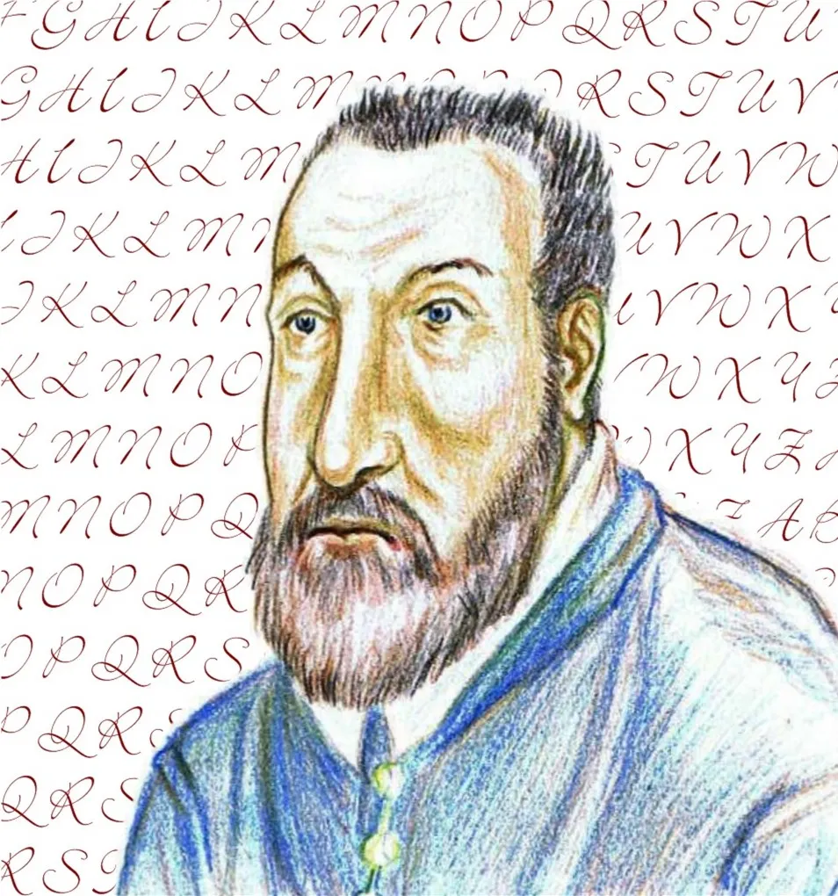

# The Vigenère Cipher

The **Vigenère cipher** is a **polyalphabetic substitution cipher** that uses a repeating keyword to shift each letter by a different amount. For 300 years it was considered unbreakable, earning it the nickname *"Le Chiffre Indechiffrable"* (the indecipherable cipher).

## What is a Polyalphabetic Cipher?

A **polyalphabetic cipher** uses **more than one substitution alphabet** across a single message ('poly' means 'many'). So the same plaintext letter can map to different ciphertext letters depending on its position.

So, depending upon which substitution alphabet is being used, the letter `E` could be substituted for `G` at one point in the message, but `U` at another point,

### Why This Defeats Frequency Analysis

In the Caesar cipher, `E` always becomes the same letter - so counting letter frequencies reveals the key. In a polyalphabetic cipher, `E` might become `X` in one place and `M` in another, flattening out the frequency pattern.

| Cipher Type               | Same Letter Always Encrypts the Same Way? | Frequency Analysis Works? |
| ------------------------- | ----------------------------------------- | ------------------------- |
| Monoalphabetic (Caesar)   | Yes                                       | Yes - easily broken       |
| Polyalphabetic (Vigenère) | No                                        | Much harder               |

## How the Vigenère Cipher Works

The Vigenère Cipher uses a **repeating keyword** to create a **keystream** that is the same length as the plaintext message. Each letter of the keystream tells you the shift to use for that position in the message.

<sub-cipher scheme="vigenere" key="SECRET">
HELLO WORLD
</sub-cipher>

> [!NOTE]
> Notice how the two `L`s in "HELLO" and "WORLD" can encrypt to *different* ciphertext letters, because they line up with different letters of the keyword.

The most famous polyalphabetic cipher is the **Vigenère cipher** - see [The Vigenère Cipher](/cs/encryption/vigenere.md) for a full walkthrough.

## How It Works

1. Choose a keyword, e.g. `SECRET`
2. Repeat the keyword to match the length of your message
3. Each letter of the keyword tells you the shift for the matching letter of the plaintext (`A` = shift 0, `B` = shift 1, and so on)

<sub-cipher scheme="vigenere" key="SECRET">
ATTACK AT DAWN
</sub-cipher>

## Worked Example

| Plaintext | A | T | T | A | C | K |
|---|---|---|---|---|---|---|
| Keyword | S | E | C | R | E | T |
| Shift | +18 | +4 | +2 | +17 | +4 | +19 |
| Ciphertext | S | X | V | R | G | D |

Try a longer message with your own keyword:

<sub-cipher scheme="vigenere" key="CRYPTO">
THE VIGENERE CIPHER IS A METHOD OF ENCRYPTING ALPHABETIC TEXT BY USING A SERIES OF INTERWOVEN CAESAR CIPHERS BASED ON THE LETTERS OF A KEYWORD
</sub-cipher>

> [!TIP]
> Notice how editing the ciphertext also decrypts back to the plaintext - encryption and decryption are just the same process running in opposite directions.

## Test Your Knowledge: Encrypting with Vigenère

Drag these steps into the correct order:

<drag-drop>

1. Choose a keyword and share it with the recipient

2. Repeat the keyword until it matches the length of the message

3. Convert each keyword letter into its shift value (A=0, B=1, and so on)

4. Shift each plaintext letter by the matching keyword shift

5. Combine the shifted letters into the final ciphertext

</drag-drop>

## Key Terms

<flashcards>

- # What makes a cipher "polyalphabetic"?

    ---

    It uses more than one substitution alphabet across a single message, so the same letter can encrypt differently depending on its position.

- # Why does this defeat basic frequency analysis?

    ---

    Because a letter like E no longer always maps to the same ciphertext letter, flattening out the frequency pattern an attacker would look for.

- # What repeats in a keyword-based polyalphabetic cipher?

    ---

    The keyword itself repeats to match the length of the message, controlling the shift used at each position.

</flashcards>

## Key Terms

<flashcards>

- # Why was the Vigenère cipher called "le chiffre indechiffrable"?

    ---

    It resisted being broken for around 300 years, since its polyalphabetic design defeated simple frequency analysis.

- # What determines the shift at each position in a Vigenère cipher?

    ---

    The matching letter of the repeating keyword.

- # What happens if the keyword is only one letter long?

    ---

    The Vigenère cipher becomes identical to a Caesar cipher.

</flashcards>

## Further Reading

<aside>

### The Wrong Person!

The invention of the Vigenère Cipher is often (incorrectly) attributed to 16th Century French diplomat, cryptographer, inventor, and alchemist Blaise de Vigenère. In reality, Italian cryptologist Giovan Battista Bellaso beat him to it.

</aside>

- [Khan Academy - The Vigenère Cipher](https://www.khanacademy.org/computing/computer-science/cryptography) - part of the full cryptography course
- [Wikipedia - Vigenère Cipher](https://en.wikipedia.org/wiki/Vigen%C3%A8re_cipher) - full technical history and explanation
