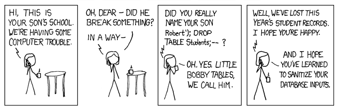

# SQL Injection Attacks

[](https://xkcd.com/327/)

## What is SQL Injection?

Imagine a form to login to a web application. It asks for a username...

<form class="demo-form">
    <label>
        Username
        <input value='jsmith'>
    </label>
    <button>Continue</button>
</form>

When this form is submitted, we need to take the form data and use it within an SQL query. If we naively took the form data and **placed it directly into the query**...

```python
username = request.form.get('username', '')
with connect_db() as db:
    sql = f'SELECT * FROM users WHERE username = "{username}"'
    records = db.execute(sql)
```

> [!TIP]
> NEVER do this with any data that has come from an untrusted user!


We have just introduced a potential **security issue**, opening us up to a type of database attack called **SQL Injection**.

We have assumed that users will only enter valid names and nothing else, but what if that is not true? What if an attacker wants to compromise our server, wants to access data they should not have access to, or wants to modify / delete the data?


## Valid User Input Data

If the user enters a real username: `jsmith`, then the SQL query would become...

```sql
SELECT * FROM users WHERE username="jsmith"
```

No issues there. A single user record would be returned.

But...


## SQL Injection Attack 1

What if the attacker types this snippet of text / SQL into the form:

<form class="demo-form">
    <label>
        Username
        <input value='jsmith" OR ""="'>
    </label>
    <button>Continue</button>
</form>

What effect does this have? Let's look at what out query now becomes...

```sql
SELECT * FROM users WHERE username="jsmith" OR ""=""
```

`""=""`(sql)... What does that do? Well, since "" does equal "", this equates to `TRUE`(sql), and so the WHERE clause will **always be True**. And `WHERE TRUE`(sql) will result in *every* user record being returned. This is BAD! The attacker has just gained access to everyone's account data!


## SQL Injection Attack 2

What if the attacker types this more complex snippet of SQL into the form:

<form class="demo-form">
    <label>
        Username
        <input value='jsmith"; DROP TABLE users; --'>
    </label>
    <button>Continue</button>
</form>

What effect does this have? Let's look at what our query now becomes...

```sql
SELECT * FROM users WHERE username="jsmith"; DROP TABLE users; --"
```

The query now contains not just our intended query, but also the attacker's `DROP TABLE users`(sql) query. This is BAD! They have just **deleted the whole users table**. We just lost everyone's accounts!

> [!NOTE]
> The `;`(sql) ends the first command, allowing a second to be started. And `--`(sql) indicates an SQL comment, here commenting out the final " and preventing an error


## Preventing SQL Injection

The solution to these attacks is to use something called **prepared statements** for all queries. Instead of adding any user data directly into a query, we instead place a `?` marker in the query where we want the user data to go, and supply the user data as parameters.


```python
username = request.form.get('username', '')
with connect_db() as db:
    sql = "SELECT * FROM users WHERE username = ?"   # note the ? marker for data
    params = (username,)                             # supply user data as parameters
    records = db.execute(sql, params)                # safe prepared statement call
```

When executing the query, the prepared statement places the data where the `?` marker is in such a way that any SQL the use provides won't be run. This is called **data sanitisation**.

> [!IMPORTANT]
> You must supply data values in the **correct order** to match the `?` markers...
> ```python
> sql = """
>     SELECT * FROM classes
>     WHERE teacher = ? AND subject = ? AND level = ?
> """
> params = (teacher_code, subject_code, class_level)   # data params in correct order
> ```
