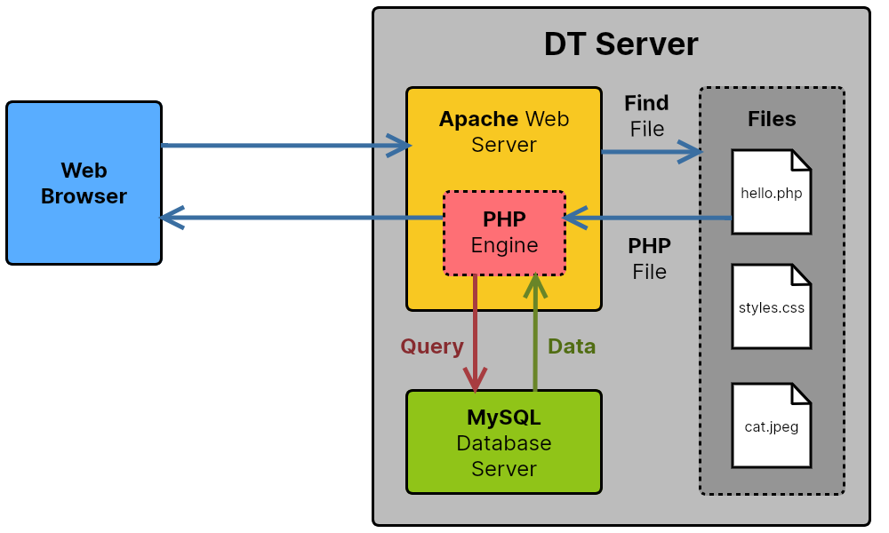
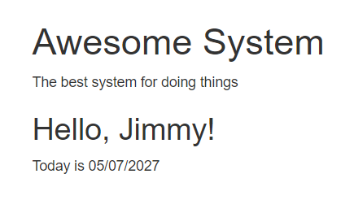

# How Does PHP Work?

When a web browser requests a web page with a **.php** file extension from the server, the following happens:

1. The **request URL** is sent to the web server (Apache)
2. The web server **locates the PHP file** (based on the request URL)
3. The PHP file is **processed by the PHP engine** and any PHP commands are run
4. The PHP code might also **request data from a database** if needed
5. The resulting **HTML is passed back** to the web browser
6. The browser **renders the HTML as a web page**




!> Note that PHP code never goes to the browser - the code is run on the server and it generates HTML code. *Only the server has access to the PHP code* - this is really important to understand and is essential for security.

## An Example

Let's assume that this file is saved as **hello.php** on the server...

```php
<body>
    <h1>Awesome System</h1>
    <p>The best system for doing things</p>

    <?php
        // This is a PHP block
        $forename = userLookup();
        echo '<h2>Hello, ' . $forename . '!</h2>';
        echo '<p>Today is ' . date('d/m/Y') . '</p>';
    ?>

</body>
```

### 1. Browser Request

A web browser sends a request for this file containing the URL... https://awesome.co.nz/hello.php - Note the **PHP** filename in the request URL

### 2. Locate File

The Apache web server analyses the request URL, then retrieves the **hello.php** file. Since it has a **.php** file extension, it passes it to the **PHP engine**.

### 3. PHP Processing

The PHP engine begins creating an HTML response. Any **normal, plain HTML code** it finds in the PHP file is simply **copied into the response, unchanged**...

```html
<body>
    <h1>Awesome System</h1>
    <p>The best system for doing things</p>
```

When it encounters a **PHP block**, however, it **runs the PHP code** and the **resulting HTML gets added to the response**. So, in this example...

### 4. Database Lookup

The code looks up the user's name from the database and then stores it in the variable **$forename**.

### 3. PHP Processing Continued

The PHP engine creates a **greeting** using the $forename variable, and it also looks up **today's date**.

These values are **inserted into the HTML response**, along with the **final lines of plain HTML**...

```html
<body>
    <h1>Awesome System</h1>
    <p>The best system for doing things</p>

    <h2>Hello, Jimmy!</h2>
    <p>Today is 05/07/2027</p>
</body>
```

### 5. HTML Response Sent to Browser

This the the **resulting HTML response** that is passed back to the browser...

- Response code: **200** (meaining 'success')
- Response data: **HTML code**
    ```html
    <body>
        <h1>Awesome System</h1>
        <p>The best system for doing things</p>

        <h2>Hello, Jimmy!</h2>
        <p>Today is 05/07/2027</p>
    </body>
    ```

### 5. Page is Rendered

The web browser **parses the HTML** and **renders the web page**...



