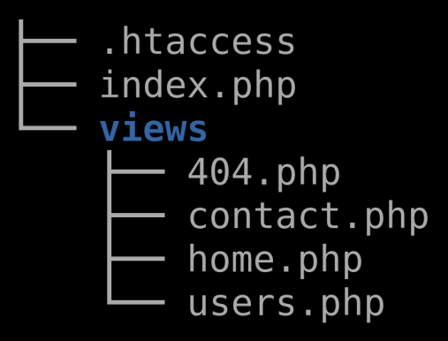

# What is URL Routing?

Website routing is a system where all requests to a website pass through the same server-side script which decodes the requested URL to determine which page (or 'view' to serve up).

## Some Examples

### 1. This URL has a request for a **specific page**:

> www.example.com<strong>/products</strong>

The router script would see the **/products** in the URL and serve up the **products view**.

### 2. This URL has a request for a **specific user**:

> www.example.com<strong>/users/34</strong>

The router script would see the **/users** in the URL and serve up the **users view**, plus the **/34** parameter would mean that the details for the user with the **ID of 34** is the one to show.

### 3. This URL has a request that includes a **filter**:

> www.example.com/users<strong>?search=Dave</strong>

The router script would see the **/users** in the URL and serve up the **users view**, plus the **?search=Dave** filter search term would show only users that matched the **search filter 'Dave'**.

## How Will We Do This?

In these examples we will use the **PHP** language for the server-side scripting.

The routing script will be **index.php** and it will parse the request URL and load the appropriate view script from the **views directory**...

Beacuse we are using the **Apache** web server, we use a **.htaccess** file to redirect all website URLs to the index.php script.