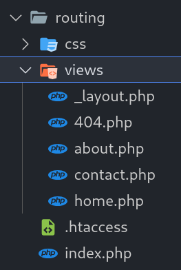

# Creating Views

## What is a 'View'?

A 'view' is a site page, or a section of a page, that can be returned to the client.

Sometimes a full page will be requested. Other times a small part of a page will be requested and placed within the page currently being viewed.


## A Views Folder

In your site folder, create a new folder called **views**. This will contain the different 'views' that our site will deal with...




## The Page Layout View

Within the views folder, create the following file:

- **_layout.php** - This will be the page template

?> Note the underscore at the start of the name - this is simply to make sure it is listed first in the list of files. We will use this naming style in a few other places.

This template will act as a template for all full-page requests, and will contain meta data, header, nav menus, etc. We will add code to this file in the [next section](php/routing/layout.md).


## Views for Specific Routes

Within the views folder, create the following files:

- **404.php** - This will be the content of the invalid route error page
- **home.php** - This will be the content of the Home page
- **about.php** - This will be the content of the About page
- **contact.php** - This will be the content of the Contact page

These files will contain and/or generate the content for each route page. Add some HTML content to each of these.

For example, this could be the **home.php** page content...

```html
<h1>Welcome!</h1>

<p>This is a great place to be!</p>
```

And this could be the **404.php** page content...

```html
<h1>Error 404</h1>

<p>We couldn't find that page!</p>
```
