# Usability

Usability is about **how easy a system is to use**. A usable system lets people complete their goals quickly, without confusion, and with as few mistakes as possible.

When designing any digital product, usability should be **considered from the very start**, not bolted on at the end.

## Why Usability Matters in Design

A system that works technically but is hard to use will still fail - people won't use it if it's hard or confusing to use!

Good design means thinking about real users and the mistakes they might make, and then designing the system so that these mistakes are prevented or don't matter.

---

# Nielsen's 10 Usability Heuristics

In 1994, usability expert **Jakob Nielsen** published 10 general principles for interface design. They're still widely used today to evaluate and improve digital systems.

> [!NOTE]
> These are called *heuristics*. They are not strict rules, but **useful guidelines** based on research into how people interact with technology

## <i data-lucide="loader"></i> Visibility of System Status

> Keep users informed about what's going on.

The system should always tell users what it's doing. If you click a button, you should see something happen (e.g. a loading spinner or a confirmation message). Without feedback, users don't know if their action worked.

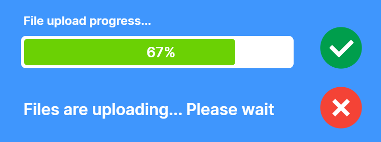

#### Examples:
- When you upload a file to Google Drive, a progress bar shows how far along it is. Without it, you'd have no idea if anything was happening.
- When ordering something, sites often show how far through the process you are.

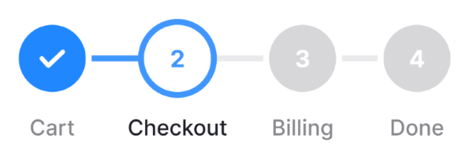

## <i data-lucide="compass"></i> Match Between the System and the Real World

> Speak the user's language, not the computer's.

Use words, icons, and ideas that users already understand from everyday life. Avoid technical jargon. Information should appear in a natural, logical order.

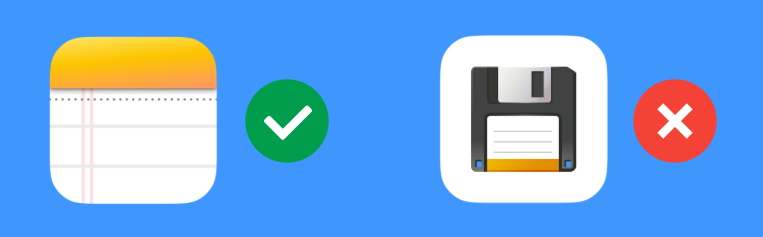

#### Examples:
- A notepad icon for a note-taking app makes sense to everyone, whereas a floppy disk for a save button makes no sense if you were born in the 21st Century!
- The "trash can" icon for deleting files matches the real-world concept of throwing something away - no explanation needed.

## <i data-lucide="undo-2"></i> User Control and Freedom

> Always give users a way out.

People make mistakes. They need an easy way to undo actions and go back to where they were, without having to go through a long process.

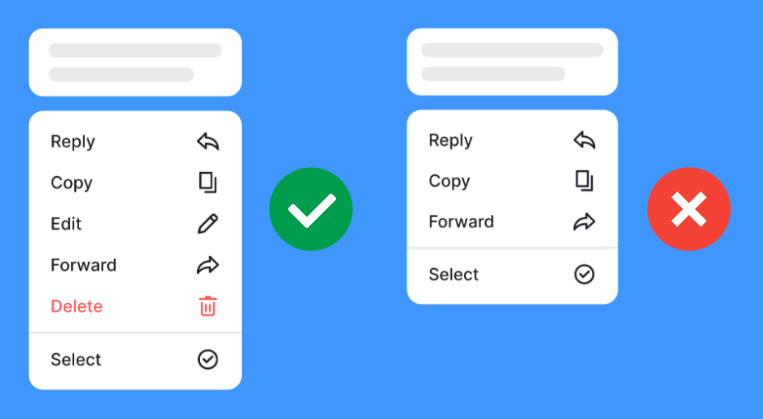

#### Examples:
- When posting a message, the ability to edit it or delete it completely allows users to undo mistakes.
- GMail's "Undo Send" button lets you cancel an email seconds after sending it - a lifesaver when you spot a typo!

## <i data-lucide="list-checks"></i> Consistency and Standards

> Don't make users wonder if different things mean the same thing.

Buttons, icons, and words should mean the same thing throughout the app, and ideally match what users expect from other apps too. Consistency reduces the mental effort needed to learn a new system.

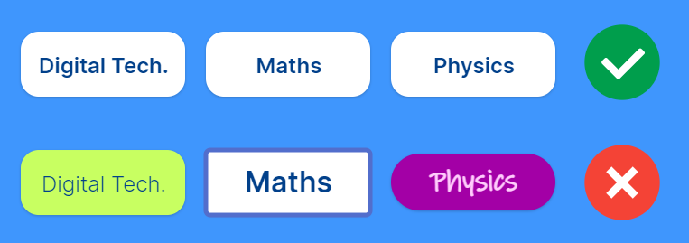

#### Examples:
- Keep your UI elements consistent: buttons should all be similar so the user recognises them instantly.
- The "hamburger" menu icon (☰) is used across countless apps - users already know what it does without being told.

## <i data-lucide="shield-check"></i> Error Prevention

> Stop mistakes before they happen.

The best error message is one that never has to appear. Design the system so that mistakes are hard to make in the first place (e.g. confirmations for risky actions like deletions, form validation rules, etc.)

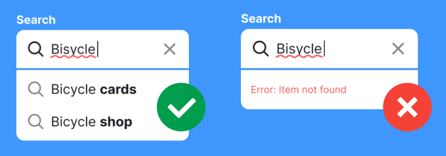

#### Examples:
- When the user searches for something, but mistypes it, don't just return an error - instead suggest fixes.
- A date-picker that won't let you select a date in the past for a flight booking prevents an invalid entry from ever being submitted.

## <i data-lucide="eye"></i> Recognition Rather Than Recall

> Show options; don't make users remember them.

Human short-term memory is limited. Instead of making users remember what to type or what options exist, show them choices they can recognise: menus, auto-complete, icons, etc.

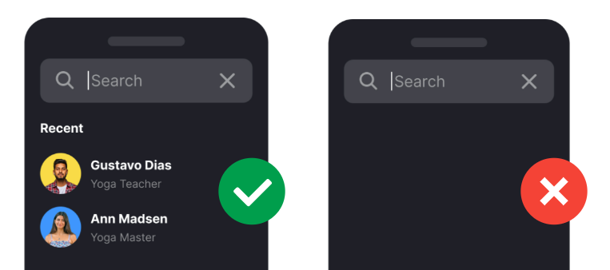

#### Examples:
- Messaging apps often show your most recent contacts when beginning a new message.
- Spotify shows your recent searches so you don't have to remember exactly what you were looking for.

## <i data-lucide="fast-forward"></i> Flexibility and Efficiency of Use

> Let beginners learn and experts work fast.

A system should work well for both new and experienced users. Beginners need clear guidance, whilst experienced users prefer shortcuts and ways to speed up repeated tasks.

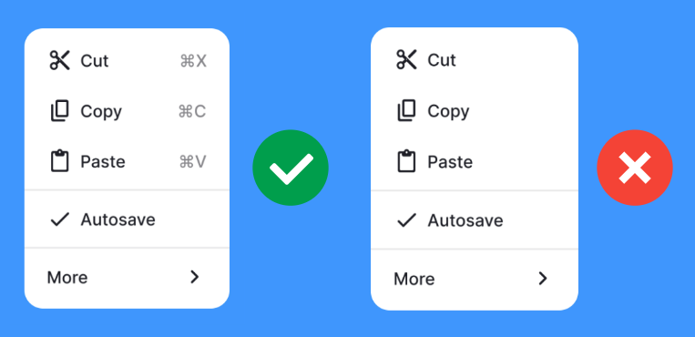

#### Examples:
- Most apps have full menus for beginners but also keyboard shortcuts (like `Ctrl+Z` to undo) that experts rely on heavily.
- Many apps have an on-boarding tutorial for new users, but experienced users can skip it.

## <i data-lucide="sparkles"></i> Aesthetic and Minimalist Design

> Don't clutter the interface with things that aren't needed.

Every extra button, image, or piece of text competes for the user's attention. Keep the design focused on what the user actually needs. Less visual 'noise' means the important things stand out more clearly.

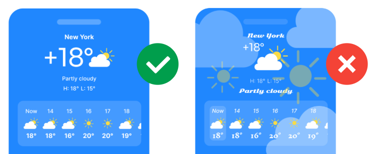

#### Examples:
- Google's homepage is famously minimal - just a search box - because that's the one thing users come to do.
- Well designed apps show you just what you need to know, and nothing more.

## <i data-lucide="triangle-alert"></i> Help Users Recognise, Diagnose, and Recover from Errors

> Write error messages that actually help.

When something goes wrong, the error message should say what happened in plain language: explain why it's a problem, and suggest a way to fix it. Avoid cryptic error codes or technical terms.

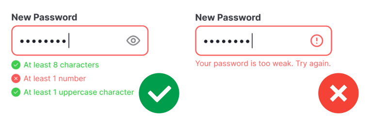

#### Examples:
- When setting a password that requires particular characters, inform the user which ones they are missing, rather than just a fail message.
- Instead of `Error 403`, a good message says: *"You don't have permission to view this page. Try signing in with a different account."*

## <i data-lucide="book-open"></i> Help and Documentation

> Sometimes people need a guide - make it easy to find.

Ideally, a system is so intuitive that no manual is needed. But when users do need help, it should be easy to access - not buried in a separate PDF doc.

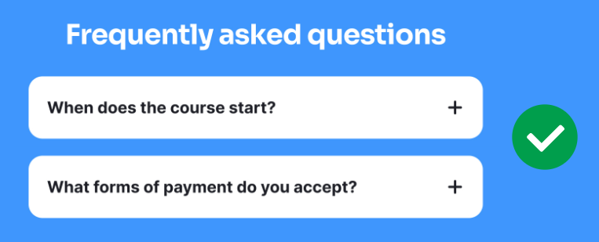

#### Examples:
- Apps can have sidebars or collapsible help sections that give answers without leaving the page you're on.
- Many apps include tooltips when you hover over UI elements so you can discover what they do

---

## <i data-lucide="play-circle"></i> Video Summaries

Here is a playlist of short videos that explain each heuristic...

<videoembed playlist-grid id="cTtc90jCULU,0TAt9Pln51g,MXuk-fdbr0A,Ibndy9KLOSQ,imS9s1DUY-I,6glQPp6q4Jc,LoTdRTBB8BQ,ZgbRmeWDgd0,cCun-ReLTFI,iIQVRzatb50"></videoembed>

