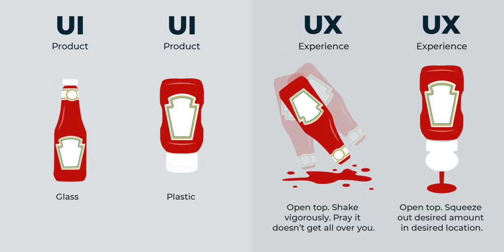
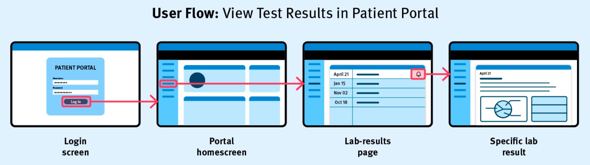
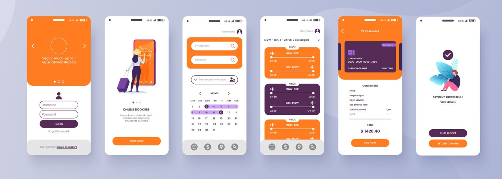
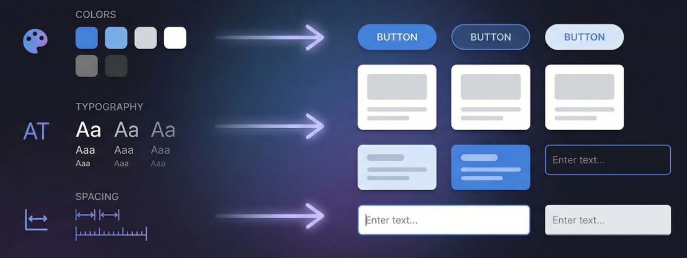
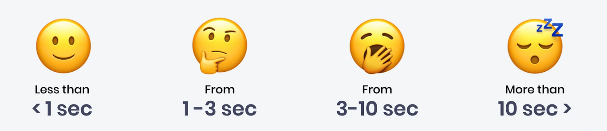
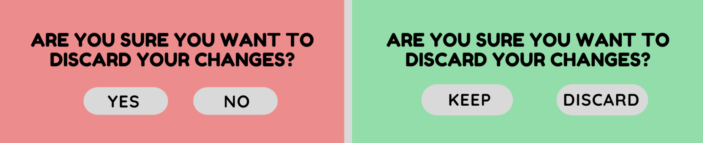
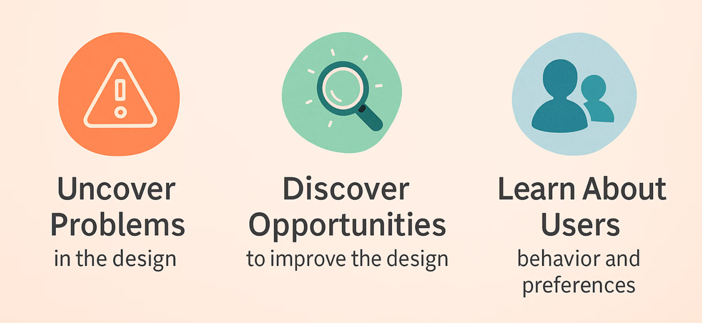

# User Experience (UX)

UX design considers everything a person encounters when using a product: the visual design, the words on screen, how long things take, what happens when something goes wrong, and whether the end result matches what they were hoping for.

## UI? UX? Usability?

- The **user interface** is **how** the user interacts with a system
- **Usability** is about whether a system *works*
- **User experience (UX)** is about how using it *feels*

A product can be technically usable but still frustrating, confusing, or unpleasant - **good UX means the whole interaction feels smooth, satisfying, and right for the user**.

---

# UX Core Principles

Good UX can be summed up with a small set of practical rules. Keep these in mind while designing and testing.

> [!TIP]
> If you want to read more about good UX and the principles to follow, see [Laws of UX](https://lawsofux.com/), or this article from [UX Design Institute](https://www.uxdesigninstitute.com/blog/ux-design-principles-2026/)

## <i data-lucide="user-round"></i> Know Your User

> Design for real people, not yourself.

The single biggest UX mistake is assuming your users think like you do. Different people have different goals, skills, expectations, and patience levels.

#### Consider:
- Who will use this? (age, experience, context)
- What is their main goal?
- What device will they use most?

## <i data-lucide="map"></i> Clear User Flows

> Make key tasks follow a clear path.

A user flow is the step-by-step path to complete a task. Each flow should be short, clear, and free of dead ends.

#### Consider:
- What are your top 1-2 tasks (e.g. sign up, find info, submit form)?
- How many steps does each task take?
- Where might users get stuck?

## <i data-lucide="layout-dashboard"></i> Keep It Clear and Consistent

> Don't make users relearn where things are.

Users learn faster when pages are consistent. Keep navigation, buttons, and layouts predictable.

#### Consider:
- Are similar pages laid out in a similar way?
- Is the navigation consistent across all pages?
- Are buttons and links easy to spot?

A great way to ensure consistency in your design is to use a design system (e.g. via CSS variables and rules):

## <i data-lucide="timer"></i> Keep Tasks Quick

> Every extra click, wait, or step costs goodwill.

If tasks take too long, users give up. Reduce steps and remove unnecessary friction.

#### Consider:
- Can common tasks be completed in as few steps as possible?
- Are loading times acceptable for your users?
- Are forms as short as possible?

## <i data-lucide="message-circle"></i> Clear, Helpful Language

> Every word in your interface is part of the UX.

Labels, button text, and error messages should be simple and direct.

#### Consider:
- Are labels and button text specific and action-oriented? ("Save changes" not "Submit")
- Is the reading level appropriate for the target audience?
- Do error messages explain what went wrong and how to fix it?

## <i data-lucide="test-tube-diagonal"></i> Test and Improve

> Your assumptions will be wrong. Testing shows you where.

Simple testing catches problems early. Even 2-3 users can reveal major issues.

#### Consider:
- Have people outside the design team tried to use it?
- Were they able to complete core tasks without help?
- What should you change based on their feedback?

