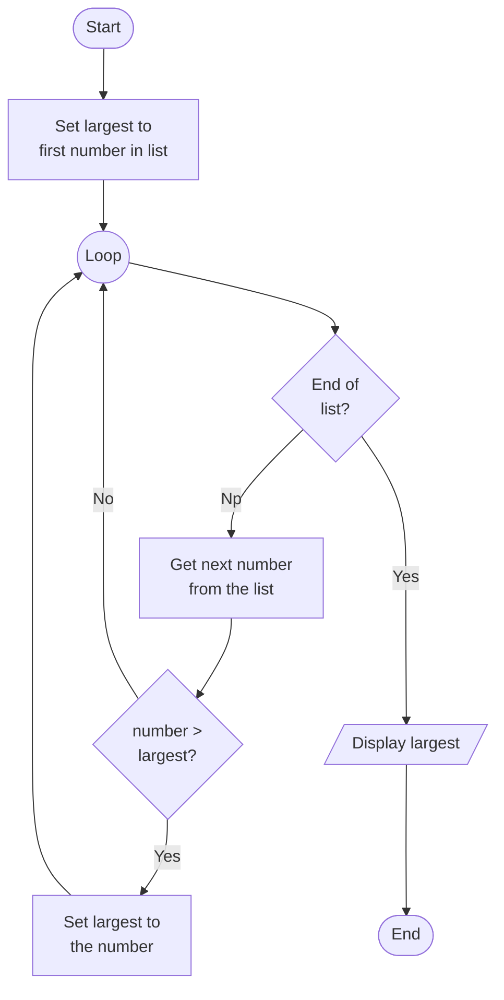

# Algorithms

## What is an Algorithm?

An **algorithm** is a step-by-step set of instructions for solving a problem or completing a task.

The steps must be:
- **Clear** - each step is unambiguous
- **Ordered** - steps happen in the right sequence
- **Finite** - it eventually stops

> [!NOTE]
> The word *algorithm* comes from the name of a 9th-century Persian mathematician called **Al-Khwarizmi**, who wrote one of the earliest books on systematic problem solving.


## Algorithms in Real Life

You already follow algorithms every day - you just don't call them that.

**Making a bowl of cereal:**

```
1. Get a bowl
2. Pour in cereal
3. Pour in milk
4. Pick up a spoon
5. Eat
```

Simple, ordered, and it works every time. That's an algorithm.

**Searching for a name in a phone book:**

```
1. Open the book roughly in the middle
2. If the name is here, stop - you found it
3. If the name comes before this page, look in the left half
4. If the name comes after this page, look in the right half
5. Repeat from step 1 with the remaining half
```

This is actually a famous algorithm called **binary search** - and computers use it all the time.


## Computer Algorithms

In programming, algorithms are the logic behind everything a computer does - from sorting a playlist, to finding directions on a map, to deciding which posts appear in your feed.

Here's a simple example: finding the **largest number** in a list.

First, here is the algorithm in plain English:

```
1. Assume the first number is the largest so far
2. Look at each number in the list
3. If it's bigger than the current largest, it becomes the new largest
4. After checking all numbers, the answer is the largest seen
```

And here is a Python program that follows this algorithm:

```python run
numbers = [4, 7, 2, 19, 5, 1]

largest = numbers[0]          # start by assuming the first is largest

for number in numbers:
    if number > largest:
        largest = number      # found a new largest - update it

print(largest)                # should be 19
```

> [!TIP]
> Notice how the algorithm description and the code say the same thing - just in different languages. Writing out steps in plain English first is a great way to plan your code.


## Flowcharts

Algorithms are often drawn as **flowcharts** - diagrams that show each step and decision.

Here's the "find the largest number" algorithm as a flowchart:



The **diamond** shapes are decisions - places where the algorithm branches depending on what's true.

## Pseudo-Code

Sometimes, before you write real code, it's helpful to jot down the steps in a way that's halfway between English and programming. That's called **pseudo-code**.

Pseudo-code isn't a real programming language. It's just a way to show the logic of your algorithm, without worrying about exact syntax.

Here's a simple pseudo-code example that checks a list of numbers and prints out the even ones:


```pseudo
// Algorithm to find the largest number in a list
start
    set largest = first value in list

    repeat until end of list
        look at next number in the list

        if number > largest
            set largest = number
        endif
    endrepeat

    display largest
end
```

> [!TIP]
> Writing pseudo-code first helps you plan your logic before you start worrying about the details of a programming language.


## What is a Good Algorithm?

Not all algorithms are equal. A good algorithm is:

| Property | Meaning |
|----------|---------|
| **Correct** | It gives the right answer every time |
| **Efficient** | It doesn't waste steps or memory |
| **Clear** | Another person (or computer) can follow it |

For example, you *could* find the largest number by checking every possible combination - but that would be incredibly slow for a large list. The simple scan above is much more efficient.

> [!NOTE]
> Figuring out *how efficient* an algorithm is - and comparing different approaches - is a big part of computer science. You'll explore this more as you progress.

