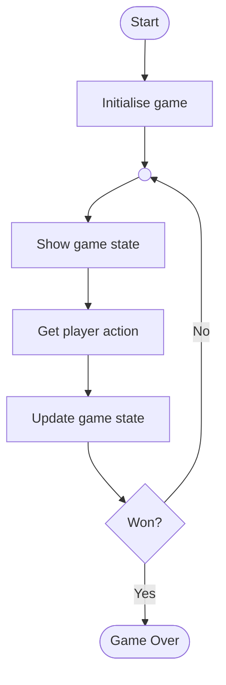
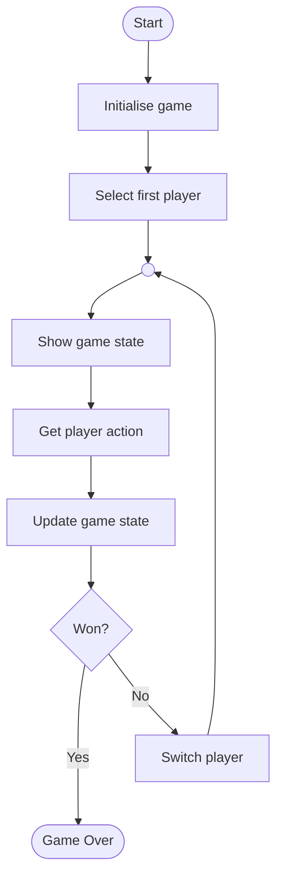
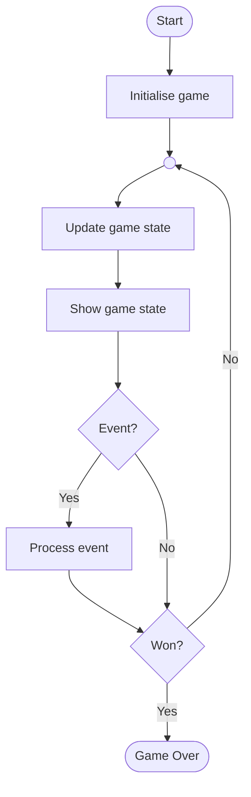

# Game Loops

If you are programming a game, you will generally have some sort of **game loop**. This manages the key events and actions that the game needs to make over and over again.

## Turn-Based Games

The simplest type of computer games are turn-based. These involve the player deciding what action to take each time round the game loop - the main loop is **blocking** and waits for the user input...

### One-Player Game

In a simple one-player game, this might look like:

### Two-Player Game

When two players are playing against each other, they will **take turns** - the game needs to switch from one to the other...

## Real-Time Games

This type of game has a main loop that **constantly runs**, updating the game state.

User action **events** can trigger updates to the game, but the main loop **doesn't wait** for these to occur - the main loop is **non-blocking**...

