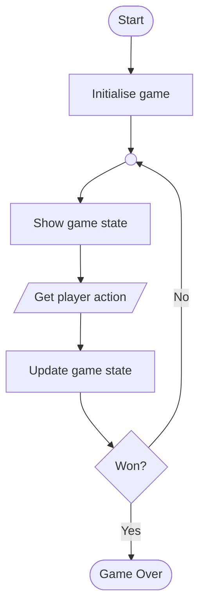

# Game Loops

If you are programming a game, you will generally have some wort of **game loop**. This manages the key events and actions that the game needs to make over and over again.

In a simple one-player game, this might look like:

