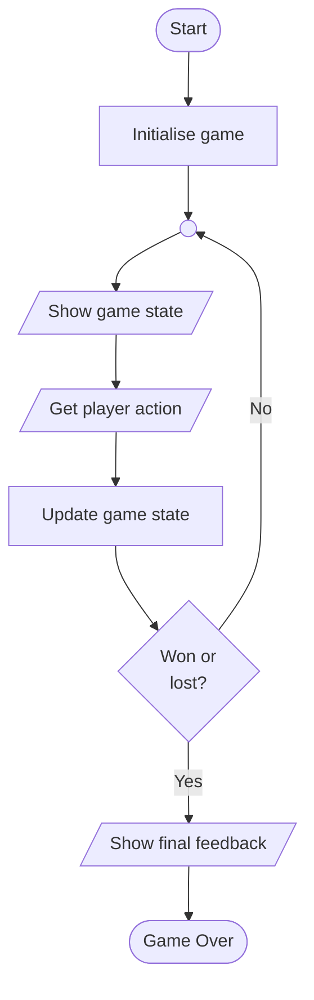
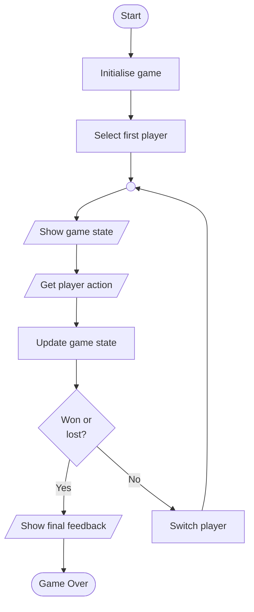
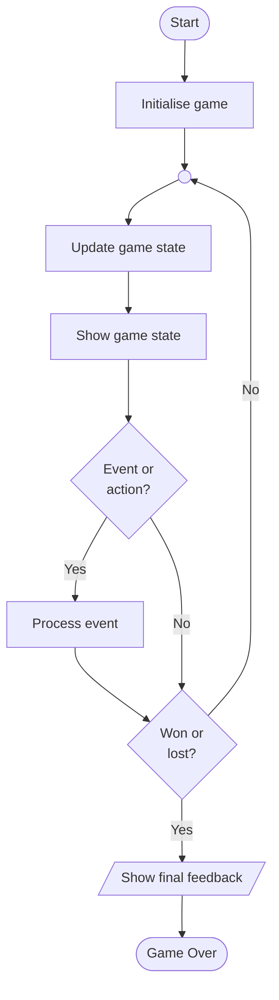

# Game Loops

If you are programming a game, you will generally have some sort of **game loop**. This manages the key events and actions that the game needs to make over and over again.


## Turn-Based Games

The simplest type of computer games are turn-based. These involve the player deciding what action to take each time round the game loop - the main loop is **blocking** and waits for the user input...

### One-Player Game

In a simple one-player game, the algorithm might look like in pseudo-code...

```pseudo
start
    initialise the game (play area, player name, etc.)

    repeat
        show the player the current game state

        get the user input / action
        update the game state based on the input

        if player has won or lost
            break from loop
        endif
    endrepeat

    show final game feedback (points, etc.)
end
```

And here as a flowchart...



### Two-Player Game

When two players are playing against each other, they will **take turns** - the game needs to switch from one to the other.

The algorithm for a two-player game might look like this in pseudo-code...

```pseudo
start
    initialise the game (play area, player names, etc.)

    pick the player to go first

    repeat
        show the players the current game state

        get current player input / action
        update the game state based on the input

        if current player has won or lost
            break from loop
        endif

        switch to the other player
    endrepeat

    show final game feedback (winner, points, etc.)
end
```

And here as a flowchart...




## Real-Time Games

This type of game has a main loop that **constantly runs**, updating the game state.

User action **events** can trigger updates to the game, but the main loop **doesn't wait** for these to occur - the main loop is **non-blocking**.

Here is a typical even-driven, real-time game loop as a flowchart...



