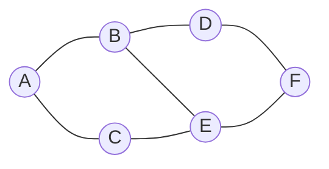
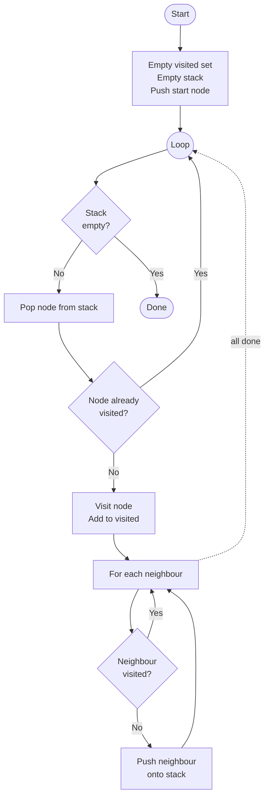
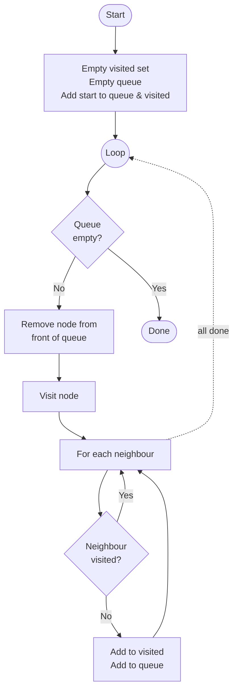
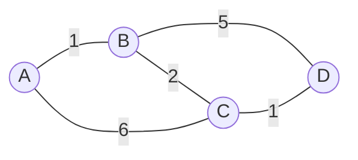
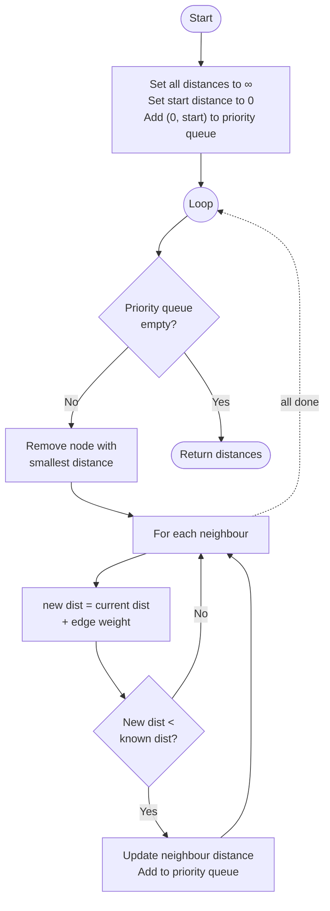

# Graph Algorithms

A **graph** is a data structure made up of **nodes** (also called vertices) connected by **edges**. Unlike a [tree](programming/algorithms/trees.md), a graph has no root, no hierarchy, and edges can form **cycles** — paths that loop back to a node you've already visited.



> [!NOTE]
> Edges can be **undirected** (no direction, like a two-way road) or **directed** (one-way, like a one-way street). They can also have **weights** (costs or distances), which matters for shortest-path algorithms.

Graphs are used to model all sorts of real-world problems: road networks, social networks, the internet, game maps, and more.


## Depth-First Search (DFS)

Depth-first search explores a graph by going **as deep as possible** along one path before backtracking. It uses a **stack** — either an explicit one, or the call stack via [recursion](programming/algorithms/recursion.md).

Because graphs can contain cycles, DFS must track which nodes have already been **visited** to avoid looping forever.

```pseudo
start dfs (graph, start)
    create an empty visited set
    create an empty stack
    add start node to the stack

    repeat until stack is empty
        pop node from top of stack

        if node not in visited then
            visit node
            add node to visited

            for each neighbour of node
                if neighbour not in visited then
                    push neighbour onto stack
                endif
            endfor
        endif
    endrepeat
end
```

And here it is as a flowchart...



And here is a runnable Python implementation using the example graph above. The graph is stored as an **adjacency list** — a dictionary where each key is a node, and the value is a list of its neighbours...

```python run
graph = {
    'A': ['B', 'C'],
    'B': ['A', 'D', 'E'],
    'C': ['A', 'E'],
    'D': ['B', 'F'],
    'E': ['B', 'C', 'F'],
    'F': ['D', 'E'],
}

def dfs(graph, start):
    visited = set()
    stack = [start]

    while stack:
        node = stack.pop()

        if node not in visited:
            print(f" → {node}", end="")
            visited.add(node)

            for neighbour in graph[node]:
                if neighbour not in visited:
                    stack.append(neighbour)

print("DFS from A:")
dfs(graph, 'A')
```


## Breadth-First Search (BFS)

Breadth-first search explores a graph **level by level** — visiting all immediate neighbours before moving further away. It uses a **queue** instead of a stack.

Like DFS, it must track visited nodes to handle cycles.

> [!NOTE]
> BFS always finds the **shortest path** (in terms of number of edges) between two nodes in an unweighted graph, because it explores closest nodes first.

```pseudo
start bfs (graph, start)
    create an empty visited set
    create an empty queue
    add start node to the queue
    add start node to visited

    repeat until queue is empty
        remove node from front of queue
        visit node

        for each neighbour of node
            if neighbour not in visited then
                add neighbour to visited
                add neighbour to queue
            endif
        endfor
    endrepeat
end
```

And here it is as a flowchart...



And here is a runnable Python implementation...

```python run
from collections import deque

graph = {
    'A': ['B', 'C'],
    'B': ['A', 'D', 'E'],
    'C': ['A', 'E'],
    'D': ['B', 'F'],
    'E': ['B', 'C', 'F'],
    'F': ['D', 'E'],
}

def bfs(graph, start):
    visited = set([start])
    queue = deque([start])

    while queue:
        node = queue.popleft()
        print(f" → {node}", end="")

        for neighbour in graph[node]:
            if neighbour not in visited:
                visited.add(neighbour)
                queue.append(neighbour)

print("BFS from A:")
bfs(graph, 'A')
```


## Comparing DFS and BFS

| | DFS | BFS |
|--|-----|-----|
| **Data structure** | Stack | Queue |
| **Explores** | Deep first | Wide first |
| **Finds shortest path?** | Not guaranteed | Yes (unweighted graphs) |
| **Memory use** | Lower for deep graphs | Lower for wide graphs |
| **Good for** | Maze solving, cycle detection | Shortest path, spreading from a source |


## Weighted Graphs

When edges have **weights** (distances, costs, times), BFS no longer guarantees the shortest path — a route with fewer edges might have a much higher total cost.



In this graph, going A → B → C → D (cost: 4) is cheaper than A → B → D (cost: 6), even though both have the same number of hops from A.

## Dijkstra: Shortest Path

**Dijkstra's algorithm** solves this by always extending the **cheapest known path** so far, rather than simply the shallowest. It works like BFS but uses a **priority queue** (sorted by total cost) instead of a regular queue.

> [!TIP]
> Dijkstra's algorithm is used in sat-navs, network routing, and game AI pathfinding to find the cheapest or fastest path between two points.

### How It Works

The algorithm keeps track of the **cheapest known cost** to reach each node, starting at infinity for every node except the start (which is zero). It then repeatedly picks the **unvisited node with the lowest cost** and updates the costs of its neighbours.

```pseudo
start dijkstra (graph, start)
    set distance of every node to infinity
    set distance of start node to 0

    create a priority queue
    add (0, start) to the priority queue

    repeat until priority queue is empty
        remove the node with the smallest distance from the queue

        for each neighbour of current node
            new distance = distance of current + edge weight

            if new distance < known distance of neighbour then
                update distance of neighbour to new distance
                add (new distance, neighbour) to the priority queue
            endif
        endfor
    endrepeat

    return distances
end
```

And here it is as a flowchart...



And here is a runnable Python implementation on the weighted example graph...

```python run
import heapq

graph = {
    'A': [('B', 1), ('C', 6)],
    'B': [('A', 1), ('C', 2), ('D', 5)],
    'C': [('A', 6), ('B', 2), ('D', 1)],
    'D': [('B', 5), ('C', 1)],
}

def dijkstra(graph, start):
    distances = {node: float('inf') for node in graph}
    distances[start] = 0

    queue = [(0, start)]    # (cost, node)

    while queue:
        current_dist, current_node = heapq.heappop(queue)

        # skip if we've already found a better path
        if current_dist > distances[current_node]:
            continue

        for neighbour, weight in graph[current_node]:
            new_dist = current_dist + weight

            if new_dist < distances[neighbour]:
                distances[neighbour] = new_dist
                heapq.heappush(queue, (new_dist, neighbour))

    return distances

#----------------------------------------------------
# Running the algorithm on the example graph

for startNode in graph:
    print(f"\nShortest paths for {startNode}...")
    distances = dijkstra(graph, startNode)
    for node, dist in distances.items():
        print(f"  {startNode} → {node}: cost {dist}")

```

