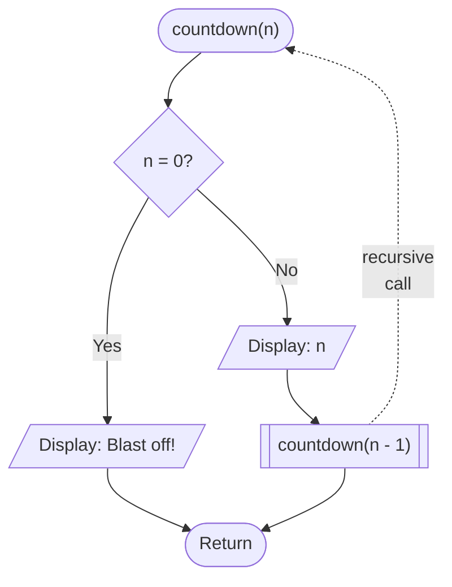
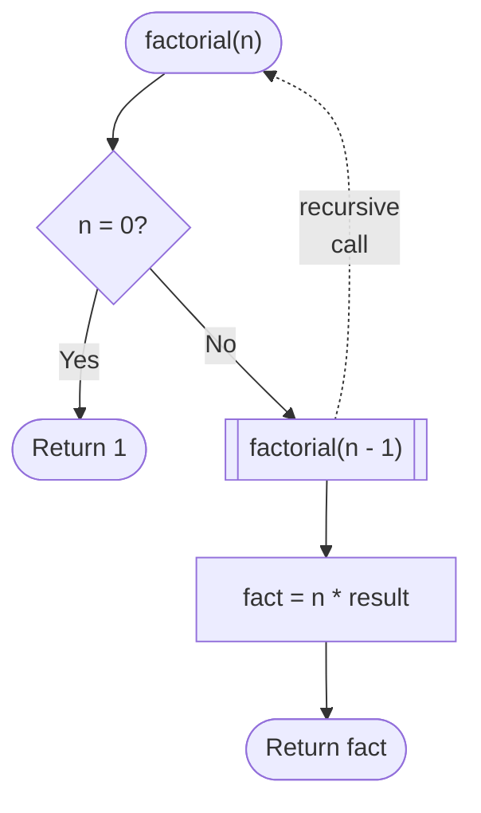
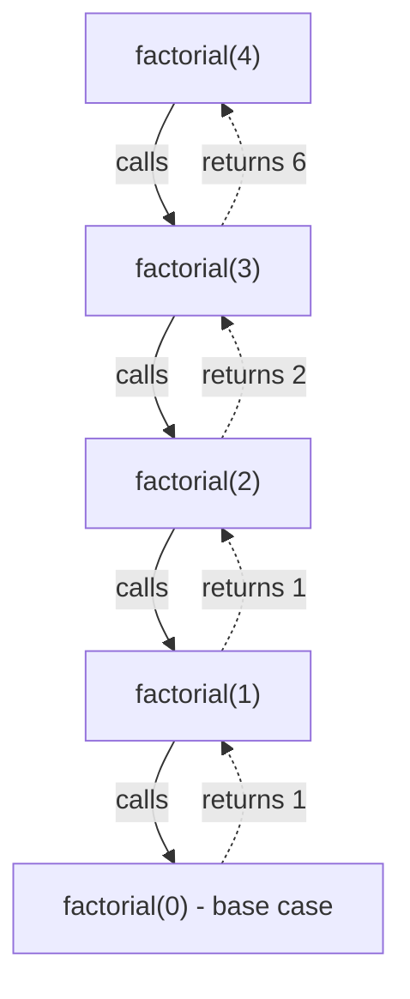

# Recursion

A **recursive** function is one that **calls itself** as part of its own definition. This sounds circular at first, but it's a powerful technique for solving problems that can be broken down into **smaller versions of the same problem**.

Think of it like a set of Russian dolls - each one contains a smaller version of itself, until you reach the tiniest one that doesn't open any further.

## The Two Key Parts

Every recursive function needs exactly two things:

| Part | Purpose |
|------|---------|
| **Base case** | The stopping condition - the function returns a result without calling itself |
| **Recursive case** | Where the function calls itself with a simpler version of the problem |

> [!IMPORTANT]
> Without a base case, the function calls itself forever - crashing with a **stack overflow** error. **Always define the base case first**.

---

## Example: Countdown

A simple example - counting down from a number to zero...

```pseudo
start countdown (n)
    if n = 0 then
        display "Blast off!"
        return
    endif

    display n

    call countdown (n - 1)
end
```

And here it is as a flowchart...



And here is a runnable Python implementation...

```python run
def countdown(n):
    if n == 0:          # base case
        print("Blast off!")
        return

    print(n)
    countdown(n - 1)    # recursive case

countdown(5)
```

---

## Example: Factorial

The **factorial** of a number is the product of all positive integers from 1 up to that number. For example:

`4! = 4 × 3 × 2 × 1 = 24`

Factorial is a classic example because the problem defines itself naturally:

- Recursive call: `n! = n × (n−1)!`
- Base case of: `0! = 1`


```pseudo
start factorial (n)
    if n = 0 then
        return 1
    endif

    fact = n * call factorial (n - 1)

    return fact
end
```

And here as a flowchart...



And here is a runnable Python implementation...

```python run
def factorial(n):
    if n == 0:
        return 1                    # base case
    return n * factorial(n - 1)    # recursive case

print(f"4! = {factorial(4)}")      # 24
print(f"6! = {factorial(6)}")      # 720
```

### How It Unwinds

When you call `factorial(4)`, each function call **waits** for the next one to complete before it can finish. The calls work their way down to the base case, then **return values back up the chain**...



> [!NOTE]
> This chain of waiting function calls is held in memory as the **call stack**. Each call is added to the stack until the base case is reached, then they are resolved one by one as values are returned back up.

---

## Where Recursion Is Used

Recursion appears throughout computer science. Two examples from these notes:

| Algorithm | How recursion is used |
|-----------|-----------------------|
| [Merge sort](programming/algorithms/sorting.md) | The list is split in half, and each half is sorted by calling the same function again |
| [Tree traversal](programming/algorithms/trees.md) | Each node's children are visited by calling the same traversal function again |
