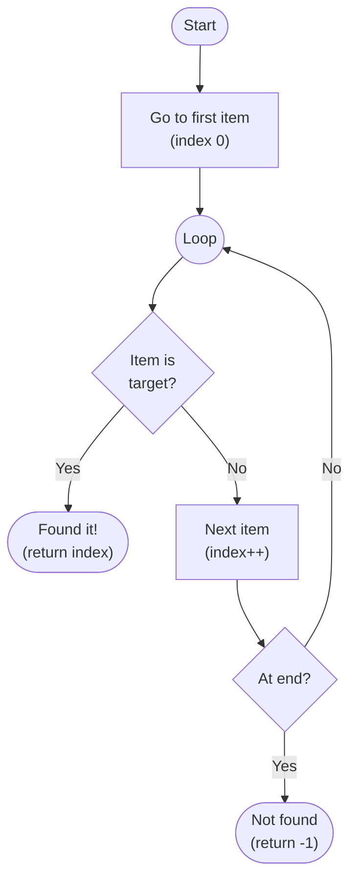
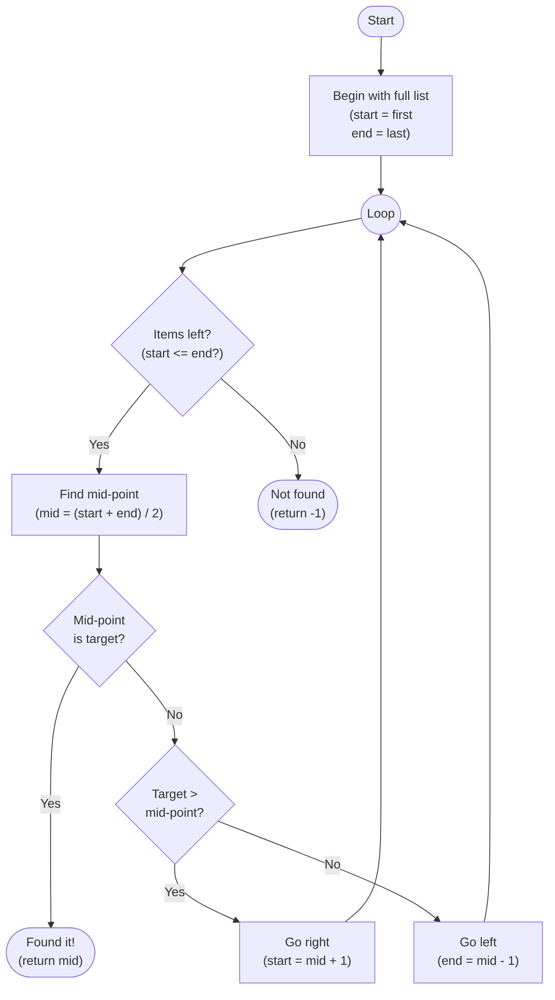

# Searching Algorithms

When data is stored in a list or database, you often need to find a specific item. **Searching algorithms** are the step-by-step methods computers use to locate an item within a dataset.

The best approach depends on what you know about your data...


## Linear Search

The simplest approach is to check each item **one by one**, starting from the beginning of the list, until you find what you're looking for — or run out of items...

```
1. Start at the first item in the list
2. Repeat, until there are no items left to search:
   a. If this is the target, return its position
   b. Otherwise, move on to the next item
4. When there are no items left, return -1
```



```python run
def linear_search(items, target):
    """
    Perform a simple linear search over a given list.
    List can be unsorted. Simply checks each item in turn
    to see if it matches the target
    """

    print(f"Looking for: {target} in {items}")

    for index in range(len(items)):     # work through the list
        print(f"  Item {index}: {items[index]}... ", end="")

        if items[index] == target:      # have a match?
            print("Found!\n")
            return index                # pass back its location
        else:
            print("No")

    print("  Not found\n")
    return -1                           # no match, so pass back -1

#----------------------------------------------------
# Testing the algorithm with an unsorted list

items = [99, 13, 37, 67, 33, 12, 28, 78, 42, 17]

linear_search(items, 13)
linear_search(items, 42)
linear_search(items, 67)
linear_search(items, 88)
```

> [!NOTE]
> Linear search works on **any list** — sorted or unsorted. However, it must check every item in the worst case, which makes it slow for large datasets.


## Binary Search

If your list is **already sorted**, you can do much better. Binary search works by repeatedly **halving the search area** — like looking up a word in a dictionary by opening it in the middle and deciding which half to search...

```
1. Start with the full list
2. While there are items left to search:
    a. Find the midpoint value
    b. If this is the target, return the mid-point index
    c. Else, if mid-point < target, search left half
    d. Else, search right half
3. When no items are left, return -1 (not found)
```



```python run
def binary_search(items, target):
    """
    Perform a binary search on a given list. The list
    *must* be sorted for this to work. Begin at the
    mid-point, checking value. If target not found,
    reject half, and then repeat for the remaining half
    """

    start = 0
    end = len(items) - 1           # start with full list

    print(f"Looking for: {target} in {items}")

    while start <= end:            # loop while value still to check
        mid = (start + end) // 2   # find mid-point

        print(f"  Item {mid}: {items[mid]}... ", end="")

        if items[mid] == target:   # found it?
            print("Found!\n")
            return mid             # yes, so pass back location

        elif target > items[mid]:  # no, so see which half to check next

            start = mid + 1        # reject left half, process right
            print("No, go right: ", end="")
        else:
            end = mid - 1          # reject right half, process left
            print("No, go left:  ", end="")

        print(items[start:end+1])

    print("  Not found\n")
    return -1                      # didn't find target, so pass back -1

#----------------------------------------------------
# Testing the algorithm on a *sorted* list

items = [12, 13, 17, 28, 33, 37, 42, 67, 78, 99]

binary_search(items, 13)
binary_search(items, 42)
binary_search(items, 67)
binary_search(items, 88)
```

> [!TIP]
> Binary search is **much faster** than linear search for large **sorted** lists. Searching one million items takes at most 20 steps — compared to up to one million steps with linear search.

| Algorithm | Works on unsorted data? | Worst-case steps (n items) |
|-----------|------------------------|----------------------------|
| Linear search | Yes | n |
| Binary search | No — list must be sorted | log₂(n) |

