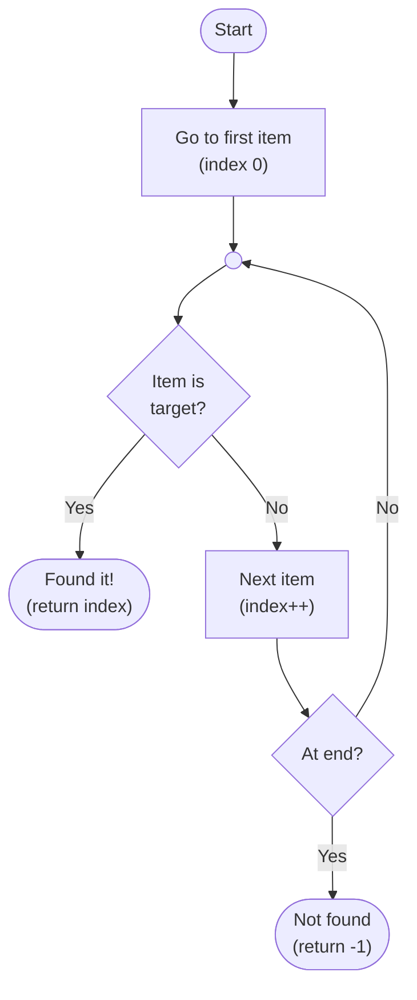
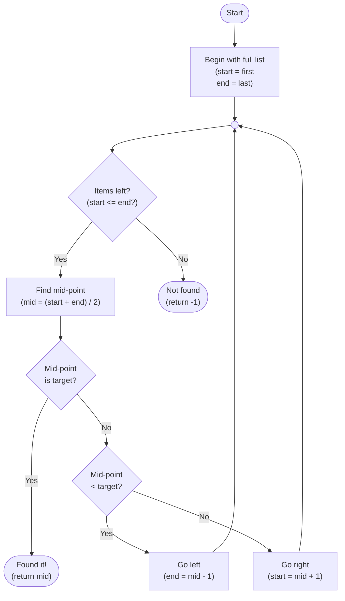

# Searching Algorithms

When data is stored in a list or database, you often need to find a specific item. **Searching algorithms** are the step-by-step methods computers use to locate an item within a dataset.

The best approach depends on what you know about your data...


## Linear Search

The simplest approach is to check each item **one by one**, starting from the beginning of the list, until you find what you're looking for — or run out of items...

```
1. Start at the first item in the list
2. Repeat, until there are no items left to search:
   a. If this is the target, return its position
   b. Otherwise, move on to the next item
4. When there are no items left, return -1
```



```python run
def linear_search(items, target):
    for index in range(len(items)):
        if items[index] == target:
            return index
    return -1

# Testing the algorithm with an unsorted list

items = [13, 10, 12, 42, 17, 2, 28, 7, 33]

print("Searching for 13:", linear_search(items, 13))
print("Searching for 42:", linear_search(items, 42))
print("Searching for 67:", linear_search(items, 67))
```

> [!NOTE]
> Linear search works on **any list** — sorted or unsorted. However, it must check every item in the worst case, which makes it slow for large datasets.


## Binary Search

If your list is **already sorted**, you can do much better. Binary search works by repeatedly **halving the search area** — like looking up a word in a dictionary by opening it in the middle and deciding which half to search...

```
1. Start with the full list
2. While there are items left to search:
    a. Find the midpoint value
    b. If this is the target, return the mid-point index
    c. Else, if mid-point < target, search left half
    d. Else, search right half
3. When no items are left, return -1 (not found)
```



```python run
def binary_search(items, target):
    low = 0
    high = len(items) - 1

    while low <= high:
        mid = (low + high) // 2

        if items[mid] == target:
            return mid
        elif items[mid] < target:
            low = mid + 1
        else:
            high = mid - 1

    return -1

# Testing the algorithm on a sorted list

items = [2, 7, 10, 12, 13, 17, 28, 33, 42]

print("Searching for 13:", binary_search(items, 13))
print("Searching for 42:", binary_search(items, 42))
print("Searching for 67:", binary_search(items, 67))
```

> [!TIP]
> Binary search is **much faster** than linear search for large **sorted** lists. Searching one million items takes at most 20 steps — compared to up to one million steps with linear search.

| Algorithm | Works on unsorted data? | Worst-case steps (n items) |
|-----------|------------------------|----------------------------|
| Linear search | Yes | n |
| Binary search | No — list must be sorted | log₂(n) |

