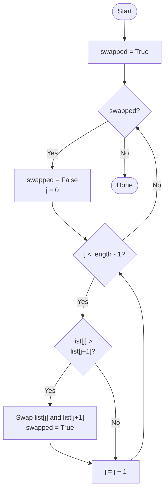
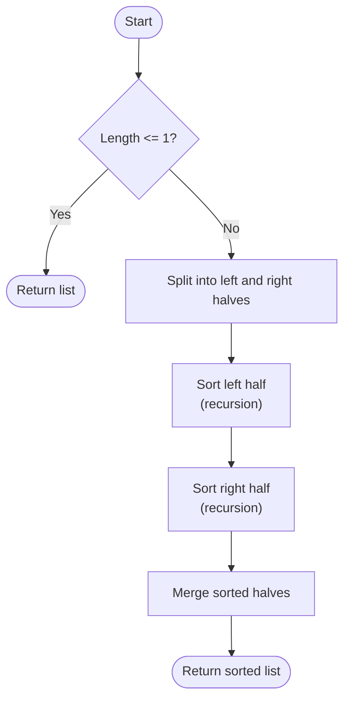

# Sorting Algorithms

Often computer programs need to sort lists of data — for example, putting names in alphabetical order, or ranking scores from highest to lowest.

There are many different sorting algorithms, each with different trade-offs between simplicity and speed. Here are two well-known examples...


## Bubble Sort

Bubble sort works by repeatedly stepping through the list and **comparing adjacent pairs** of items. If a pair is in the **wrong order**, they are **swapped**. This process repeats until no swaps are needed — meaning the list is sorted.

It gets its name because larger values gradually "bubble up" to their correct position at the end of the list...

- Repeatedly pass over the list from start to end:
    - For each pass, beginning from the left:
        - Compare adjacent pair of items:
        - If the left item > the right item, swap them
        - Move on to the next pair of items
    - If no swaps occurred, list is sorted, so stop
    - Otherwise, start the next pass
- When stopped passing over the list, return the sorted list




```python run
def bubble_sort(items):
    for p in range(1, len(items)):
        swapped = False
        print(f"\nPass {p}")

        for i in range(0, len(items) - 1):
            print(" ", items, " ", items[i], "<->", items[i+1], end="  ")

            if items[i] > items[i + 1]:
                items[i], items[i + 1] = items[i + 1], items[i]
                swapped = True
                print(f"Swap!")
            else:
                print("Ok")

        print(" ", items)

        if not swapped:
            print("  No swaps!\n")
            break

    return items

# Testing the algorithm with an unsorted list

items = [13, 99, 67, 42, 17, 33, 12, 28]

print("Before:", items)
items = bubble_sort(items)
print("Sorted:", items)
```

> [!NOTE]
> Bubble sort is easy to understand, but it's slow for large lists. In the worst case, it compares nearly every pair of items many times over.


## Merge Sort

Merge sort uses a **divide and conquer** approach. It repeatedly splits the list in half until each piece contains a single item, then merges those pieces back together in sorted order.

Because a single item is always sorted, building back up from small pieces is straightforward...

```
Sort a list:
1. If the list has 0 or 1 items, it is already sorted — return it
2. Split the list into two halves
3. Recursively sort the left half
4. Recursively sort the right half
5. Merge the two sorted halves together

Merge two sorted lists:
1. Create an empty result list
2. While both lists still have items:
    a. Compare the first item of each list
    b. Move the smaller one into the result
3. Append any remaining items from either list
4. Return the result
```



```python run
def merge_sort(items):
    if len(items) <= 1:
        return items

    mid = len(items) // 2
    left = items[:mid]
    right = items[mid:]

    print("\n   Cut:", items, " -> ", left, "", right)

    left = merge_sort(left)
    right = merge_sort(right)

    return merge(left, right)


def merge(left, right):
    result = []
    i = j = 0

    print("\n Merge:", left, "+", right)

    while i < len(left) and j < len(right):
        if left[i] <= right[j]:
            result.append(left[i])
            i += 1
        else:
            result.append(right[j])
            j += 1
        print("       ", result)

    result.extend(left[i:])
    result.extend(right[j:])
    print("       ", result, "\n")

    return result

# Testing the algorithm with an unsorted list

items = [13, 99, 67, 42, 17, 33, 12, 28]

print("Before:", items)
items = merge_sort(items)
print("Sorted:", items)

```

> [!TIP]
> Merge sort is significantly faster than bubble sort for large lists. It is widely used in practice and is the basis for sorting in many programming languages.

| Algorithm | Simplicity | Worst-case steps (n items) |
|-----------|------------|----------------------------|
| Bubble sort | Simple | n² |
| Merge sort | More complex | n log n |

