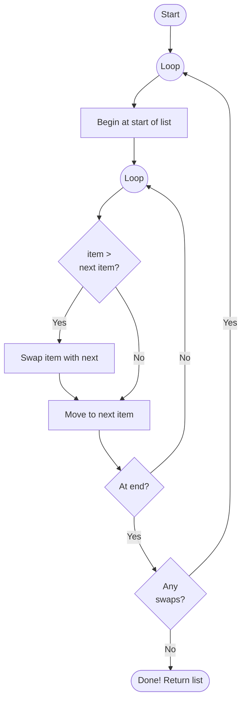
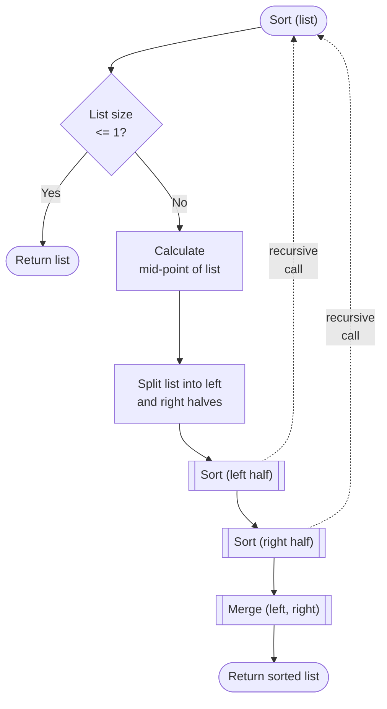
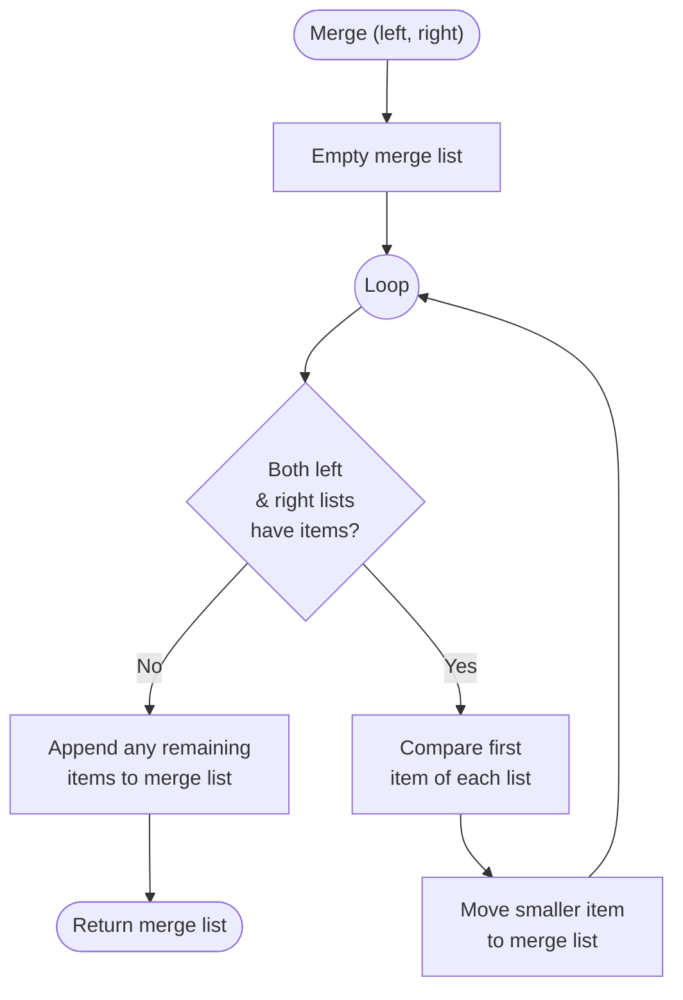

# Sorting Algorithms

Often computer programs need to sort lists of data - for example, putting names in alphabetical order, or ranking scores from highest to lowest.

There are many different sorting algorithms, each with different trade-offs between simplicity and speed. Here are two well-known examples...


## Bubble Sort

Bubble sort works by repeatedly stepping through the list and **comparing adjacent pairs** of items. If a pair is in the **wrong order**, they are **swapped**. This process repeats until no swaps are needed - meaning the list is sorted.

It gets its name because larger values gradually "bubble up" to their correct position at the end of the list.

> [!NOTE]
> Bubble sort is easy to understand, but it's slow for large lists. In the worst case, it compares nearly every pair of items many times over.


Here is the algorithm is pseudo-code...

```pseudo
start
    // Loop for repeatedly passing over list
    repeat
        go to the start of the list
        // Loop for working through items
        repeat
            compare item with next one
            if item > next one then
                swap items
            endif
            move onto next item
        until get to end of list

        if no swaps occurred then
            return list
        endif
    endrepeat
end
```

And here it is in flowchart form...



Here is a runnable Python implementation of a bubble sort, with print statements so you can see it progress...

```python run
def bubble_sort(items):
    """
    Perform a bubble sort on a given list. The list is
    passed over multiple times, each pass comparing
    adjacent items and swapping them if out of order.
    Passes stop when no swaps occur - list is in order
    """
    for p in range(1, len(items)):          # pass loop: max passes = size of list
        swapped = False
        print(f"\nPass {p}")

        for i in range(0, len(items) - 1):  # work through each item

            print(f"  {items}   {items[i]} <-> {items[i+1]}", end="  ")

            if items[i] > items[i + 1]:     # if items are out of order...
                items[i], items[i + 1] = items[i + 1], items[i]     # swap them
                swapped = True
                print(f"Swap!")
            else:
                print("Ok")

        print(" ", items)

        if not swapped:                     # No swaps mean we're done
            print("  No swaps!\n")
            break

    return items

#---------------------------------------------------------
# Testing the algorithm with an unsorted list

items = [13, 99, 67, 42, 17, 33, 12, 28]

print("Before:", items)
items = bubble_sort(items)
print("Sorted:", items)
```

## Merge Sort

Merge sort uses a **divide and conquer** approach. It repeatedly splits the list in half until each piece contains a single item, then merges those pieces back together in sorted order.

Because a single item is always sorted, building back up from small pieces is straightforward.

> [!TIP]
> Merge sort is significantly faster than bubble sort for large lists. It is widely used in practice and is the basis for sorting in many programming languages.
> See the Algorithmic Complexity notes in the Computer Science section for more details

This is the algorithm for a merge sort in pseudo-code...

```pseudo
start sort(list)
    if list contains 0 or 1 items only
        return the list
    endif

    calculate the mid-point of the list
    split the list into left and right halves

    sortedLeft  = call sort(left half of list)
    sortedRight = call sort(right half of list)

    call merge(sortedLeft, sortedRight)

    return the merged list
end


start merge(left, right)
    create an empty merge list

    repeat while both lists have items
        compare first item of left & right lists
        move smaller item into the merge list
    endrepeat

    append any remaining list items to the merge list

    return the merge list
end
```

And here it is as a flowchart, first showing the **recursive sort** function...



... and here the **merge** function used above...



This is a runnable implementation of a merge sort in Python, with print statements showing the progress...


```python run
def merge_sort(items):
    """
    Perform a merge sort on a given list. The list is
    split in half and the function is called recursively
    on each half
    """

    if len(items) <= 1:			# can't split any further?
        return items

    mid = len(items) // 2		# find mid-point and split list
    left = items[:mid]
    right = items[mid:]

    print(f"\n   Cut: {items}  ->  {left}  {right}")

    leftSorted = merge_sort(left)	       # process list halves
    rightSorted = merge_sort(right)

    return merge(leftSorted, rightSorted)  # merge the halves


def merge(left, right):
    """
    Merge together two given sorted lists to give a
    final list combining the sorted values in order
    """

    result = []
    i = j = 0

    print(f"\n Merge: {left} + {right}")

    while i < len(left) and j < len(right):
        if left[i] <= right[j]:
            result.append(left[i])      # left list value is smallest
            i += 1
        else:
            result.append(right[j])     # right list value is smallest
            j += 1
        print(f"        {result}")

    result.extend(left[i:])             # add on any remaining values
    result.extend(right[j:])
    print(f"        {result}\n")

    return result

#---------------------------------------------------------
# Testing the algorithm with an unsorted list

items = [13, 99, 67, 42, 17, 33, 12, 28]

print("Before:", items)
items = merge_sort(items)
print("Sorted:", items)

```

