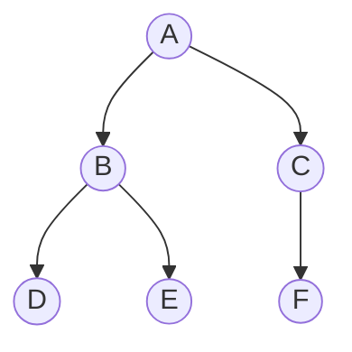
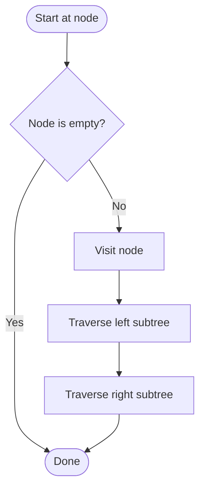
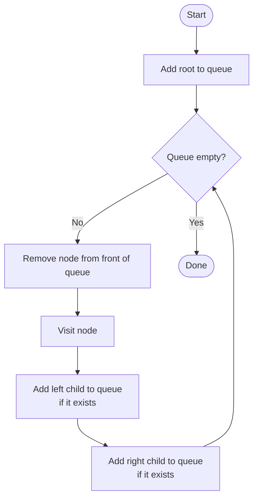

# Tree Traversal Algorithms

A **tree** is a data structure made up of **nodes** connected by **edges**, arranged in a hierarchy. The node at the top is called the **root**, and each node can have **child nodes** below it...



> [!NOTE]
> In a **binary tree**, each node has at most two children — referred to as the **left** and **right** child. The tree above is a binary tree with root **A**.

There are a number of ways that trees can be **traversed** — that is, visited node by node in a specific order. The two main categories are **depth-first** and **breadth-first**...


## Depth-First

Depth-first traversal explores as **far down a branch** as possible before backtracking. There are three common orderings:

| Order | Visit sequence |
|-------|----------------|
| **Pre-order** | Root, Left, Right |
| **In-order** | Left, Root, Right |
| **Post-order** | Left, Right, Root |

Using the tree above:

| Order | Result |
|-------|--------|
| Pre-order | A, B, D, E, C, F |
| In-order | D, B, E, A, F, C |
| Post-order | D, E, B, F, C, A |

The algorithm is naturally **recursive** — each call handles one node, then calls itself on the left and right children...

```
Pre-order traversal:
1. If the node is empty, stop
2. Visit the node
3. Traverse the left subtree
4. Traverse the right subtree
```



```python
def pre_order(node):
    if node is None:
        return
    print(node.value)       # visit
    pre_order(node.left)    # then left
    pre_order(node.right)   # then right
```

> [!TIP]
> To get **in-order** traversal, move the `print` line between the two recursive calls. For **post-order**, move it after both.


## Breadth-First

Breadth-first traversal (also called **level-order** traversal) visits nodes **level by level**, from top to bottom and left to right.

Using the tree above, the result would be: **A, B, C, D, E, F**

Instead of recursion, breadth-first search uses a **queue** — a structure where items are added to the back and removed from the front...

```
1. Add the root node to the queue
2. While the queue is not empty:
    a. Remove the node at the front of the queue
    b. Visit that node
    c. Add its left child to the queue (if it exists)
    d. Add its right child to the queue (if it exists)
```



```python
from collections import deque

def breadth_first(root):
    if root is None:
        return

    queue = deque([root])

    while queue:
        node = queue.popleft()      # remove from front
        print(node.value)           # visit

        if node.left:
            queue.append(node.left)
        if node.right:
            queue.append(node.right)
```

| Traversal | Order visited | Data structure used |
|-----------|---------------|---------------------|
| Depth-first | Down each branch first | Stack / recursion |
| Breadth-first | Level by level | Queue |

