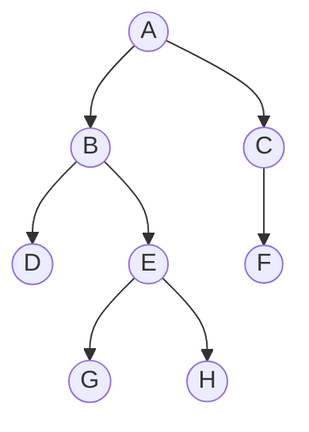
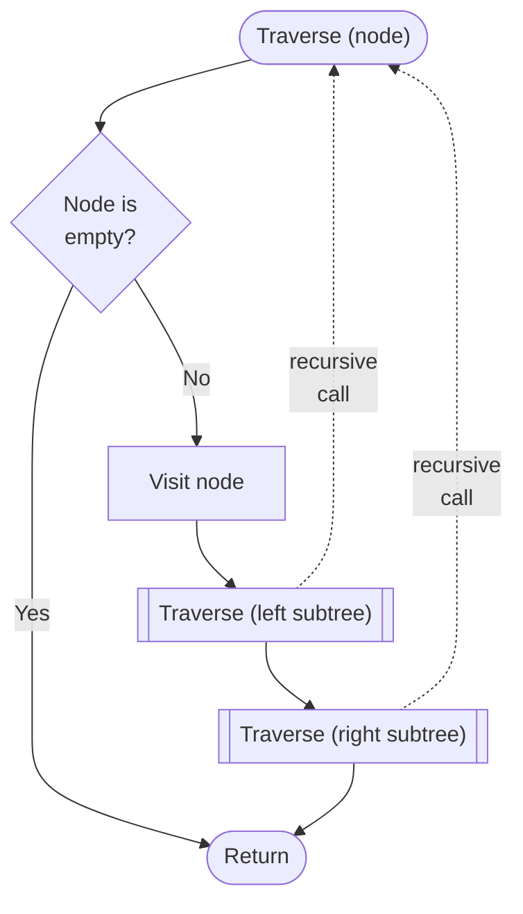

# Tree Traversal Algorithms

A **tree** is a data structure made up of **nodes** connected by **edges**, arranged in a hierarchy. The node at the top is called the **root**, and each node can have **child nodes** below it...



> [!NOTE]
> In a **binary tree**, each node has at most two children - referred to as the **left** and **right** child. The tree above is a binary tree with **root: A**.

There are a number of ways that trees can be **traversed** - that is, visited node by node in a specific order. The two main categories are **depth-first** and **breadth-first**...


## Depth-First

Depth-first traversal explores as **far down a branch** as possible before backtracking. There are three common orderings:

| Order          | Visit sequence    | Result for example tree |
| -------------- | ----------------- | ----------------------- |
| **Pre-order**  | Root, Left, Right | A, B, D, E, G, H, C, F  |
| **In-order**   | Left, Root, Right | D, B, G, E, H, A, F, C  |
| **Post-order** | Left, Right, Root | D, G, H, E, B, F, C, A  |

> [!NOTE]
> The algorithm is naturally **recursive** - each call handles one node, then **calls itself** on the left and right children.

Here is the pre-order algorithm in pseudo-ce...

```pseudo
start traverse (node)
    if node is empty then
        return
    endif

    visit node
    call traverse (left subtree)
    call traverse (right subtree)
end
```

And here is is as a flowchart...



This is a runnable Python implementation of the **pre-order** algorithm...

```python setup=example_tree
#---------------------------------------
# Define the tree

class Node:
    def __init__(self, value):
        self.value = value
        self.left = None
        self.right = None

# Build the tree
a = Node("A")
b = Node("B")
c = Node("C")
d = Node("D")
e = Node("E")
f = Node("F")
g = Node("G")
h = Node("H")

a.left = b
a.right = c
b.left = d
b.right = e
c.left = f
e.left = g
e.right = h

root = a
```

```python run setup=example_tree
def depth_first_pre_order(node):
    """
    Perform a depth-first, pre-order traversal of a given tree
    """
    if node is None:
        return

    print(f" → {node.value}", end="")   # 1. visit node
    depth_first_pre_order(node.left)    # 2. then go left
    depth_first_pre_order(node.right)   # 3. then go right

#---------------------------------------
# Test the algorithm on the example tree

print("Depth-first, pre-order...")
depth_first_pre_order(root)
```

This is a runnable Python implementation of the **in-order** algorithm...

```python run setup=example_tree
def depth_first_in_order(node):
    """
    Perform a depth-first, in-order traversal of a given tree
    """
    if node is None:
        return

    depth_first_in_order(node.left)     # 1. go left
    print(f" → {node.value}", end="")   # 2. then visit node
    depth_first_in_order(node.right)    # 3. then go right

#---------------------------------------
# Test the algorithm on the example tree

print("Depth-first, in-order...")
depth_first_in_order(root)
```

This is a runnable Python implementation of the **post-order** algorithm...

```python run setup=example_tree
def depth_first_post_order(node):
    """
    Perform a depth-first, post-order traversal of a given tree
    """
    if node is None:
        return

    depth_first_post_order(node.left)   # 1. go left
    depth_first_post_order(node.right)  # 2. then go right
    print(f" → {node.value}", end="")   # 3. then visit node

#---------------------------------------
# Test the algorithm on the example tree

print("Depth-first, post-order...")
depth_first_post_order(root)
```

> [!NOTE]
> The above algorithms are all the same, except for the order of the `print` statement and the recursive calls.


## Breadth-First

Breadth-first traversal (also called **level-order** traversal) visits nodes **level by level**, from top to bottom and left to right.

Using the tree above, the result would be: **A, B, C, D, E, F, G, H**

Instead of recursion, breadth-first search uses a **queue** - a structure where items are added to the back and removed from the front...

```pseudo
start
    add root to queue

    repeat until queue is empty
        remove node from front of queue
        visit node

        if node has left child then
            add left child to queue
        endif

        if node has right child then
            add right child to queue
        endif
    endrepeat
end
```


```python run setup=example_tree
from collections import deque

def breadth_first(root):
    """
    Perform a breadth-first traversal of a given tree
    """

    if root is None:
        print("Done!")
        return

    queue = deque([root])

    while queue:
        node = queue.popleft()          # remove from front

        print(node.value, end=" → ")    # visit node

        if node.left:
            queue.append(node.left)
        if node.right:
            queue.append(node.right)

#---------------------------------------
# Test the algorithm on the example tree

print("Breadth-first...")
breadth_first(root)
```

| Traversal | Order visited | Data structure used |
|-----------|---------------|---------------------|
| Depth-first | Down each branch first | Stack / recursion |
| Breadth-first | Level by level | Queue |

