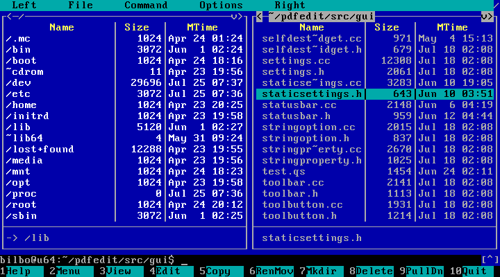

# Laying Out Data in the Console

Plain `println`(kotlin) output can quickly become hard to read. Kotlin gives you tools to align columns, pad values, and draw borders using box-drawing characters - turning raw output into something that looks intentional.

## Padding and Alignment

`padStart(n)`(kotlin) and `padEnd(n)`(kotlin) pad a string to a fixed width with spaces (or any character you choose):

```kotlin run
val item1  = "Health Potion"
val price1 = "4.99"
val item2  = "Battle Axe"
val price2 = "13.50"

println(item1.padEnd(15) + price1.padStart(8))
println(item2.padEnd(15) + price2.padStart(8))
```

`padStart`(kotlin) aligns text to the **right** (adds spaces before), `padEnd`(kotlin) aligns to the **left** (adds spaces after).

To pad with a custom character, pass it as the second argument:

```kotlin run
val label1 = "Player"
val value1 = "Jimmy Tickles"
val label2 = "Score"
val value2 = "12345"

println(label1.padEnd(10, '.') + value1.padStart(15, '.'))
println(label2.padEnd(10, '.') + value2.padStart(15, '.'))
```

> [!TIP]
> `padStart`(kotlin) and `padEnd`(kotlin) only add padding - they **never truncate**. If the string is already longer than `n`, it is returned unchanged. Use `.take(n)`(kotlin) first if you need a hard limit.


## Formatting in Columns

A more powerful alternative to `padStart()`(kotlin) and `padEnd()`(kotlin) is to use `String.format()`(kotlin) to format values. You can specify fixed widths, trim decimal places, show thousand separators, etc.:

```
Item                  Price
---------------------------
Sword                14,900
Shield                8,950
Health Potion           400
Map                  12,500
```

This example shows a Map formatted in neatly aligned columns:

```kotlin run
val items = mapOf(
    "Sword"         to 14900,
    "Shield"        to 8950,
    "Health Potion" to 400,
    "Map"           to 12500
)

println("%-20s %6s".format("Item", "Price"))
println("-".repeat(27))

for ((name, price) in items) {
    println("%-20s %,6d".format(name, price))
}
```

Format specifiers for `String.format()`(kotlin):

| Specifier | Meaning | Example |
|-----------|---------|-----|
| `%s`      | String | `"Carrot"` |
| `%10s`    | Right-align, 10 wide | `"    Carrot"` |
| `%-10s`   | Left-align, 10 wide | `"Carrot    "` |
| `%d`      | Integer | `"12345"` |
| `%,d`     | Integer with commas | `"12,345"` |
| `%010d`   | Zero-pad integer, width 10 | `"0000012345"` |
| `%f`      | Float / Double | `"3.14159"` |
| `%.2f`    | Float to 2 decimal places | `"3.14"` |
| `%10.2f`  | Float to 2 dp, width 10 | `"      3.14"` |


## Box Drawing Characters

Box-drawing characters let you draw borders and dividers that look clean in any monospace terminal:
- Edges: `─` `│`
- Corners: `┌` `┐` `└` `┘`
- Junctions: `├` `┤` `┬` `┴` `┼`

These characters can create very neat borders:

```
┌───┐┌───┐┌───┐┌┐   ┌┐
│┌──┘│┌┐ ││┌┐ │││   ││
││   │││ ││││ │││   └┘
│└──┐│└┘ ││└┘ ││└──┐┌┐
└───┘└───┘└───┘└───┘└┘
```

> [!TIP]
> You can paste these characters directly into your Kotlin strings. There are also [many more box-drawing characters](https://www.compart.com/en/unicode/block/U+2500): double-lined boxes, thicker lines, dashed lines and round corners.

A simple example drawing a box around a message:

```
┌───────────────┐
│ Hello, World! │
└───────────────┘
```

This example matches the width of the box to the message inside:


```kotlin run
fun printInBox(message: String) {
    val width = message.length + 2

    println("┌" + "─".repeat(width) + "┐")
    println("│ $message │")
    println("└" + "─".repeat(width) + "┘")
}

fun main() {
    printInBox("Game Over")
    printInBox("You are the winner!")
}
```


## Lists as a **Vertical** Table

Combining padding and box-drawing characters produces a proper, vertical table:

```
┌────────────┐
│ Names      │
├────────────┤
│ Alice      │
│ Bob        │
│ Zara       │
│ Charlie    │
└────────────┘
```

This example displays a list of `String`(kotlin) values in a table:

```kotlin run
fun printAsTable(items: List<String>, heading: String, width: Int) {
    val top = "┌" + "─".repeat(width + 2) + "┐"
    val mid = "├" + "─".repeat(width + 2) + "┤"
    val bot = "└" + "─".repeat(width + 2) + "┘"

    fun printAsRow(s: String) = println("│ ${s.padEnd(width)} │")

    println(top)
    printAsRow(heading)
    println(mid)

    for (item in items) printAsRow(item)

    println(bot)
}

fun main() {
    val names = listOf("Alice", "Bob", "Zara", "Charlie")
    printAsTable(names, "Names", 10)

    val grades = listOf("Not Achieved", "Achieved", "Merit", "Excellence")
    printAsTable(grades, "NCEA Grades", 15)
}
```


## Lists as a **Horizontal** Table

Tables can also be drawn horizontally:

```
┌─────┬─────┬─────┬─────┬─────┬─────┐
│  42 │  12 │  99 │  67 │ 100 │  13 │
└─────┴─────┴─────┴─────┴─────┴─────┘
```

This example shows a list of `Int`(kotlin) values as a table:

```kotlin run
fun printAsHorizTable(items: List<Int>, width: Int = 3) {
    val count = items.size
    val line = "─".repeat(width + 2)
    val top = ("┌" + line) + ("┬" + line).repeat(count - 1) + "┐"
    val bot = ("└" + line) + ("┴" + line).repeat(count - 1) + "┘"

    fun printAsCol(s: String) = print("│ ${s.padStart(width)} ")

    println(top)

    for (item in items) printAsCol("%,d".format(item))
    println("│")

    println(bot)
}

fun main() {
    val scores = listOf(42, 12, 99, 67, 100, 13)
    printAsHorizTable(scores)

    val distances = listOf(120000, 99999, -50000, 666666)
    printAsHorizTable(distances, 8)
}
```

## Terminal UIs (TUIs)

Box-drawing characters have been used for decades to create terminal UIs (TUIs). Before the rise of GUIs in the 80s, many computer applications looked like this:

