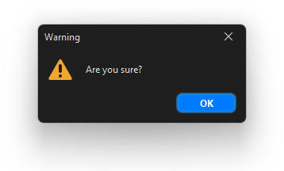
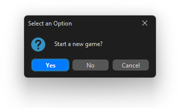
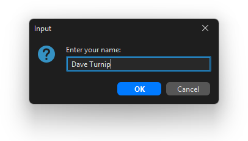

# Dialog (Pop-Up) Windows

Sometimes you need a small pop-up - to show a message, ask a yes/no question, or prompt for some input. Swing gives you two options: `JOptionPane`(kotlin) for quick built-in dialogs, and `JDialog`(kotlin) when you need something custom.


## JOptionPane - Quick Built-In Dialogs

`JOptionPane`(kotlin) handles the most common cases with a single line of code. All of its methods are static - no object needed.


### Showing a Message

Displays a message and an OK button. Blocks until the user dismisses it.

```kotlin
JOptionPane.showMessageDialog(frame, "Game over! Better luck next time.")
```

The first argument is the **parent window** - Swing uses it to centre the dialog over the right window. Pass `frame`(kotlin) from your `MainWindow`(kotlin), or `null`(kotlin) to centre on screen.

You can also set the dialog type to change the icon shown:

```kotlin
JOptionPane.showMessageDialog(
    frame,
    "File saved!",
    "Success",
    JOptionPane.INFORMATION_MESSAGE
)
```


```kotlin
JOptionPane.showMessageDialog(
    frame,
    "Something went wrong.",
    "Error",
    JOptionPane.ERROR_MESSAGE
)
```


```kotlin
JOptionPane.showMessageDialog(
    frame,
    "Are you sure?",
    "Warning",
    JOptionPane.WARNING_MESSAGE
)
```



### Asking a Yes/No Question

`showConfirmDialog`(kotlin) returns an `Int`(kotlin) - compare against `JOptionPane.YES_OPTION`(kotlin):

```kotlin
val result = JOptionPane.showConfirmDialog(
    frame,
    "Start a new game?"
)

if (result == JOptionPane.YES_OPTION) {
    app.reset()
    updateUI()
}
```




### Asking for Text Input

`showInputDialog`(kotlin) shows a text field and returns the typed string - or `null`(kotlin) if the user cancelled:

```kotlin
val name = JOptionPane.showInputDialog(
    frame,
    "Enter your name:"
)

if (!name.isNullOrBlank()) {
    player.name = name.trim()
    updateUI()
}
```




## JDialog - Custom Dialogs

When you need a more complex pop-up - with multiple elements, your own layout, or specific behaviour - use `JDialog`(kotlin). Structure it exactly like a `MainWindow`(kotlin), but extending `JDialog`(kotlin) instead of wrapping a `JFrame`(kotlin).

```kotlin
import com.formdev.flatlaf.FlatDarkLaf
import java.awt.*
import javax.swing.*

class InfoDialog(owner: JFrame, val app: App) {
    private val dialog = JDialog(owner, "Game Info", false)  // false = non-modal
    private val panel  = JPanel().apply { layout = null }

    private val scoreLabel = JLabel()
    private val closeButton = JButton("Close")

    init {
        setupLayout()
        setupStyles()
        setupActions()
        setupWindow()
    }

    private fun setupLayout() {
        panel.preferredSize = Dimension(240, 160)

        scoreLabel.setBounds(30, 30, 180, 40)
        closeButton.setBounds(60, 100, 120, 35)

        panel.add(scoreLabel)
        panel.add(closeButton)
    }

    private fun setupStyles() {
        scoreLabel.font  = Font(Font.SANS_SERIF, Font.BOLD, 20)
        closeButton.font = Font(Font.SANS_SERIF, Font.PLAIN, 16)
    }

    private fun setupActions() {
        closeButton.addActionListener { dialog.isVisible = false }
    }

    private fun setupWindow() {
        dialog.isResizable = false
        dialog.defaultCloseOperation = JDialog.HIDE_ON_CLOSE
        dialog.contentPane = panel
        dialog.pack()
        dialog.setLocationRelativeTo(dialog.owner)
    }

    fun updateUI() {
        scoreLabel.text = "Score: ${app.score}"
    }

    fun show() {
        updateUI()
        dialog.isVisible = true
    }
}
```

Declare it in `MainWindow` and open it from a button handler:

```kotlin
class MainWindow(val app: App) {
    // ...
    private val infoDialog = InfoDialog(frame, app)

    private fun setupActions() {
        infoButton.addActionListener { handleInfoClick() }
    }

    private fun handleInfoClick() {
        infoDialog.show()
    }
}
```

> [!TIP]
> `setLocationRelativeTo(dialog.owner)`(kotlin) centres the dialog over its parent window. This is nicer than centring on screen when the parent window isn't centred itself.


## Modal vs Non-Modal

The third argument to `JDialog(owner, title, modal)`(kotlin) controls whether the dialog **blocks** the parent window:

| Value | Behaviour |
|---|---|
| `true`(kotlin) (modal) | Parent window is frozen until the dialog is closed |
| `false`(kotlin) (non-modal) | Parent window stays interactive while the dialog is open |

Use modal for confirmations and alerts (`JOptionPane`(kotlin) dialogs are always modal). Use non-modal for info panels or tool windows that can stay open alongside the main window.

