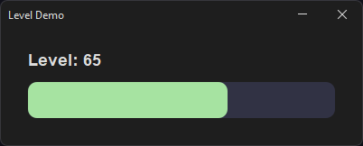

# Drawing and Custom Graphics

Swing's standard components (buttons, labels, etc.) cover most UI needs, but for games or custom visuals you often need to draw things directly — shapes, lines, grids, sprites. You do this by overriding `paintComponent()` on a `JPanel`.


## The Drawing Panel

Create a subclass of `JPanel` and override `paintComponent(g: Graphics)`. Swing calls this method automatically whenever the panel needs to be redrawn.

```kotlin
import java.awt.*
import javax.swing.*

class DrawingPanel : JPanel() {
    override fun paintComponent(g: Graphics) {
        super.paintComponent(g)        // Always call first to clear panel

        g.color = Color.RED
        g.fillRect(50, 50, 100, 80)    // Draw a filled rectangle
    }
}
```

!> Always call `super.paintComponent(g)` as the **first line**. It clears the previous frame. Skipping it causes old drawings to pile up on screen.

Use this panel as the content pane, exactly like a regular `JPanel`:

```kotlin
private val canvas = DrawingPanel()

private fun setupWindow() {
    frame.contentPane = canvas
    // ...
}
```


## The Graphics Object

`g: Graphics` is your drawing tool. Every draw call goes through it. Set a colour first, then call the shape methods:

```kotlin
g.color = Color(0x89b4fa)           // All draws below use this colour
g.fillRect(50, 50, 200, 100)
```

?> All coordinates are in pixels from the top-left corner of the panel. X increases right, Y increases down.


## Drawing Shapes

Cast `g` to `Graphics2D` (see next section) for full control, but the core shape calls are the same on both:

| Method | What it draws |
|---|---|
| `fillRect(x, y, w, h)` | Filled rectangle |
| `drawRect(x, y, w, h)` | Rectangle outline |
| `fillRoundRect(x, y, w, h, arcW, arcH)` | Filled rectangle with rounded corners |
| `drawRoundRect(x, y, w, h, arcW, arcH)` | Rounded rectangle outline |
| `fillOval(x, y, w, h)` | Filled oval (use equal `w`/`h` for a circle) |
| `drawOval(x, y, w, h)` | Oval outline |
| `drawLine(x1, y1, x2, y2)` | Straight line |
| `drawArc(x, y, w, h, startAngle, arcAngle)` | Arc (portion of an oval outline) |
| `fillArc(x, y, w, h, startAngle, arcAngle)` | Filled pie-slice arc |
| `drawPolygon(xPoints, yPoints, n)` | Polygon outline from point arrays |
| `fillPolygon(xPoints, yPoints, n)` | Filled polygon |
| `drawString(text, x, y)` | Text — `x, y` is the **bottom-left** of the first character |

```kotlin
// Rounded rectangle — last two args are corner width and height
g.fillRoundRect(40, 40, 200, 60, 20, 20)

// Arc — angles in degrees, 0° = 3 o'clock, goes anti-clockwise
g.drawArc(50, 50, 100, 100, 0, 270)    // three-quarter circle

// Polygon — arrays of x and y coordinates
val xs = intArrayOf(100, 150, 50)
val ys = intArrayOf(50,  150, 150)
g.fillPolygon(xs, ys, 3)               // filled triangle
```


## Colours and Fonts

```kotlin
g.color = Color(0x89b4fa)               // hex colour
g.color = Color(100, 200, 100)          // RGB (0–255)
g.color = Color(100, 200, 100, 128)     // RGBA — last arg is opacity (0 = invisible, 255 = solid)
g.color = Color.WHITE                   // named colour constant

g.font = Font(Font.SANS_SERIF, Font.PLAIN,  16)
g.font = Font(Font.SANS_SERIF, Font.BOLD,   24)
g.font = Font(Font.MONOSPACED, Font.ITALIC, 14)
```


## Using Graphics2D for More Control

Cast `g` to `Graphics2D` to unlock smoother rendering and stroke control:

```kotlin
override fun paintComponent(g: Graphics) {
    super.paintComponent(g)
    val g2 = g as Graphics2D

    // Anti-aliasing — smoother edges on shapes and text
    g2.setRenderingHint(
        RenderingHints.KEY_ANTIALIASING,
        RenderingHints.VALUE_ANTIALIAS_ON
    )

    // Draw a thick rounded rectangle
    g2.color = Color(0xf38ba8)
    g2.stroke = BasicStroke(4f)                     // 4-pixel thick outline
    g2.drawRoundRect(40, 40, 200, 120, 20, 20)      // Last two args: corner radius
}
```


## Triggering a Redraw

Swing won't redraw the panel automatically when your data changes. Call `repaint()` to tell Swing to call `paintComponent()` again:

```kotlin
private fun updateUI() {
    canvas.repaint()        // Triggers a fresh paint
}
```

Call `updateUI()` any time the app state changes — from a button handler, a timer tick, or after loading data.


## Passing Data to the Panel

The drawing panel needs access to app data to know what to draw. Pass it in via the constructor:

```kotlin
class DrawingPanel(val app: App) : JPanel() {
    override fun paintComponent(g: Graphics) {
        super.paintComponent(g)
        val g2 = g as Graphics2D
        g2.setRenderingHint(
            RenderingHints.KEY_ANTIALIASING,
            RenderingHints.VALUE_ANTIALIAS_ON
        )

        val fillWidth = (width * app.level / 100.0).toInt()

        g2.color = Color(0x313244)          // background track
        g2.fillRoundRect(0, 0, width, height, 20, 20)

        g2.color = Color(0xa6e3a1)          // filled portion, sized by level
        g2.fillRoundRect(0, 0, fillWidth, height, 20, 20)
    }
}
```

In `MainWindow`, create the panel with the app object:

```kotlin
class MainWindow(val app: App) {
    private val frame  = JFrame("Level Demo")
    private val panel  = JPanel().apply { layout = null }
    private val canvas = DrawingPanel(app)

    private fun setupLayout() {
        panel.preferredSize = Dimension(400, 160)
        canvas.setBounds(30, 60, 340, 40)
        panel.add(canvas)
    }
}
```


## Putting It Together

The code below will use a canvas to draw a level meter that relates to the level state within the app:




```kotlin
import com.formdev.flatlaf.FlatDarkLaf
import java.awt.*
import javax.swing.*

fun main() {
    FlatDarkLaf.setup()
    val app    = App()
    val window = MainWindow(app)
    SwingUtilities.invokeLater { window.show() }
}


class App {
    val level = 65      // 0–100
}


class DrawingPanel(val app: App) : JPanel() {
    override fun paintComponent(g: Graphics) {
        super.paintComponent(g)
        val g2 = g as Graphics2D
        g2.setRenderingHint(
            RenderingHints.KEY_ANTIALIASING,
            RenderingHints.VALUE_ANTIALIAS_ON
        )

        val fillWidth = (width * app.level / 100.0).toInt()

        // Background track
        g2.color = Color(0x313244)
        g2.fillRoundRect(0, 0, width, height, 20, 20)

        // Filled portion — width scales with level
        g2.color = Color(0xa6e3a1)
        g2.fillRoundRect(0, 0, fillWidth, height, 20, 20)
    }
}


class MainWindow(val app: App) {
    private val frame       = JFrame("Level Demo")
    private val panel       = JPanel().apply { layout = null }
    private val levelLabel  = JLabel("Level: ${app.level}")
    private val canvas      = DrawingPanel(app)

    init {
        setupLayout()
        setupStyles()
        setupWindow()
    }

    private fun setupLayout() {
        panel.preferredSize = Dimension(400, 130)

        levelLabel.setBounds(30, 20, 340, 30)
        canvas.setBounds(30, 60, 340, 40)

        panel.add(levelLabel)
        panel.add(canvas)
    }

    private fun setupStyles() {
        levelLabel.font = Font(Font.SANS_SERIF, Font.BOLD, 18)
    }

    private fun setupWindow() {
        frame.isResizable = false
        frame.defaultCloseOperation = JFrame.EXIT_ON_CLOSE
        frame.contentPane = panel
        frame.pack()
        frame.setLocationRelativeTo(null)
    }

    fun updateUI() {
        canvas.refresh()
    }

    fun show() { frame.isVisible = true }
}
```

