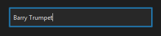
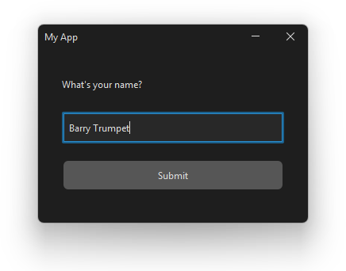

# Adding UI Elements to a Window

Once you have a [window set up](programming/kotlin/gui/window.md), you can start adding things to it. Swing calls these things **components** - labels, buttons, text boxes, and so on.

This page covers the three most common ones: `JLabel()`(kotlin), `JButton()`(kotlin), and `JTextField()`(kotlin).

| Component | What it does | Read / set with |
|---|---|---|
| `JLabel("text")`(kotlin) | Displays a piece of text | `.text`(kotlin) |
| `JButton("text")`(kotlin) | A clickable button | `.isEnabled`(kotlin) |
| `JTextField()`(kotlin) | Single-line text input box | `.text`(kotlin) |


## How Components Work

Every component follows the same three steps:

1. **Declare** it as a class-level property
2. **Position and size** it using `setBounds(x, y, width, height)`(kotlin) in `setupLayout()`(kotlin)
3. **Add** it to the panel using `panel.add(...)`(kotlin) in `setupLayout()`(kotlin)

```
setBounds(x, y, width, height)
          │  │   │      │
          │  │   │      └─ height in pixels
          │  │   └──────── width in pixels
          │  └──────────── y position (distance from top of panel)
          └─────────────── x position (distance from left of panel)
```

> [!NOTE]
> The top-left corner of the panel is `(0, 0)`(kotlin). X increases to the right, Y increases downward.


## JLabel - Displaying Text

`JLabel()`(kotlin) shows a piece of **text** on screen. Use it for titles, instructions, scores, status messages - anything that just needs to be *read*.


Create it like this:

```kotlin
private val titleLabel = JLabel("What is your name?")
```

In `setupLayout()`(kotlin):

```kotlin
titleLabel.setBounds(30, 30, 200, 40)
panel.add(titleLabel)
```

To update the text later (e.g. when the score changes):

```kotlin
titleLabel.text = "Hello, there!"
```


## JButton - A Clickable Button

`JButton()`(kotlin) creates a button the user can **click**. You wire it up to do something on the [actions page](programming/kotlin/gui/actions.md).


Create it like this:

```kotlin
private val launchButton = JButton("Launch!")
```

In `setupLayout()`(kotlin):

```kotlin
launchButton.setBounds(30, 100, 160, 40)
panel.add(launchButton)
```

Buttons can also be enabled or disabled:

```kotlin
launchButton.isEnabled = false  // Grey it out
launchButton.isEnabled = true   // Re-enable it
```


## JTextField - A Text Input Box

`JTextField()`(kotlin) is a single-line box the user can **type into**. Use it to collect a name, a search term, or any short piece of text.



Create it like this:

```kotlin
private val nameField = JTextField()
```

In `setupLayout()`(kotlin):

```kotlin
nameField.setBounds(30, 160, 200, 40)
panel.add(nameField)
```

To read whatever the user has typed:

```kotlin
val name = nameField.text
```

To pre-fill it with default text:

```kotlin
val nameField = JTextField("Enter your name...")
```


## Putting It Together

Here's a complete example with all three components in one window:




```kotlin
import com.formdev.flatlaf.FlatDarkLaf
import java.awt.Dimension
import javax.swing.*

fun main() {
    FlatDarkLaf.setup()
    val window = MainWindow()
    SwingUtilities.invokeLater { window.show() }
}


class MainWindow {
    private val frame = JFrame("My App")
    private val panel = JPanel().apply { layout = null }

    private val titleLabel  = JLabel("What's your name?")
    private val nameField   = JTextField()
    private val submitButton = JButton("Submit")
    private val resultLabel = JLabel("")

    init {
        setupLayout()
        setupWindow()
    }

    private fun setupLayout() {
        panel.preferredSize = Dimension(340, 220)

        titleLabel.setBounds(30, 30, 280, 30)
        nameField.setBounds(30, 80, 280, 40)
        submitButton.setBounds(30, 140, 280, 40)
        resultLabel.setBounds(30, 190, 280, 30)   // (wired up on the actions page)

        panel.add(titleLabel)
        panel.add(nameField)
        panel.add(submitButton)
        panel.add(resultLabel)
    }

    private fun setupWindow() {
        frame.isResizable = false
        frame.defaultCloseOperation = JFrame.EXIT_ON_CLOSE
        frame.contentPane = panel
        frame.pack()
        frame.setLocationRelativeTo(null)
    }

    fun show() {
        frame.isVisible = true
    }
}
```

> [!TIP]
> Declare all your components at the **class level** (not inside a function). This means you can access them from `setupLayout()`(kotlin), `setupStyles()`(kotlin), `setupActions()`(kotlin), and `updateUI()`(kotlin) - wherever they're needed.

Next up: [Listening and Responding to User Actions](programming/kotlin/gui/actions.md)


## More Components

Swing has a lot more components. Here are some of the most useful ones:

| Component | What it does | Key property / method |
|---|---|---|
| `JPanel()`(kotlin) | An invisible container for grouping other components | `.add(component)`(kotlin) |
| `JTextArea()`(kotlin) | Multi-line text input box | `.text`(kotlin) |
| `JPasswordField()`(kotlin) | Single-line input that hides what's typed | `.password`(kotlin) |
| `JCheckBox("label")`(kotlin) | A checkbox the user can tick on or off | `.isSelected`(kotlin) |
| `JRadioButton("label")`(kotlin) | One option from a group (use with `ButtonGroup`(kotlin)) | `.isSelected`(kotlin) |
| `JComboBox(arrayOf(...))`(kotlin) | A dropdown list of choices | `.selectedItem`(kotlin) |
| `JList(arrayOf(...))`(kotlin) | A scrollable list of items | `.selectedValue`(kotlin) |
| `JSlider(min, max, value)`(kotlin) | A draggable slider for picking a number | `.value`(kotlin) |
| `JSpinner(SpinnerNumberModel(...))`(kotlin) | A number box with up/down arrows | `.value`(kotlin) |
| `JScrollPane(component)`(kotlin) | Wraps another component to add scrollbars | - |

> [!TIP]
> `JScrollPane()`(kotlin) is often paired with `JTextArea()`(kotlin) or `JList()`(kotlin) - just wrap the component: `JScrollPane(myTextArea)`(kotlin), then add the scroll pane to the panel instead.


