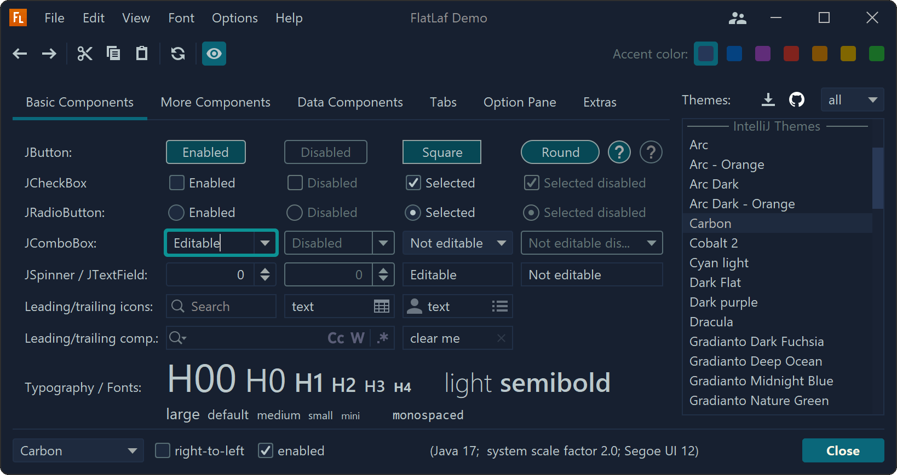

# The FlatLAF Library for Swing GUIs

Swing works well, but its default look is stuck in the early 2000s - grey panels, raised buttons, and chunky borders. **FlatLAF** fixes that.

## What is FlatLAF?

**FlatLAF** (Flat Look and Feel) is a free library that gives your Swing app a clean, modern appearance - similar to what you'd expect from a current desktop app. It supports light and dark themes, and looks consistent across Windows, Mac, and Linux.

The same Swing code, just with FlatLAF applied:

| Without FlatLAF | With FlatLAF |
|-----------------|--------------|
| Grey, raised buttons | Flat, modern buttons |
| Dated system appearance | Clean, professional look |
| Looks different on every OS | Consistent across platforms |



?> FlatLAF is used in production software - including JetBrains' own IDEs (IntelliJ IDEA, the tool you write Kotlin in). So what you're building with can look as polished as the tools professionals use.


## What is a "Look and Feel"?

Swing has a built-in system called **Look and Feel (LAF)** that controls how every component is drawn - button shapes, colours, fonts, borders, and more. By swapping the Look and Feel, you change the visual style of your entire app in one go, without touching any of your layout code.

FlatLAF is a drop-in replacement for Swing's default LAF. Your existing Swing code doesn't change - you just apply FlatLAF at the start of the program.


## Applying FlatLAF

To use FlatLAF, you first need to add it as a dependency in your project (see the [setup page](programming/kotlin/gui/setup.md) for how to do this).

Then, call `FlatLightLaf.setup()` or `FlatDarkLaf.setup()` before creating your window:

```kotlin
import com.formdev.flatlaf.FlatDarkLaf
import javax.swing.JFrame
import javax.swing.JButton

fun main() {
    FlatDarkLaf.setup()     // Apply the dark FlatLAF theme

    val window = JFrame("My App")
    window.setSize(400, 300)
    window.defaultCloseOperation = JFrame.EXIT_ON_CLOSE

    val button = JButton("Click me")
    window.add(button)

    window.isVisible = true
}
```

That single line is all it takes - every component in the app automatically uses the new theme.


## Light and Dark Themes

FlatLAF comes with four built-in themes (but there are also many variations on these):

| Class | Theme |
|-------|-------|
| `FlatLightLaf` | Clean light theme |
| `FlatDarkLaf` | Dark theme |
| `FlatIntelliJLaf` | IntelliJ-style light theme |
| `FlatDarculaLaf` | Darcula dark theme (like IntelliJ's dark mode) |

```kotlin
FlatLightLaf.setup()       // light
FlatDarkLaf.setup()        // dark
FlatDarculaLaf.setup()     // dark - IntelliJ's Darcula theme
```

?> You only call one of these - whichever theme you want. Call it once, right at the start of `main()`, before creating any windows.

