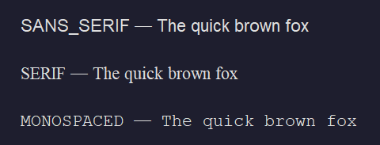
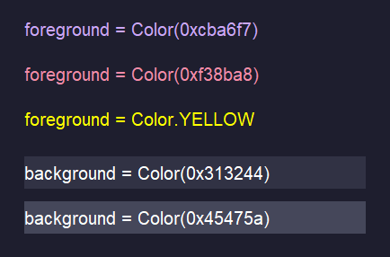
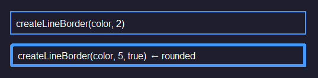

# Styling UI Elements

Once your [elements are on screen](programming/kotlin/gui/elements.md), you can control how they look - font, size, colour, alignment, and borders. All of this happens in `setupStyles()`(kotlin).


## Fonts

Every component has a `font`(kotlin) property. You set it using the `Font`(kotlin) class, which takes three arguments: the font family, the style, and the size in points.

```kotlin
import java.awt.Font

titleLabel.font = Font(Font.SANS_SERIF, Font.BOLD, 32)
bodyLabel.font  = Font(Font.SANS_SERIF, Font.PLAIN, 16)
noteLabel.font  = Font(Font.SANS_SERIF, Font.ITALIC, 14)
```

For the font family, use these built-in constants rather than hardcoding a font name - they're guaranteed to work on every platform:

| Constant | What you get |
|---|---|
| `Font.SANS_SERIF`(kotlin) | Clean, modern - good for most UIs |
| `Font.SERIF`(kotlin) | Traditional with serifs - more formal |
| `Font.MONOSPACED`(kotlin) | Fixed-width - great for code or numbers |




For the style, you can combine `BOLD`(kotlin) and `ITALIC`(kotlin) with `+`(kotlin):

```kotlin
label.font = Font(Font.SANS_SERIF, Font.BOLD + Font.ITALIC, 20)
```


## Colours

Colours are set using the `Color`(kotlin) class. The easiest way is to pass a hex value - the same format used in CSS:

```kotlin
import java.awt.Color

panel.background        = Color(0x1e1e2e)   // Panel background
titleLabel.foreground   = Color(0xf5c2e7)   // Text colour
scoreLabel.foreground   = Color.YELLOW      // Built-in colour constant
```

`Color`(kotlin) also has a set of named constants for common colours: `Color.WHITE`(kotlin), `Color.BLACK`(kotlin), `Color.RED`(kotlin), `Color.GREEN`(kotlin), `Color.BLUE`(kotlin), `Color.YELLOW`(kotlin), `Color.CYAN`(kotlin), `Color.MAGENTA`(kotlin), `Color.GRAY`(kotlin), `Color.ORANGE`(kotlin).

For full control, you can also construct a colour from RGB values (0–255):

```kotlin
val purple = Color(148, 85, 211)
```




> [!NOTE]
> `foreground`(kotlin) sets the text/icon colour. `background`(kotlin) sets the fill colour of the component. Not all components show their background by default (e.g. labels)


### Background Colour on Labels

By default, `JLabel`(kotlin) is transparent - setting `background`(kotlin) has no visible effect. To make the background colour show, set `isOpaque = true`(kotlin):

```kotlin
tagLabel.background = Color(0xcc0055)
tagLabel.isOpaque = true
```


## Text Alignment

Labels have `horizontalAlignment`(kotlin) and `verticalAlignment`(kotlin) properties. Use `SwingConstants`(kotlin) values:

```kotlin
import javax.swing.SwingConstants

titleLabel.horizontalAlignment = SwingConstants.CENTER  // Left, Center, Right
titleLabel.verticalAlignment   = SwingConstants.CENTER  // Top, Center, Bottom
```


## Borders

Borders are added via `setBorder()`(kotlin). The `BorderFactory`(kotlin) class provides a range of ready-made border styles:

```kotlin
import javax.swing.BorderFactory

// Simple line border
nameField.setBorder(BorderFactory.createLineBorder(Color(0x89b4fa), 2))

// Empty border - useful as padding (top, left, bottom, right)
textLabel.setBorder(BorderFactory.createEmptyBorder(4, 8, 4, 8))
```




> [!TIP]
> FlatLAF overrides many default borders on buttons and text fields to give them its clean look. If you set a border on a `JButton`(kotlin), it may conflict with the FlatLAF styling - use `isBorderPainted = false`(kotlin) to remove the default border first if needed.


## Putting It Together

Here's `setupStyles()`(kotlin) for a small app, following on from the [elements example](programming/kotlin/gui/elements.md):


```kotlin
import java.awt.Color
import java.awt.Font
import javax.swing.BorderFactory
import javax.swing.SwingConstants

private fun setupStyles() {
    panel.background = Color(0x1e1e2e)

    titleLabel.font                = Font(Font.SANS_SERIF, Font.BOLD, 28)
    titleLabel.foreground          = Color(0xcdd6f4)
    titleLabel.horizontalAlignment = SwingConstants.CENTER

    nameField.font       = Font(Font.SANS_SERIF, Font.PLAIN, 18)
    nameField.foreground = Color(0xcdd6f4)
    nameField.background = Color(0x313244)
    nameField.setBorder(BorderFactory.createLineBorder(Color(0x89b4fa), 2))

    submitButton.font       = Font(Font.SANS_SERIF, Font.BOLD, 18)
    submitButton.foreground = Color(0x1e1e2e)
    submitButton.background = Color(0x89b4fa)

    resultLabel.font                = Font(Font.SANS_SERIF, Font.ITALIC, 16)
    resultLabel.foreground          = Color(0xa6e3a1)
    resultLabel.horizontalAlignment = SwingConstants.CENTER
}
```
