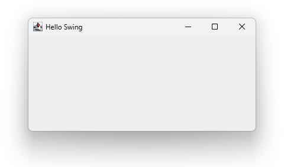

# The Swing GUI Library

**Swing** is a library for building desktop GUIs - windows, buttons, text boxes, menus, and everything else you'd expect from an app. It follows an **imperative** approach.

## Imperative vs Declarative GUIs

There are two main approaches to building a GUI:

**Declarative** - you *describe* what the interface should look like, and the framework builds it for you. This is how modern frameworks like Jetpack Compose or SwiftUI work. It's powerful, but uses some advanced patterns that take time to learn.

**Imperative** - you write step-by-step instructions to *build* the interface yourself: create a window, create a button, add the button to the window. This is how Swing works.

```kotlin
val window = JFrame("My App")       // 1. Create a window
val button = JButton("Click me")    // 2. Create a button
window.add(button)                  // 3. Add button to window
window.isVisible = true             // 4. Show the window
```

The imperative approach is very readable - the code does exactly what it says, in order. For learning, this is a real advantage.


## The Basic Building Blocks

Swing provides a collection of ready-made component classes. The most common ones:

| Class | What it is |
|-------|------------|
| `JFrame`(kotlin) | The main application window |
| `JPanel`(kotlin) | A container for grouping components |
| `JLabel`(kotlin) | A piece of text displayed on screen |
| `JButton`(kotlin) | A clickable button |
| `JTextField`(kotlin) | A single-line text input |
| `JTextArea`(kotlin) | A multi-line text input |
| `JCheckBox`(kotlin) | A tick box |
| `JComboBox`(kotlin) | A dropdown list |
| `JList`(kotlin) | A selectable list of items |

You create objects from these classes, configure them, and add them to a window - that's essentially all there is to building a Swing GUI.


## A Minimal Window

Here's the smallest complete Swing program - a window that opens on screen:

```kotlin
import javax.swing.JFrame

fun main() {
    val window = JFrame("Hello Swing")
    window.setSize(400, 200)
    window.defaultCloseOperation = JFrame.EXIT_ON_CLOSE
    window.isVisible = true
}
```

- `JFrame("Hello Swing")`(kotlin) - creates the window with a title bar
- `setSize(400, 300)`(kotlin) - sets the width and height in pixels
- `defaultCloseOperation`(kotlin) - tells Swing to quit the program when the window is closed
- `isVisible = true`(kotlin) - makes the window appear



> [!IMPORTANT]
> Swing code won't run in the browser-based Kotlin Playground used here, so the pages in this section show code snippets rather than runnable code. You'll need to run these snippets in an IDE like IntelliJ IDEA.


## A Brief History

Swing was created by Sun Microsystems as part of **Java** in the late 1990s. The goal was simple: write your GUI code once, and it would run on Windows, Mac, and Linux without changes. This was a big deal at the time.

Because Kotlin runs on the same platform as Java (the **JVM**), it can use Swing directly - no extra setup needed. Everything written for Swing in Java works in Kotlin too.

> [!NOTE]
> Swing is a mature, well-documented library. It's been around for decades, which means there's an enormous amount of help, examples, and answers available online.


