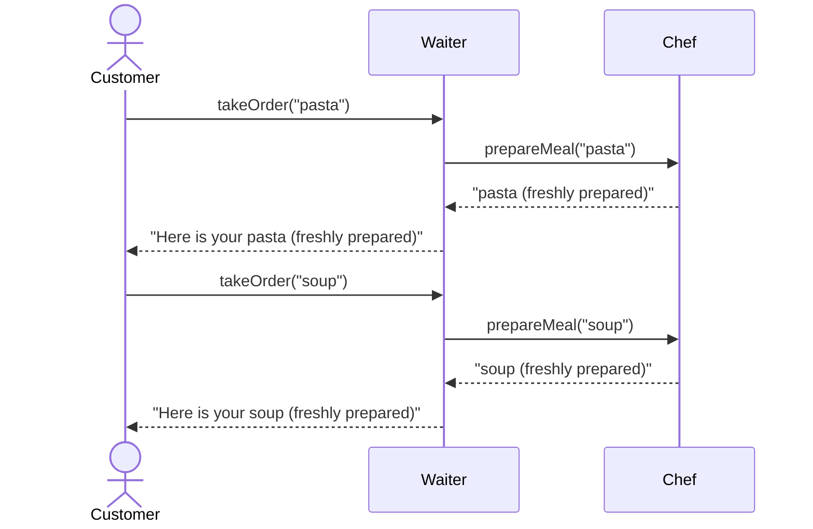

# What is Object-Oriented Programming (OOP)?

## Why OOP Was Invented

In the early days of computing, programs were small and simple. A program might calculate a payroll, sort a list, or print a report. A single programmer could hold the entire program in their head. But by the 1980s, this changed. Software became dramatically more complex:

- **Graphical User Interfaces (GUIs)** appeared - suddenly a program had to manage windows, buttons, menus, text boxes, scroll bars, and mouse input all at the same time
- **Teams** of programmers were needed to build software, and code written by one person had to work alongside code written by others
- Programs were expected to keep running and be **maintained and extended** for years

The old style of programming - long lists of instructions running top to bottom - was not suitable any more and a new approach was needed.

**Object-Oriented Programming** (OOP) was the solution. Instead of one long list of instructions, OOP organises code around **objects** - self-contained units that each manage their own small piece of the program.

> [!INFO]
> Most major modern languages - Kotlin, Java, Python, C++, C#, Swift - are object-oriented. Learning OOP is one of the most valuable things you can do as a programmer.


## Classes and Objects

The two key ideas in OOP are **classes** and **objects**.

- A **class** is a **blueprint** - it describes what something looks like and can do, but it isn't a real thing itself - think of the plans for a house.
- An **object** is a real thing created from that blueprint - think of building actual houses based on the plan.

You can create many objects from the same class:

```
Class: Wizard     ← the blueprint

Wizard: Gandalf   ← one real Wizard
Wizard: Merlin    ← another real Wizard
Wizard: Saruman   ← another real Wizard
```

In Kotlin, define a class with `class`, then create objects from it:

```kotlin
class Wizard {
    // ...
}

val myWizard = Wizard()    // create an object from the Wizard class
```

This is called **instantiation** - you are creating an **instance** of the class.


## State and Behaviour

Every object has two things:

- **State** - the data it holds (what it *is*)
- **Behaviour** - the actions it can perform (what it *does*)

In Kotlin, state is stored in **properties** (variables inside the class), and behaviour is defined by **methods** (functions inside the class).

```kotlin run
class Wizard(val name: String, var mana: Int) {

    fun castSpell(spell: String) {
        mana -= 10
        println("$name casts $spell! (mana left: $mana)")
    }

    fun rest() {
        mana += 20
        println("$name rests and recovers. (mana: $mana)")
    }
}


fun main() {
    val gandalf = Wizard("Gandalf", 100)
    val merlin  = Wizard("Merlin",   80)

    gandalf.castSpell("Fireball")
    gandalf.castSpell("Ice Storm")

    merlin.rest()
}
```

> [!NOTE]
> `gandalf` and `merlin` are both `Wizard` objects, but each has its **own** `name` and `mana` - they are completely independent of each other.


## Encapsulation

Each object is responsible for **managing its own state**. Outside code can't reach in and change the data directly - it can only use the methods the object provides.

This is called **encapsulation** - the internal details are hidden, and the outside world interacts through a controlled set of actions.

```kotlin run
class Account(val owner: String) {

    private var balance = 0    // hidden - can't be accessed from outside

    fun deposit(amount: Int) {
        println("$owner depositing $amount...")
        balance += amount
        println("Balance: $balance")
    }

    fun withdraw(amount: Int) {
        println("$owner withdrawing $amount...")

        if (amount > balance) {
            println("Insufficient funds!")
            return
        }

        balance -= amount
        println("Balance: $balance")
    }
}


fun main() {
    val account = Account("Alice")  // Create new account

    account.deposit(500)            // Now have $500
    account.withdraw(120)           // Now have $380
    account.withdraw(600)           // should be refused

    // account.balance = 99999      // Would cause an error as private
}
```

> [!NOTE]
> The `private` keyword means `balance` can only be changed through `deposit()` and `withdraw()` - no outside code can set it to an arbitrary value.


## Sending 'Messages' Between Objects

Objects work together by calling each other's **methods** - this is sometimes called **message passing**. Each object only exposes a limited set of methods to the outside world.

Think of objects as staff in a restaurant:

- The **customer** tells the **waiter** what they want - they don't go into the kitchen themselves
- The **waiter** passes the order to the **chef** - the waiter doesn't cook the food
- The **chef** manages the kitchen - no one else needs to know how the kitchen works

Each role has a clear, limited interface. The customer only needs to know how to interact with the waiter - the internal details of the kitchen are hidden.

```kotlin run
class Chef {
    fun prepareMeal(dish: String): String {
        println("Chef: Preparing $dish...")
        return "$dish (freshly prepared)"
    }
}


class Waiter {
    private val chef = Chef()   // Waiter has access to a Chef

    fun takeOrder(dish: String) {
        println("Waiter: Taking order for $dish...")
        val meal = chef.prepareMeal(dish)
        println("Waiter: Here is your $meal\n")
    }
}


fun main() {
    val waiter = Waiter()

    waiter.takeOrder("pasta")
    waiter.takeOrder("soup")
}
```

> [!NOTE]
> The customer (the `main` function) only talks to the `Waiter`. It has no idea a `Chef` even exists - that's an internal detail. This is the key idea of OOP: objects hide their complexity and expose only what others need to know.




## Summary

| Concept | What it means |
|---------|---------------|
| **Class** | A blueprint describing what an object looks like and can do |
| **Object** | A real instance created from a class |
| **Property** | A variable belonging to an object - its *state* |
| **Method** | A function belonging to an object - its *behaviour* |
| **Encapsulation** | Hiding internal details; the object manages its own state |
| **API** | The limited set of methods an object exposes to the outside world |
