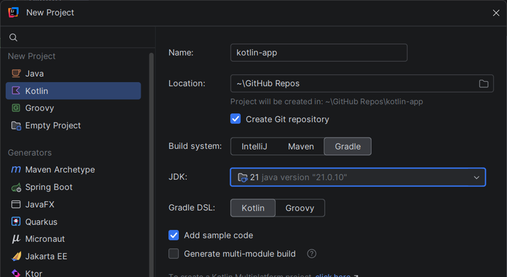
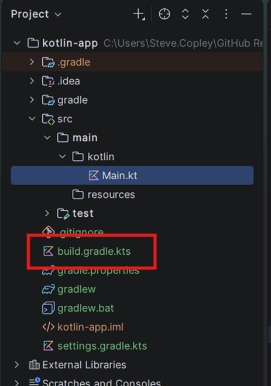
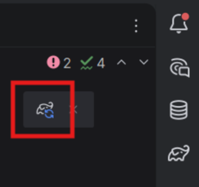
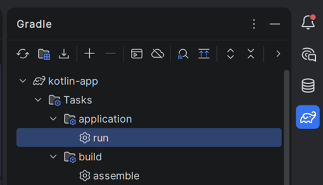
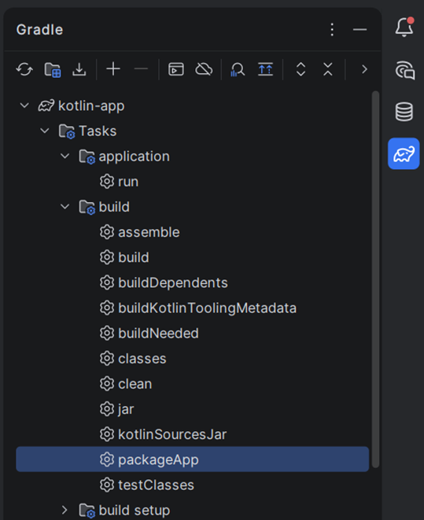
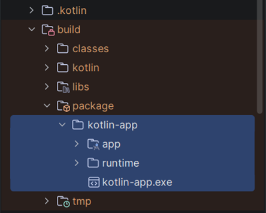
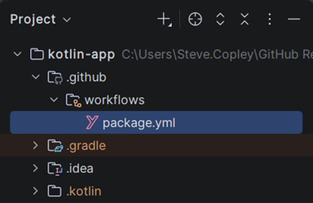
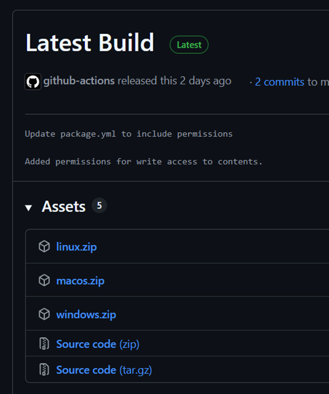

# Project Setup in IntelliJ IDEA with Gradle

Create a new project in IntelliJ IDEA:
- **Kotlin** project
- a recent **JDK** (Java 21 is the current stable version)
- a suitable **save location**
- select **Gradle** as the build system
- select the option to start with some **sample code**

> [!IMPORTANT]
> You must select **Gradle** as the build system - This is the recommended way to manage Kotlin projects. Gradle is a build automation tool which handles compiling code, managing dependencies, running tests, and packaging applications.



The project structure of a Gradle project is a little different to a simple IntelliJ build project, with Main.kt within the **src → main → kotlin** folder, and a `build.gradle.kts` file controlling the project:



## Gradle Setup File, `build.gradle.kts`

Edit the `build.gradle.kts` file to have the following code:

```kotlin
plugins {
    kotlin("jvm") version "2.3.0"
    application
}

repositories {
    mavenCentral()
}

kotlin {
    jvmToolchain(21)
}

application {
    mainClass = "MainKt"
}

dependencies {
    // this is where you will list external libraries
}
```

Then update Gradle by clicking the sync button that appears at the top-right:



> [!TIP]
> You can safely delete the `test` folder and its contents from your project (this is for unit-testing, which we won't cover)


## Advanced Setup - Building JARs and Executables

Add the following to the **bottom** of your `build.gradle.kts` file to create Gradle actions for packaging up your app into a standalone executable program:

```kotlin
//------------------------------------------------------------------------
// Packaging

tasks.jar {
    archiveVersion = ""
    manifest {
        attributes["Main-Class"] = "MainKt"
        attributes["Add-Opens"] = "java.base/java.lang=ALL-UNNAMED"
    }
    from(configurations.runtimeClasspath.get().map {
        if (it.isDirectory) it else zipTree(it)
    })
    duplicatesStrategy = DuplicatesStrategy.EXCLUDE
}

tasks.register<Exec>("packageApp") {
    group = "build"
    description = "Package app as a self-contained executable"
    dependsOn("jar")
    doFirst {
        delete("build/package")
    }
    commandLine(
        "jpackage",
        "--input", "build/libs",
        "--main-jar", "${rootProject.name}.jar",
        "--main-class", "MainKt",
        "--type", "app-image",
        "--name", rootProject.name,
        "--dest", "build/package",
        "--java-options", "--enable-native-access=ALL-UNNAMED",
    )
}
```

After updating your Gradle configuration, you should be able to open the Gradle side-panel and use the following Gradle actions:

Under application you should see a run command which you can use to run your app...



And under build you will see a packageApp command which will create a standalone executable...



When you run this, look in your project build folder and you will see a file you can run without needing your source code, or IntelliJ IDEA (note that it needs to be run within the app folder)...




## Advanced Setup - GitHub Actions to Build Apps

We can use **GitHub Actions** to create **downloadable executables** for our project, updated every time we push a code change.



Setup the GitHub workflow instructions:
- In your **project root**, create a **folder** called `.github` (note the leading dot)
- Inside that folder, create a **folder** called `workflows`
- Inside that folder, create a **file** called `package.yml` and add these contents:

```yaml
name: Package and Release

on:
  push:
    branches: [ "master" ]
  workflow_dispatch:

permissions:
  contents: write

jobs:
  package:
    strategy:
      matrix:
        include:
          - os: windows-latest
            label: windows
          - os: macos-latest
            label: macos
          - os: ubuntu-latest
            label: linux

    runs-on: ${{ matrix.os }}

    steps:
      - name: Checkout code
        uses: actions/checkout@v4

      - name: Set up JDK 21
        uses: actions/setup-java@v4
        with:
          java-version: '21'
          distribution: 'temurin'

      - name: Make gradlew executable
        run: chmod +x gradlew

      - name: Package app
        run: ./gradlew packageApp

      - name: Zip package (Windows)
        if: matrix.os == 'windows-latest'
        shell: pwsh
        run: Compress-Archive -Path build/package/* -DestinationPath ${{ matrix.label }}.zip

      - name: Zip package (macOS/Linux)
        if: matrix.os != 'windows-latest'
        shell: bash
        run: |
          cd build/package
          zip -r ../../${{ matrix.label }}.zip .

      - name: Upload artifact
        uses: actions/upload-artifact@v4
        with:
          name: ${{ matrix.label }}
          path: ${{ matrix.label }}.zip

  release:
    needs: package
    runs-on: ubuntu-latest

    steps:
      - name: Download all artifacts
        uses: actions/download-artifact@v4

      - name: Create Release
        uses: softprops/action-gh-release@v2
        with:
          tag_name: latest
          name: Latest Build
          files: |
            windows/windows.zip
            macos/macos.zip
            linux/linux.zip
```

Now, when you push code to GitHub, the Actions will run (it can take a few minutes) and they will produce a **release** of your project...


And within the release you will have downloadable executables for Windows, Linux and Mac...



