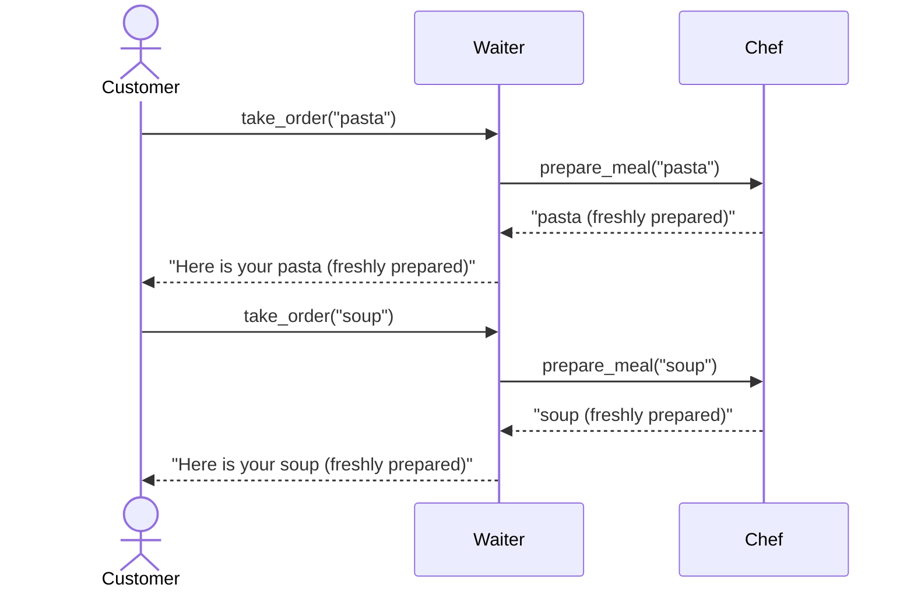

# What is Object-Oriented Programming (OOP)?

## Why OOP Was Invented

In the early days of computing, programs were small and simple. A program might calculate a payroll, sort a list, or print a report. A single programmer could hold the entire program in their head. But by the 1980s, this changed. Software became dramatically more complex:

- **Graphical User Interfaces (GUIs)** appeared - suddenly a program had to manage windows, buttons, menus, text boxes, scroll bars, and mouse input all at the same time
- **Teams** of programmers were needed to build software, and code written by one person had to work alongside code written by others
- Programs were expected to keep running and be **maintained and extended** for years

The old style of programming - long lists of instructions running top to bottom - was not suitable any more and a new approach was needed.

**Object-Oriented Programming** (OOP) was the solution. Instead of one long list of instructions, OOP organises code around **objects** - self-contained units that each manage their own small piece of the program.

?> Python is a multi-paradigm language - you can write Python without OOP, but it fully supports OOP and it becomes increasingly important as your programs grow. Most major Python libraries (like tkinter, pygame, and Flask) are built around OOP.


## Classes and Objects

The two key ideas in OOP are **classes** and **objects**.

- A **class** is a **blueprint** - it describes what something looks like and can do, but it isn't a real thing itself - think of the plans for a house.
- An **object** is a real thing created from that blueprint - think of building actual houses based on the plan.

You can create many objects from the same class:

```
Class: Wizard     ← the blueprint

Wizard: Gandalf   ← one real Wizard
Wizard: Merlin    ← another real Wizard
Wizard: Saruman   ← another real Wizard
```

In Python, define a class with `class`, then create objects from it:

```python
class Wizard:
    pass    # empty class for now

my_wizard = Wizard()    # create an object from the Wizard class
```

This is called **instantiation** - you are creating an **instance** of the class.


## State and Behaviour

Every object has two things:

- **State** - the data it holds (what it *is*)
- **Behaviour** - the actions it can perform (what it *does*)

In Python, state is stored in **attributes** (variables belonging to the object), and behaviour is defined by **methods** (functions inside the class).

```python
class Wizard:

    def __init__(self, name, mana):
        self.name = name
        self.mana = mana

    def cast_spell(self, spell):
        self.mana -= 10
        print(f"{self.name} casts {spell}! (mana left: {self.mana})")

    def rest(self):
        self.mana += 20
        print(f"{self.name} rests and recovers. (mana: {self.mana})")


gandalf = Wizard("Gandalf", 100)
merlin  = Wizard("Merlin",   80)

gandalf.cast_spell("Fireball")
gandalf.cast_spell("Ice Storm")

merlin.rest()
```

?> `gandalf` and `merlin` are both `Wizard` objects, but each has its **own** `name` and `mana` - they are completely independent of each other.


## Encapsulation

Each object is responsible for **managing its own state**. Outside code can't reach in and change the data directly - it can only use the methods the object provides.

This is called **encapsulation** - the internal details are hidden, and the outside world interacts through a controlled set of actions.

```python
class Account:

    def __init__(self, owner):
        self.owner   = owner
        self._balance = 0    # _ prefix signals "private - don't touch from outside"

    def deposit(self, amount):
        print(f"{self.owner} depositing {amount}...")
        self._balance += amount
        print(f"Balance: {self._balance}")

    def withdraw(self, amount):
        print(f"{self.owner} withdrawing {amount}...")

        if amount > self._balance:
            print("Insufficient funds!")
            return

        self._balance -= amount
        print(f"Balance: {self._balance}")


account = Account("Alice")

account.deposit(500)     # Now have $500
account.withdraw(120)    # Now have $380
account.withdraw(600)    # should be refused

# account._balance = 99999   # technically possible, but strongly discouraged
```

?> Python doesn't enforce private attributes the way some languages do. The `_` prefix is a **convention** that signals to other programmers: *don't access this directly*. Well-behaved code respects that convention.


## Sending 'Messages' Between Objects

Objects work together by calling each other's **methods** - this is sometimes called **message passing**. Each object only exposes a limited set of methods to the outside world.

Think of objects as staff in a restaurant:

- The **customer** tells the **waiter** what they want - they don't go into the kitchen themselves
- The **waiter** passes the order to the **chef** - the waiter doesn't cook the food
- The **chef** manages the kitchen - no one else needs to know how the kitchen works

```python
class Chef:

    def prepare_meal(self, dish):
        print(f"Chef: Preparing {dish}...")
        return f"{dish} (freshly prepared)"


class Waiter:

    def __init__(self):
        self._chef = Chef()    # Waiter has access to a Chef

    def take_order(self, dish):
        print(f"Waiter: Taking order for {dish}...")
        meal = self._chef.prepare_meal(dish)
        print(f"Waiter: Here is your {meal}\n")


waiter = Waiter()

waiter.take_order("pasta")
waiter.take_order("soup")
```

?> The customer (the calling code) only talks to the `Waiter`. It has no idea a `Chef` even exists - that's an internal detail. This is the key idea of OOP: objects hide their complexity and expose only what others need to know.




## Summary

| Concept | What it means |
|---------|---------------|
| **Class** | A blueprint describing what an object looks like and can do |
| **Object** | A real instance created from a class |
| **Attribute** | A variable belonging to an object - its *state* |
| **Method** | A function belonging to an object - its *behaviour* |
| **Encapsulation** | Hiding internal details; the object manages its own state |
