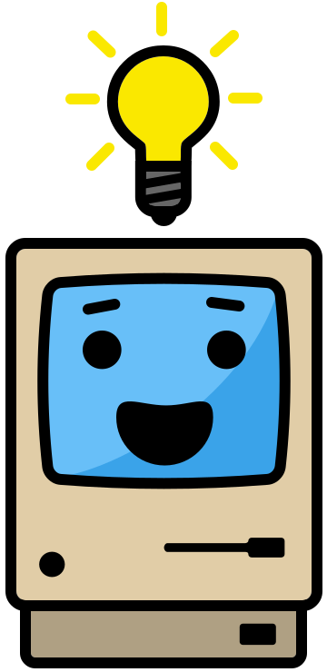

# Scratch

<speak>

Snap those blocks together!

**Scratch** is a block-based language for building games without typing a line of code.

</speak>

Scratch lets you build games, animations and stories by snapping together blocks instead of typing syntax. These notes focus on building simple games: movement, walls, projectiles, enemies, scoring and lives.

<menu>

### Scratch

<i class="si si-scratch"></i>

[Link](/programming/scratch/scratch.md)

Find out what Scratch is and how its block-based projects are structured

---

### Movement

<i data-lucide="rocket"></i>

[Link](/programming/scratch/movement-xy.md)

Move sprites around the stage using X-Y, top-down and gravity movement

---

### Detecting Walls

<i data-lucide="brick-wall"></i>

[Link](/programming/scratch/movement-xy.md)

Stop sprites passing through walls in mazes and platformers

---

### Projectiles

<i data-lucide="ellipsis"></i>

[Link](/programming/scratch/movement-xy.md)

Fire projectiles upwards, sideways, or aimed at the player

---

### Enemies

<i data-lucide="snail"></i>

[Link](/programming/scratch/movement-xy.md)

Spawn and move enemies in straight lines, at random, or in circles

---

### Scoring

<i data-lucide="coins"></i>

[Link](/programming/scratch/movement-xy.md)

Keep score for single-player and two-player games

---

### Player Lives

<i data-lucide="heart"></i>

[Link](/programming/scratch/movement-xy.md)

Track and lose lives in single-player and two-player games

</menu>

