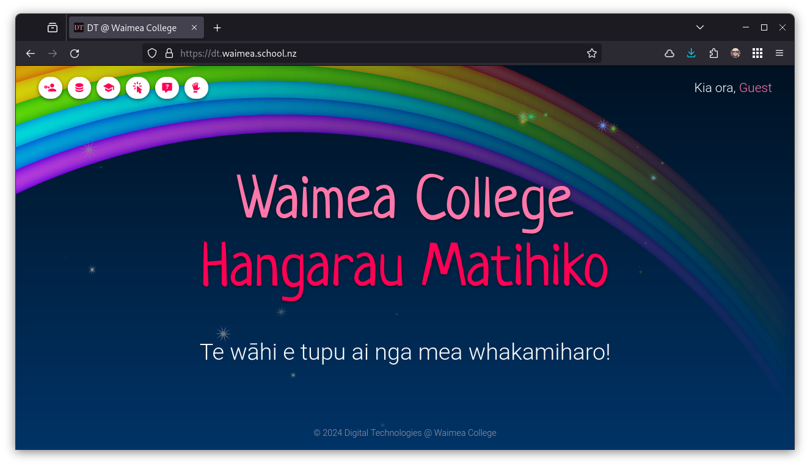

# Accessing the DT Server

The server can be accessed via any web broswer (Chrome, Firefox, Safari, Edge, etc.) at the following URL:

> ### https://dt.waimea.school.nz

## Server Security

The files and sites that you create on the server are **password-protected** so, generally, only you will be able to access them. This is a security measure (we don't want your sites or the server to be compromised in any way!)

Note the the server is **geo-locked** which means that it is only available within New Zealand (this is also a security measure), so you won't be able to access it if you are overseas.
