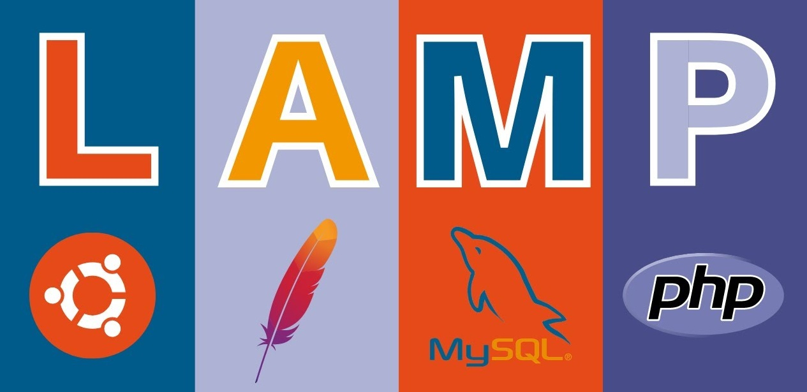

# The Waimea College DT Server

The Digital Technologies Server is a Linix server setup for **Web Development**.

It runs the following software:

- [Linux][linux] - the **Operating System** (OS)
- [Apache][apache] - the **web server** (delivers web pages upon request)
- [MySQL][mysql] - a **database server** (stores data to be used in web pages)
- [PHP][php] - a **scripting engine** (allows **code** to be run on the server)

This configuration is often called the **'LAMP'** stack and remains one of the most frequently used web server setups on the Internet.

[linux]: https://ubuntu.com/server
[apache]: https://httpd.apache.org/
[mysql]: https://www.mysql.com/
[php]: https://www.php.net/
