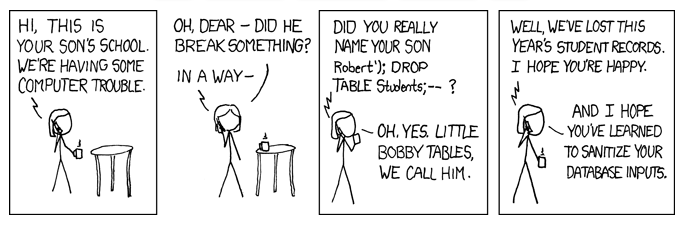
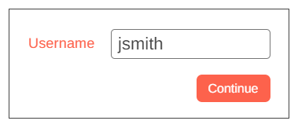

# SQL Injection Attacks

[](https://xkcd.com/327/)

## What is SQL Injection?

Imagine a form to login to a web application. It asks for a username...



When this form is submitted, we need to take the form data and use it within an SQL query. If we naively took the form data and **concatenated it directly into the query**...

```php
$query = 'SELECT * FROM users WHERE username="' . $_POST['username'] . '"';
```

... we have just introduced a potential **security issue** since we are assuming that users will only enter valid names and nothing else.

If the user enters a real username:

```
jsmith
```

... then the SQL query would become...

```sql
SELECT * FROM users WHERE username="jsmith"
```

No issues there. A single user record would be returned.

But... What if an attacker is attempting to compromise our server. They might try to access data they should not have access to, or they might try to modify the data in some way.

An attacker might not just type a username, they might type some **malicious SQL** into the form...


## Example of SQL Injection - Accessing Data

The attacker types this into the form:

```
jsmith" OR ""="
```

What effect does this have? Let's look at what out query now becomes...

```sql
SELECT * FROM users WHERE username="jsmith" OR ""=""
```

Since "" does equal "", the WHERE clause will always be true, so *every* user record will be returned.

This is BAD! The attacker potentially has access to everyone's account data.


## Example of SQL Injection - Deleting Data

The attacker types this into the form:

```
jsmith"; DROP TABLE users; --
```

What effect does this have? Let's look at what out query now becomes...

```sql
SELECT * FROM users WHERE username="jsmith"; DROP TABLE users; --"
```

The query now contains not just our intended query, but also the attacker's DROP TABLE query.

This is BAD! They have just deleted the whole of our user table, with everyone's accounts!

?> The `;` ends the first command, allowing a second to be started. And `--` indicates an SQL comment, here commenting out the final " and preventing an error*


