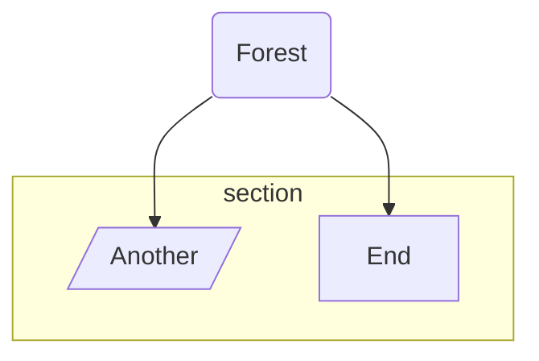
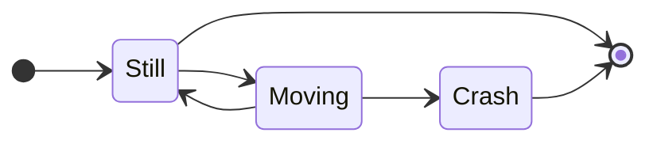
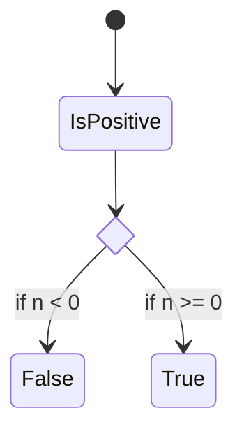
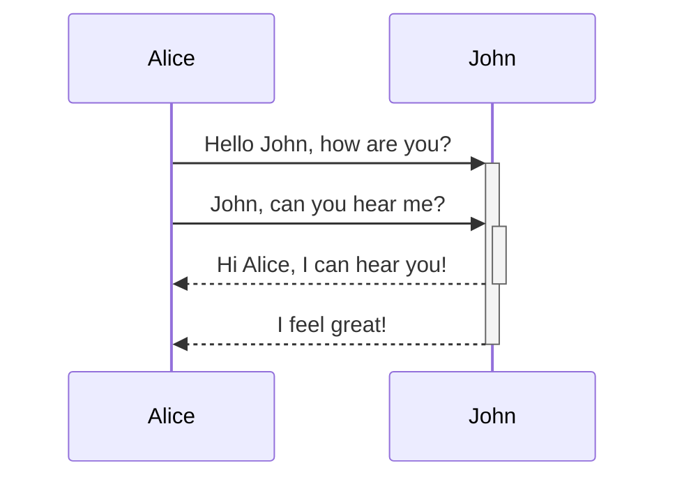

# Testing

## Mermaid Test

## Accordian Test

+ Question 1 +

    Lorem ipsum dolor sit amet, consectetur adipiscing elit, sed do eiusmod tempor incididunt ut labore et dolore magna aliqua. Placerat duis ultricies lacus sed turpis tincidunt id aliquet risus. Etiam tempor orci eu lobortis elementum nibh tellus molestie nunc.

+ Question 3 +

    Lorem ipsum dolor sit amet, consectetur adipiscing elit, sed do eiusmod tempor incididunt ut labore et dolore magna aliqua. Placerat duis ultricies lacus sed turpis tincidunt id aliquet risus. Etiam tempor orci eu lobortis elementum nibh tellus molestie nunc.

+ Question 3 +

    Lorem ipsum dolor sit amet, consectetur adipiscing elit, sed do eiusmod tempor incididunt ut labore et dolore magna aliqua. Placerat duis ultricies lacus sed turpis tincidunt id aliquet risus. Etiam tempor orci eu lobortis elementum nibh tellus molestie nunc.

