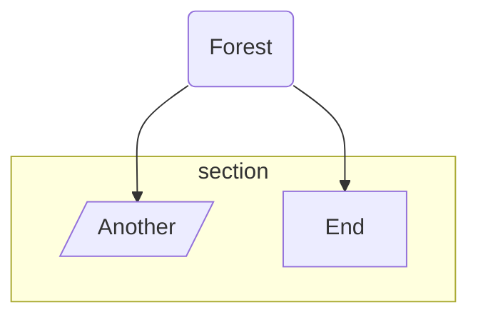
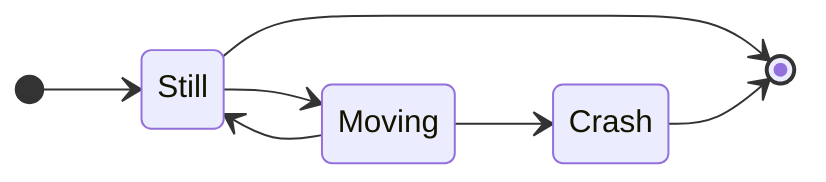
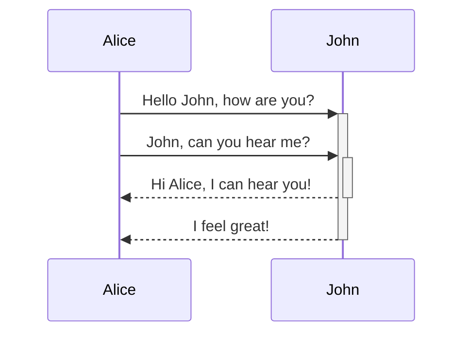

# Testing


## Flash Card Demo


- # How many beans make five?

    ---

    - 2 beans
    - A bean
    - A half a bean
    - And a bean and a half


- # Who is this?

    Clue: they are fun!

    ---

    ## Finn and Jake!


- # What code would do this?

    ---

    The keel-mounted rail gun pushed the whole ship backward.

    ```python
    print("Hello!")
    ```


- # What does this code do?

    ```python
    print("Hello!")
    ```

    ---

    The keel-mounted rail gun pushed the whole ship backward.


- # What does **HTML** mean?

    ---

    ## **H**yper**T**ext **M**ark-up **L**anguage

    This is the language of the web:


- # What does **CSS** mean?

    ---

    **C**ascading **S**tyle**S**heet


<flash-cards>


## Reveal.js Slides Testing

Normal docs content here...

<slides>

# Arrays — Your First Chest of Loot

Store items in order, retrieve them by index.

---

# Accessing Items

```js
const loot = ['sword', 'shield', 'potion']
console.log(loot[0]) // 'sword' — zero-indexed!
```

---

# Looping Through Loot

Use a `for...of` loop to grab everything.

---

## Hmmm

- Item 1 <!-- .element: class="fragment" data-fragment-index="2" -->
- Item 2 <!-- .element: class="fragment" data-fragment-index="1" -->

---

# Another
<!-- .slide: data-background="#ff0000" -->

Testing

---

## Code

```js [2-3|5|10|1-99]
hook.doneEach(function () {
    const placeholders = document.querySelectorAll('.slides-placeholder')
    if (!placeholders.length) return

    placeholders.forEach((placeholder) => {
        const index = placeholder.getAttribute('data-index')
        placeholder.outerHTML = buildRevealHTML(index)
    })

    initDecks()
})
```


</slides>

Back to normal docs...


<slides>

# Arrays — Your First Chest of Loot

Store items in order, retrieve them by index.

---

# Accessing Items

```js
const loot = ['sword', 'shield', 'potion']
console.log(loot[0]) // 'sword' — zero-indexed!
```

---

# Looping Through Loot

Use a `for...of` loop to grab everything.

</slides>

Back to normal docs...


## Mermaid Test


```mermaid
graph TD
A(Forest) --> B[/Another/]
A --> C[End]
  subgraph section
  B
  C
  end
```


```mermaid
stateDiagram-v2
    direction LR

    [*] --> Still
    Still --> [*]

    Still --> Moving
    Moving --> Still
    Moving --> Crash
    Crash --> [*]
```


```mermaid
stateDiagram-v2
    state if_state <<choice>>
    [*] --> IsPositive
    IsPositive --> if_state
    if_state --> False: if n < 0
    if_state --> True : if n >= 0
```


```mermaid
sequenceDiagram
    Alice->>+John: Hello John, how are you?
    Alice->>+John: John, can you hear me?
    John-->>-Alice: Hi Alice, I can hear you!
    John-->>-Alice: I feel great!
```


## Accordion Test

+ Question 1 +

    Lorem ipsum dolor sit amet, consectetur adipiscing elit, sed do eiusmod tempor incididunt ut labore et dolore magna aliqua. Placerat duis ultricies lacus sed turpis tincidunt id aliquet risus. Etiam tempor orci eu lobortis elementum nibh tellus molestie nunc.

+ Question 3 +

    Lorem ipsum dolor sit amet, consectetur adipiscing elit, sed do eiusmod tempor incididunt ut labore et dolore magna aliqua. Placerat duis ultricies lacus sed turpis tincidunt id aliquet risus. Etiam tempor orci eu lobortis elementum nibh tellus molestie nunc.

+ Question 3 +

    Lorem ipsum dolor sit amet, consectetur adipiscing elit, sed do eiusmod tempor incididunt ut labore et dolore magna aliqua. Placerat duis ultricies lacus sed turpis tincidunt id aliquet risus. Etiam tempor orci eu lobortis elementum nibh tellus molestie nunc.

