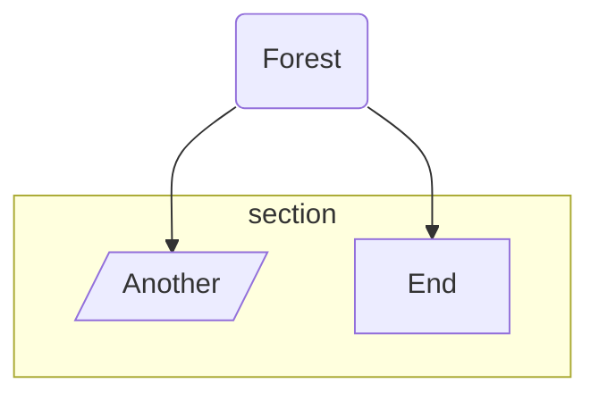
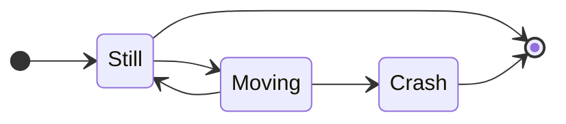
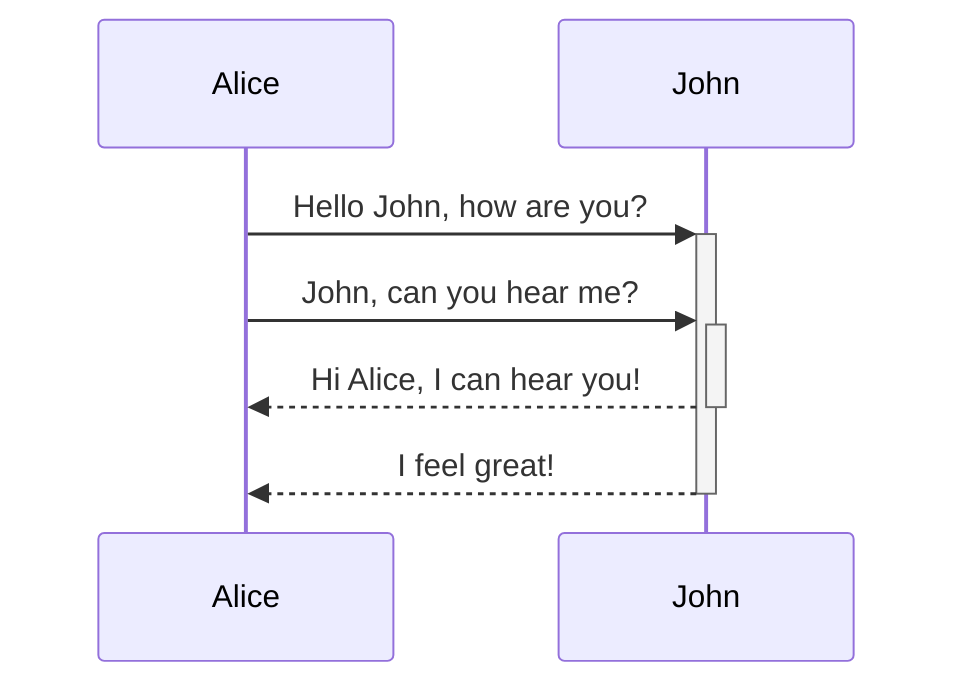

# Testing


## SQL Runner Demo

Create a table and populate it with data:

```sql run setup=create
CREATE TABLE cats (
    id     INTEGER     PRIMARY KEY AUTOINCREMENT,
    name   VARCHAR(10) NOT NULL,
    colour VARCHAR(10) NOT NULL,
    legs   INTEGER     DEFAULT(4),
    added  TIMESTAMP   DEFAULT(CURRENT_TIMESTAMP)
);
```

Insert some data (depends on the table being created):

```sql run setup=insert depends=create
INSERT INTO cats (name, colour)
VALUES
    ('Jane', 'Black'),
    ('Mike', 'Ginger'),
    ('Dave', 'Tabby'),
    ('Gary', 'Ginger'),
    ('Thom', 'White');

INSERT INTO cats (name, colour, legs)
VALUES
    ('Fred', 'Tabby', 3);
```

Select all cats:

```sql run depends=insert
SELECT * FROM cats;
```

Select cats ordered by name:

```sql run depends=insert
SELECT id, name, legs
FROM cats
ORDER BY name ASC;
```

Find cats with fewer than 4 legs:

```sql run depends=insert
SELECT id, name, colour, legs
FROM cats
WHERE legs < 4;
```

Count cats by colour:

```sql run depends=insert
SELECT colour, COUNT(*) as count
FROM cats
GROUP BY colour
ORDER BY count DESC;
```


## Python Programming Quiz

<quiz>

- # 1. Variable Assignment

    What will be the value of `x` after executing this code?

    ```python
    x = 10
    x = x + 5
    ```

    ---

    - [ ] 10
    - [x] 15
    - [ ] 105
    - [ ] Error

    ---

    - [x] **Correct!** The variable `x` starts at 10, then `x + 5` evaluates to 15, which is reassigned to `x`.

        ```python
        x = 10    # x is now 10
        x = x + 5 # x is now 15
        print(x)  # Output: 15
        ```

    - [ ] **Not quite.** Remember that `x = x + 5` means "take the current value of x, add 5, and store the result back in x."


- # 2. String Concatenation

    What is the output of this code?

    ```python
    greeting = "Hello"
    name = "Python"
    print(greeting + " " + name)
    ```

    ---

    - [ ] HelloPython
    - [x] Hello Python
    - [ ] greeting name
    - [ ] Error

    ---

    - [x] **Perfect!** The `+` operator concatenates strings. The space `" "` is added between the two strings.

        ```python
        # String concatenation adds strings together
        "Hello" + " " + "Python" = "Hello Python"
        ```

    - [ ] **Incorrect.** The `+` operator joins strings together, and we're adding a space between them with `" "`.


- # 3. Data Types

    Which of these is **not** a valid Python data type?

    ---

    - [ ] `int`
    - [ ] `float`
    - [ ] `str`
    - [x] `character`

    ---

    - [x] **Correct!** Python doesn't have a separate `character` type. Single characters are just strings of length 1.

        ```python
        # These are all valid Python types
        age = 25           # int
        price = 19.99      # float
        name = "Alice"     # str
        letter = "A"       # str (not character)
        ```

    - [ ] **Not quite.** Python uses `str` for both single characters and longer text. There's no separate `character` type.


- # 4. Lists

    How do you access the **first** element of a list?

    ```python
    fruits = ["apple", "banana", "cherry"]
    ```

    ---

    - [x] `fruits[0]`
    - [ ] `fruits[1]`
    - [ ] `fruits.first()`
    - [ ] `fruits[-1]`

    ---

    - [x] **Excellent!** Python uses zero-based indexing, so the first element is at index 0.

        ```python
        fruits = ["apple", "banana", "cherry"]
        print(fruits[0])   # apple
        print(fruits[1])   # banana
        print(fruits[-1])  # cherry (last element)
        ```

    - [ ] **Incorrect.** Python lists use **zero-based indexing**, meaning the first element is at position `[0]`, not `[1]`.


- # 5. Boolean Logic

    What does this expression evaluate to?

    ```python
    x = 5
    result = x > 3 and x < 10
    ```

    ---

    - [x] `True`
    - [ ] `False`
    - [ ] `5`
    - [ ] `None`

    ---

    - [x] **Spot on!** Both conditions are true: `5 > 3` is True and `5 < 10` is True. Using `and`, both must be true.

        ```python
        x = 5
        x > 3    # True (5 is greater than 3)
        x < 10   # True (5 is less than 10)
        # True and True = True
        ```

    - [ ] **Not quite.** Check each condition: Is 5 greater than 3? Is 5 less than 10? What happens when you use `and` with boolean values?


- # 6. For Loops

    How many times will "Hello" be printed?

    ```python
    for i in range(3):
        print("Hello")
    ```

    ---

    - [ ] 0 times
    - [ ] 2 times
    - [x] 3 times
    - [ ] 4 times

    ---

    - [x] **Correct!** `range(3)` generates numbers 0, 1, and 2 (three numbers total).

        ```python
        for i in range(3):
            print(i)  # Prints: 0, 1, 2
        # The loop runs 3 times (0, 1, 2)
        ```

    - [ ] **Incorrect.** `range(3)` generates the sequence [0, 1, 2], which is 3 values. Try running the code and counting!


- # 7. String Methods

    What is the output of this code?

    ```python
    text = "python"
    print(text.upper())
    ```

    ---

    - [ ] python
    - [x] PYTHON
    - [ ] Python
    - [ ] Error

    ---

    - [x] **Brilliant!** The `.upper()` method converts all characters in the string to uppercase.

        ```python
        text = "python"
        print(text.upper())   # PYTHON
        print(text.lower())   # python
        print(text.title())   # Python
        ```

    - [ ] **Not quite.** The `.upper()` method converts **all** letters to uppercase. Try it yourself!


- # 8. Conditionals

    What will be printed?

    ```python
    age = 16
    if age >= 18:
        print("Adult")
    else:
        print("Minor")
    ```

    ---

    - [ ] Adult
    - [x] Minor
    - [ ] 16
    - [ ] Nothing

    ---

    - [x] **Correct!** Since 16 is not greater than or equal to 18, the condition is False and the `else` block executes.

        ```python
        age = 16
        age >= 18    # False (16 is less than 18)
        # So the else block runs
        print("Minor")
        ```

    - [ ] **Incorrect.** Check the condition: Is 16 ≥ 18? When this is False, which block of code runs?


- # 9. Function Return

    What does this function return when called with `calculate(4)`?

    ```python
    def calculate(n):
        return n * 2 + 1
    ```

    ---

    - [ ] 6
    - [ ] 8
    - [x] 9
    - [ ] 10

    ---

    - [x] **Perfect!** The function multiplies 4 by 2 (getting 8), then adds 1 (getting 9).

        ```python
        def calculate(n):
            return n * 2 + 1

        result = calculate(4)
        # Step 1: 4 * 2 = 8
        # Step 2: 8 + 1 = 9
        print(result)  # 9
        ```

    - [ ] **Not quite.** Follow the order of operations: First multiply `n * 2`, then add 1. Remember PEMDAS!


- # 10. List Length

    What is the result of `len(numbers)`?

    ```python
    numbers = [10, 20, 30, 40, 50]
    ```

    ---

    - [ ] 50
    - [ ] 4
    - [x] 5
    - [ ] Error

    ---

    - [x] **Excellent!** The `len()` function returns the number of elements in the list. There are 5 numbers.

        ```python
        numbers = [10, 20, 30, 40, 50]
        print(len(numbers))      # 5
        print(numbers[0])        # 10 (first element)
        print(numbers[4])        # 50 (last element)
        print(numbers[-1])       # 50 (also last element)
        ```

    - [ ] **Incorrect.** The `len()` function counts how many **items** are in the list, not the values of those items.

</quiz>


## Flash Card Demo


<flashcards>

- # How many beans make five?

    ---

    - 2 beans
    - A bean
    - A half a bean
    - And a bean and a half


- # Who is this?

    Clue: they are fun!

    ---

    ## Finn and Jake!


- # What code would do this?

    ---

    The keel-mounted rail gun pushed the whole ship backward.

    ```python
    print("Hello!")
    ```


- # What does this code do?

    ```python
    print("Hello!")
    ```

    ---

    The keel-mounted rail gun pushed the whole ship backward.


- # What does **HTML** mean?

    ---

    ## **H**yper**T**ext **M**ark-up **L**anguage

    This is the language of the web:


- # What does **CSS** mean?

    ---

    **C**ascading **S**tyle**S**heet

</flashcards>


## Reveal.js Slides Testing

Normal docs content here...

<slides>

# Arrays — Your First Chest of Loot

Store items in order, retrieve them by index.

---

# Accessing Items

```js
const loot = ['sword', 'shield', 'potion']
console.log(loot[0]) // 'sword' — zero-indexed!
```

---

# Looping Through Loot

Use a `for...of` loop to grab everything.

---

## Hmmm

- Item 1 <!-- .element: class="fragment" data-fragment-index="2" -->
- Item 2 <!-- .element: class="fragment" data-fragment-index="1" -->

---

# Another
<!-- .slide: data-background="#ff0000" -->

Testing

---

## Code

```js [2-3|5|10|1-99]
hook.doneEach(function () {
    const placeholders = document.querySelectorAll('.slides-placeholder')
    if (!placeholders.length) return

    placeholders.forEach((placeholder) => {
        const index = placeholder.getAttribute('data-index')
        placeholder.outerHTML = buildRevealHTML(index)
    })

    initDecks()
})
```


</slides>

Back to normal docs...


<slides>

# Arrays — Your First Chest of Loot

Store items in order, retrieve them by index.

---

# Accessing Items

```js
const loot = ['sword', 'shield', 'potion']
console.log(loot[0]) // 'sword' — zero-indexed!
```

---

# Looping Through Loot

Use a `for...of` loop to grab everything.

</slides>

Back to normal docs...


## Mermaid Test


```mermaid
graph TD
A(Forest) --> B[/Another/]
A --> C[End]
  subgraph section
  B
  C
  end
```


```mermaid
stateDiagram-v2
    direction LR

    [*] --> Still
    Still --> [*]

    Still --> Moving
    Moving --> Still
    Moving --> Crash
    Crash --> [*]
```


```mermaid
stateDiagram-v2
    state if_state <<choice>>
    [*] --> IsPositive
    IsPositive --> if_state
    if_state --> False: if n < 0
    if_state --> True : if n >= 0
```


```mermaid
sequenceDiagram
    Alice->>+John: Hello John, how are you?
    Alice->>+John: John, can you hear me?
    John-->>-Alice: Hi Alice, I can hear you!
    John-->>-Alice: I feel great!
```


## Accordion Test

+ Question 1 +

    Lorem ipsum dolor sit amet, consectetur adipiscing elit, sed do eiusmod tempor incididunt ut labore et dolore magna aliqua. Placerat duis ultricies lacus sed turpis tincidunt id aliquet risus. Etiam tempor orci eu lobortis elementum nibh tellus molestie nunc.

+ Question 3 +

    Lorem ipsum dolor sit amet, consectetur adipiscing elit, sed do eiusmod tempor incididunt ut labore et dolore magna aliqua. Placerat duis ultricies lacus sed turpis tincidunt id aliquet risus. Etiam tempor orci eu lobortis elementum nibh tellus molestie nunc.

+ Question 3 +

    Lorem ipsum dolor sit amet, consectetur adipiscing elit, sed do eiusmod tempor incididunt ut labore et dolore magna aliqua. Placerat duis ultricies lacus sed turpis tincidunt id aliquet risus. Etiam tempor orci eu lobortis elementum nibh tellus molestie nunc.

