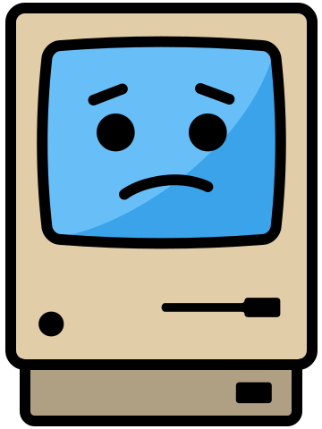
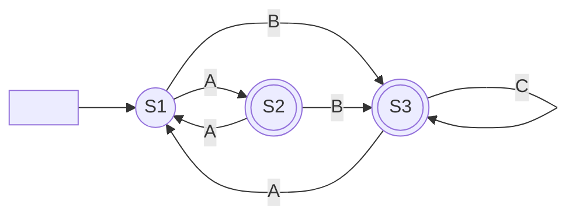
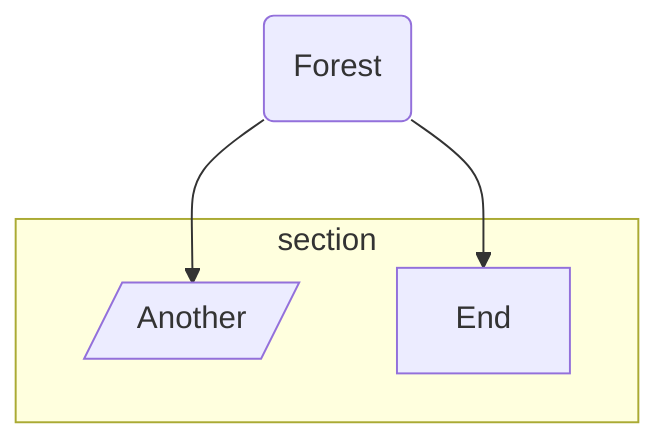
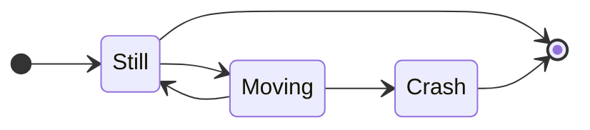
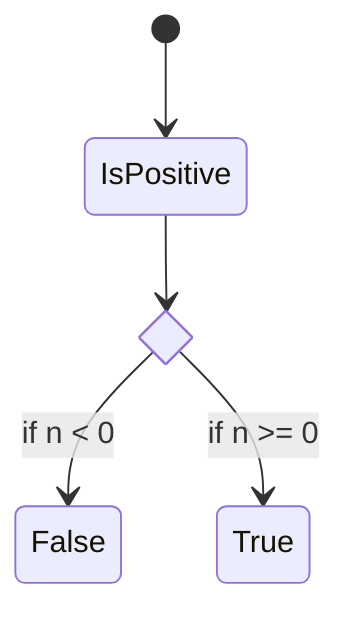
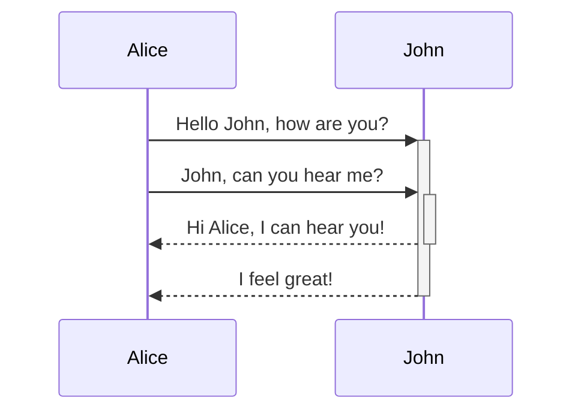

# Testing


# Logical Operations

## Logic Gates

### Simple

```logic
gate 10   AND  A B ''
gate ON   OR   A B ''
gate TF   NOT  A   ''
gate YN   XOR  A B ''
gate 5V   NAND A B ''
gate Tick NOR  A B ''
```

### Simple with Initial Values

```logic
gate 10   AND  A+ B+ ''
gate ON   OR   A  B+ ''
gate TF   NOT  A+    ''
gate YN   XOR  A  B+ ''
gate 5V   NAND A+ B+ ''
gate Tick NOR  A+ B  ''
gate Tick NOR  +  '' ''
```

### No Style Values (style 'None')

```logic
gate None AND
gate None AND A B Out
gate None AND A B ''
gate None AND '' '' ''
```

### Raw Gate (style 'Raw')

```logic
gate Raw AND
gate Raw AND A B Out
gate Raw AND A B ''
gate Raw AND '' '' ''
```

### Hidden Gate (style 'Hide')

```logic
gate Hide AND
gate Hide AND A B Out
gate Hide AND A B ''
gate Hide AND '' '' ''
```

### Code Logic Demo

```logic
gate YN AND 'age >= 18' 'sober?' 'Allowed In'
```

## Logic Tables

### Simple

```logic
table 10 AND
table 10 OR
table 10 NOT
table 10 XOR
table 10 NAND
table 10 NOR
table 10 NOP1
table 10 NOP2
table 10 NOP3
```

### Three Inputs

```logic
table 10 AND3
table 10 OR3
table 10 XOR3
```

### Named Inputs / Output

```logic
table 10 AND In1 In2 Out
table 10 OR  In1 In2 Out
table 10 NOT In Out
table 10 AND3 In1 In2 In3 Out
table YN AND 'age >= 18' 'sober?' 'Allowed In'
```

### Different Styles

```logic
table YN    XOR
table ON    XOR
table TF    XOR
table 5V    XOR
table HL    XOR
table Cross XOR
table Tick  XOR
table Dot   XOR
```

## Table and Gate (with Table Highlighting)

```logic
gate  ON AND  A B Out
table ON AND  A B Out
```

```logic
gate  ON NOT  A Out
table ON NOT  A Out
```

```logic
gate  ON AND  A+ B+ Out
table ON AND  A  B  Out
```

```logic
gate  ON NOT  A+ Out
table ON NOT  A  Out
```


## Tables


### Basic Table

Hover over any row to see it highlight:

| Name | Age | City | Occupation |
|------|-----|------|------------|
| Alice | 28 | London | Engineer |
| Bob | 34 | Paris | Designer |
| Carol | 42 | Berlin | Manager |
| David | 31 | Madrid | Developer |
| Eve | 29 | Rome | Analyst |


### Highlight Cols Table

Hover over any row to see it highlight. The City column is highlighted:

| Name  | Age | !! City | Occupation | Name  | Age | !! City | Occupation |
| ----- | --- | ------- | ---------- | ----- | --- | ------- | ---------- |
| Alice | 28  | London  | Engineer   | Alice | 28  | London  | Engineer   |
| Bob   | 34  | Paris   | Designer   | Bob   | 34  | Paris   | Designer   |
| Carol | 42  | Berlin  | Manager    | Carol | 42  | Berlin  | Manager    |
| David | 31  | Madrid  | Developer  | David | 31  | Madrid  | Developer  |
| Eve   | 29  | Rome    | Analyst    | Eve   | 29  | Rome    | Analyst    |


### Highlight Cells Table

Hover over any row to see it highlight:

| Name | Age | City | Occupation |
|------|-----|------|------------|
| Alice | !! 28 | London | Engineer |
| Bob | 34 | Paris | !! Designer |
| Carol | 42 | Berlin | Manager |
| !! David | 31 | Madrid | Developer |
| Eve | 29 | Rome | Analyst |


### Highlight Cells & Cols Table

Both column and individual cell highlighting:

| Name | Age | !! City | Occupation |
|------|-----|------|------------|
| !! Alice | 28 | London | Engineer |
| Bob | 34 | Paris | Designer |
| Carol | 42 | !! Berlin | Manager |
| David | 31 | Madrid | !! Developer |
| Eve | 29 | Rome | Analyst |


### Highlight Rows Table

Row highlighting with !!! in first cell:

| Name | Age | City | Occupation |
|------|-----|------|------------|
| Alice | 28 | London | Engineer |
| !!! Bob | 34 | !! Paris | Designer |
| Carol | 42 | Berlin | Manager |
| !!! David | 31 | Madrid | Developer |
| Eve | 29 | Rome | Analyst |


### All Together

Columns, cells, and rows all highlighted:

| Name | !! Age | City | Occupation |
|------|-----|------|------------|
| Alice | 28 | London | Engineer |
| !!! Bob | 34 | Paris | Designer |
| Carol | 42 | Berlin | Manager |
| David | 31 | Madrid | Developer |
| Eve | 29 | Rome | !! Analyst |


## Speech

<speak>


Hello, human!

</speak>

<speak>



Oh no! Something went **terribly** wrong!

</speak>

<speak>


I'm *so* happy to see you today! This is going to be **great**!

</speak>


## Captions

<captioned>


Hello, human!

</captioned>

<captioned>


This Mac is sad because something went wrong.

</captioned>


## Cards

### Default (20rem)

<cards>

# One

His eyes were eggs of unstable crystal, vibrating with a frequency whose name was rain and the sound of trains, suddenly sprouting a humming forest of hair-fine glass spines.

---

# Two

But the human race did not have even the slightest bit of psychological preparation for what was about to happen. In this age of enlightenment, the soothsayer and astrologer flourish; as science pushes forward, ignorance and superstition gallop around the flanks and bite science in the rear with big dark teeth.

---

# Three

Arguing with anonymous strangers on the Internet is a sucker's game because they almost always turn out to be—or to be indistinguishable from—self-righteous sixteen-year-olds possessing infinite amounts of free time.

</cards>

### Narrow (12rem)

<cards size="narrow">

# A

Short card

---

# B

Another short card

---

# C

Third card

---

# D

Fourth card

</cards>

### Full (100%)

<cards size="full">

# Full Width Card

This card takes up the full width of the container.

---

# Another Full Width

These cards stack vertically and don't wrap.

</cards>


<cards size="narrow">

## One

His eyes were eggs of unstable crystal, vibrating with a frequency whose name was rain and the sound of trains, suddenly sprouting a humming forest of hair-fine glass spines.

---

## Two

But the human race did not have even the slightest bit of psychological preparation for what was about to happen. In this age of enlightenment, the soothsayer and astrologer flourish; as science pushes forward, ignorance and superstition gallop around the flanks and bite science in the rear with big dark teeth.

---

## Three

Arguing with anonymous strangers on the Internet is a sucker's game because they almost always turn out to be—or to be indistinguishable from—self-righteous sixteen-year-olds possessing infinite amounts of free time.

</cards>


<cards size="full">

## One

His eyes were eggs of unstable crystal, vibrating with a frequency whose name was rain and the sound of trains, suddenly sprouting a humming forest of hair-fine glass spines.

---

## Two

But the human race did not have even the slightest bit of psychological preparation for what was about to happen. In this age of enlightenment, the soothsayer and astrologer flourish; as science pushes forward, ignorance and superstition gallop around the flanks and bite science in the rear with big dark teeth.

</cards>


## Callouts

> [!NOTE]
> This is a note callout with useful information.

> [!TIP]
> This is a tip callout with helpful advice.

> [!IMPORTANT]
> This is an important callout highlighting critical information.

> [!WARNING]
> This is a warning callout about potential issues.

> [!ATTENTION]
> This is an attention callout for urgent matters.

> [!DANGER]
> This is a danger callout for critical warnings.

> [!QUESTION]
> This is a question callout for queries and FAQs.

> [!EXAMPLE]
> This is an example callout demonstrating usage.


# Request Sequence Demos

## Simple LR

<requests>

- Left: **A**

- Right: **B**

- Requests:

    1. L ---> R : Hello!
    2. L <--- R : Hello!
    3. L ---> R : How are you?
    4. L <--- R : I'm good, thanks

</requests>

## Simple LR with Info

<requests>

- Left: **A**

- Right: **B**

- Requests:

    1. L ---> R : Hello!
    2. L   (i R : Thinks...
    3. L <--- R : Hello!
    4. L i)   R : Happy!
    5. L ---> R : How are you?
    6. L <--- R : I'm good, thanks

</requests>


## HTTP Requests

<requests>

- Left: **Web Browser**

    <i data-lucide="square-mouse-pointer" class="x-large"></i>

    The web browser is the *client*

- Right: **Web Server**

    <i data-lucide="server" class="x-large"></i>

    The web *server* services requests from the client

- Requests:

    1. L ---> R : **GET Request:** index.html
    2. L <--- R : **Response (200):** index.html
    3. L i)   R : Parses HTML
    4. L ---> R : **GET Request:** styles.css
    5. L <--- R : **Response (200):** styles.css
    6. L i)   R : Renders the page

</requests>


## Simple LMR

<requests>

- Left: **A**

- Middle: **B**

- Right: **C**

- Requests:

    1. L ---> M      R : Hello!
    2. L      M ---> R : Hello!
    3. L      M <--- R : How are you?
    4. L <--- M      R : How you are?

</requests>


<requests>

- Left: **A**

- Middle: **B**

- Right: **C**

- Requests:

    1. L ---> M      R : Hello!
    2. L   (i M      R : Ponders on this
    2. L      M ---> R : Hello!
    4. L      M   (i R : Is excited!
    3. L      M <--- R : How are you?
    4. L <--- M      R : How you are?

</requests>


## Web App

<requests>

- Left: **Web Browser**

    <i data-lucide="square-mouse-pointer" class="x-large"></i>

    The web browser is the *client*

- Middle: **Web Server**

    <i data-lucide="server" class="x-large"></i>

    The *web server* services requests from the client

- Right: **DB Server**

    <i data-lucide="database" class="x-large"></i>

    The *DB server* services database requests from the web server

- Requests:

    1.  L ---> M      R : HTTP **GET** /
    2.  L   (i M      R : Matches route
    3.  L      M ---> R : SQL **SELECT**
    4.  L      M <--- R : DB **Data**
    5.  L   (i M      R : Builds page
    6.  L <--- M      R : HTTP **Response** HTML
    7.  L i)   M      R : Parses HTML
    8.  L ---> M      R : HTTP **GET** styles.css
    9.  L <--- M      R : HTTP **Response** CSS
    10. L i... M      R : Renders page

</requests>


## Animated

<requests animated="true">

- Left: **A**

- Right: **B**

- Requests:

    1. L ---> R : Hello!
    2. L <--- R : Hello!
    3. L ---> R : How are you?
    4. L <--- R : I'm good, thanks

</requests>


<requests animated="true">

- Left: **A**

- Right: **B**

- Requests:

    1. L ---> R : Hello!
    2. L   (i R : Thinks...
    3. L <--- R : Hello!
    4. L i)   R : Happy!
    5. L ---> R : How are you?
    6. L <--- R : I'm good, thanks

</requests>


## Web App

<requests animated="true">

- Left: **Web Browser**

    <i data-lucide="square-mouse-pointer" class="x-large"></i>

    The web browser is the *client*

- Middle: **Web Server**

    <i data-lucide="server" class="x-large"></i>

    The *web server* services requests from the client

- Right: **DB Server**

    <i data-lucide="database" class="x-large"></i>

    The *DB server* services database requests from the web server

- Requests:

    1. L ---> M      R : HTTP **GET:** route /
    2. L      M ---> R : SQL **SELECT:** required data
    3. L      M <--- R : DB **Data**
    4. L <--- M      R : HTTP **Response:** HTML of home page
    5. L ---> M      R : HTTP **GET:** styles.css
    6. L <--- M      R : HTTP **Response:** styles.css

</requests>


## Web App

<requests animated="true">

- Left: **Web Browser**

    <i data-lucide="square-mouse-pointer" class="x-large"></i>

    The web browser is the *client*

- Middle: **Web Server**

    <i data-lucide="server" class="x-large"></i>

    The *web server* services requests from the client

- Right: **DB Server**

    <i data-lucide="database" class="x-large"></i>

    The *DB server* services database requests from the web server

- Requests:

    1.  L ---> M      R : HTTP **GET** /
    2.  L   (i M      R : Matches route
    3.  L      M ---> R : SQL **SELECT**
    4.  L      M   (i R : Retrieves data
    4.  L      M <--- R : DB **Data**
    5.  L   (i M      R : Builds page
    6.  L <--- M      R : HTTP **Response** HTML
    7.  L i)   M      R : Parses HTML
    8.  L ---> M      R : HTTP **GET** styles.css
    9.  L <--- M      R : HTTP **Response** CSS
    10. L i)   M      R : Renders page

</requests>


# Timeline Demos

## Just Dates

<timeline>

- 1945

    When a population is dependent on a machine, they are hostages of the men who tend the machines.

- 1967

    It's not the end of the world at all - it's only the end for us... The world will go on just the same, only we shan't be in it... I dare say it will get along all right without us.

- 1994

    The left side of my brain had been shut down like a damaged section of a spinship being sealed off, airtight doors leaving the doomed compartments open to vacuum.

</timeline>


## Just Dates, No Description

<timeline>

- 1945
- 1967
- 1994

</timeline>


## Dates and Title

<timeline>

- 1967: Steve

    Ordering matter was the sole endeavor of Life, whether it was a jumble of self-replicating molecules in the primordial ocean, or a steam-powered English mill turning weeds into clothing.

- 1978: Jemma

    One of the most frightening things about your true nerd, for may people, is not that he's socially inept - because everybody's been there - but rather his complete lack of embarrassment about it.

- 2011: Eva Rose

    Nothing is more important than that you see and love the beauty that is right in front of you, or else you will have no defense against the ugliness that will hem you in and come at you in so many ways.

- 2017: Finn Henry

    But the human race did not have even the slightest bit of psychological preparation for what was about to happen.

</timeline>


## Just Dates and Title

<timeline>

- 1967: Steve
- 1978: Jemma
- 2011: Eva Rose
- 2017: Finn Henry

</timeline>


## Long Date, No Title

<timeline>

- 1967-2025

    Ordering matter was the sole endeavor of Life, whether it was a jumble of self-replicating molecules in the primordial ocean, or a steam-powered English mill turning weeds into clothing.

- 1978-2025

    One of the most frightening things about your true nerd, for may people, is not that he's socially inept - because everybody's been there - but rather his complete lack of embarrassment about it.

</timeline>


## Long Dates and Title

<timeline>

- 1967-2025: Steve

    Ordering matter was the sole endeavor of Life, whether it was a jumble of self-replicating molecules in the primordial ocean, or a steam-powered English mill turning weeds into clothing.

- 1978-2025: Jemma

    One of the most frightening things about your true nerd, for may people, is not that he's socially inept - because everybody's been there - but rather his complete lack of embarrassment about it.

</timeline>


## Very Long Dates

<timeline>

- Pre-History

    She's far in her mind, deep in her own thoughts, the air on her wings feels amazing, she is swimming, rolling through the air as if it's water.

- 19th Century

    Ordering matter was the sole endeavor of Life, whether it was a jumble of self-replicating molecules in the primordial ocean, or a steam-powered English mill turning weeds into clothing.

- Early 20th Century

    One of the most frightening things about your true nerd, for may people, is not that he's socially inept - because everybody's been there - but rather his complete lack of embarrassment about it.

</timeline>


## Very Long Dates with Title

<timeline>

- Pre-History: Ug!

    She's far in her mind, deep in her own thoughts, the air on her wings feels amazing, she is swimming, rolling through the air as if it's water.

- 19th Century: Victorians

    Ordering matter was the sole endeavor of Life, whether it was a jumble of self-replicating molecules in the primordial ocean, or a steam-powered English mill turning weeds into clothing.

- Early 20th Century: World Wars

    One of the most frightening things about your true nerd, for may people, is not that he's socially inept - because everybody's been there - but rather his complete lack of embarrassment about it.

</timeline>


# File List Demos

## Just Files

<filetree>

- One
- Two
- Three

</filetree>


## Folder and File

<filetree>

- Folder
    - One
    - Two
    - Three

</filetree>


## Nested Folders and Files

<filetree>

- project
    - app
        - __init__.py
        - static
            - css
                - styles.css
            - images
                - icon.svg
                - logo.svg
        - templates
            - components
                - nav.jinja
                - messages.jinja
            - pages
                - base.jinja
                - home.jinja
                - user.jinja
    - README.md
    - requirements.txt

</filetree>


## With Highlighting

<filetree>

- project
    - !! app
        - __init__.py
        - static
            - css
                - styles.css
            - images
                - icon.svg
                - logo.svg
        - templates
            - components
                - nav.jinja
                - messages.jinja
            - pages
                - base.jinja
                - home.jinja
                - user.jinja
    - README.md
    - requirements.txt

</filetree>


<filetree>

- project
    - app
        - __init__.py
        - static
            - !! css
                - styles.css
            - images
                - !! icon.svg
                - logo.svg
        - templates
            - components
                - nav.jinja
                - messages.jinja
            - !! pages
                - base.jinja
                - home.jinja
                - user.jinja
    - README.md
    - requirements.txt

</filetree>


## Nested Highlighting

<filetree>

- project
    - !! app
        - !! __init__.py
        - static
            - !! css
                - styles.css
            - images
                - !! icon.svg
                - logo.svg
        - !! templates
            - components
                - nav.jinja
                - messages.jinja
            - !! pages
                - base.jinja
                - home.jinja
                - user.jinja
    - README.md
    - !! requirements.txt

</filetree>


# Hierarchy Demos

## Basic

<hierarchy>

- Top Level

    - Sub-Level 1

        - A
        - B
        - C

    - Sub-Level 2

        - D
        - E
        - F

</hierarchy>

<hierarchy colouring="depth">

- Top Level

    - Sub-Level 1

        - A
        - B
        - C

    - Sub-Level 2

        - D
        - E
        - F

</hierarchy>


## With Notes

<hierarchy>

- Top Level

    This is the most important thing!

    - Sub-Level 1

        Some are like this

        - A
        - B
        - C

    - Sub-Level 2

        But others are more like this

        - D
        - EEE
        - F

</hierarchy>


## With Highlighting

<hierarchy>

- Top Level

    This is the most important thing!

    - !! Sub-Level 1

        As it turned out, imagining the fate of seven billion people was far less emotionally affecting than imagining the fate of one.

        - A
        - B
        - C

    - Sub-Level 2

        But others are more like this

        - D
        - !! EEE
        - F

</hierarchy>


## More Complex

<hierarchy>

- Waimea College

    - Staff

        - Teaching Staff

            - Senior Management

                - Principal
                - Assistant Principal

        - Support Staff

    - Students

        - Junior Students

        - Senior Students

            - NCEA Level 1
            - NCEA Level 2
            - !! NCEA Level 3

    - Guests

</hierarchy>

<hierarchy colouring="depth">

- Waimea College

    - Staff

        - Teaching Staff

            - Senior Management

                - Principal
                - Assistant Principal

        - Support Staff

    - Students

        - Junior Students

        - Senior Students

            - NCEA Level 1
            - NCEA Level 2
            - !! NCEA Level 3

    - Guests

</hierarchy>


## Horizontal

<hierarchy direction="horizontal">

- Waimea College

    - Staff

        - Teaching Staff

            - Senior Management

                - Principal
                - Assistant Principal

        - Support Staff

    - Students

        - Junior Students

        - Senior Students

            - NCEA Level 1
            - NCEA Level 2
            - !! NCEA Level 3

    - Guests

</hierarchy>

<hierarchy direction="horizontal" colouring="depth">

- Waimea College

    - Staff

        - Teaching Staff

            - Senior Management

                - Principal
                - Assistant Principal

        - Support Staff

    - Students

        - Junior Students

        - Senior Students

            - NCEA Level 1
            - NCEA Level 2
            - !! NCEA Level 3

    - Guests

</hierarchy>


## Horizontal with Notes

<hierarchy direction="horizontal">

- Waimea College

    A great place to be

    - Staff

        Try to get the students to do something!

        - Teaching Staff
        - Support Staff

    - Students

        Have all the fun!

        - Juniors
        - Seniors

    - Guests

        Now and then

</hierarchy>


# Structure Demos

## Web Server

<structure>

- Web Server

    - Server Application
    - Programming Language
    - Web Framework
    - Database Management

</structure>


<structure>

- Web Server

    A web server is a computer running software that 'serves up' web pages when it receives requests. These requests come from web browsers, the 'clients'.

    Often, web servers run a combination of applications...

    - Server Application

        Server software does the actual work of listening for **HTTP requests** and then sending back **HTML responses** over **HTTP**.

        Examples of web servers in common use: *Gunicorn, Nginx, Apache*

    - Programming Language

        Web applications often need to **run code** on the '**back-end**' that analyses each HTTP request, checks system state, checks data in a database, etc., before then building the HTML response.

        Examples of back-end languages in common use: *Python, JS, PHP, Go*

    - Web Framework

        A web framework is a **library of code** used by the programming language to perform common tasks such as analysing HTTP requests (e.g. matching routes), handling user authentication, accessing databases, etc.

        Examples of web frameworks in common use: *Flask (Python), Django (Python), Express (JS), React (JS), Laravel (PHP)*

    - Database Management

        Most web applications require data to be stored and later accessed (e.g. user details, items in a to-do list, store products, etc.). A **database management System (DBMS)** provides this functionality. It might run as apart of the web server, or might be running elsewhere.

        Examples of DBMSs in common use: *PostgreSQL, MySQL, SQLite*

</structure>


<structure colouring="depth">

- Web Server

    A web server is a computer running software that 'serves up' web pages when it receives requests. These requests come from web browsers, the 'clients'.

    Often, web servers run a combination of applications...

    - Server Application

        Server software does the actual work of listening for **HTTP requests** and then sending back **HTML responses** over **HTTP**.

        Examples of web servers in common use: *Gunicorn, Nginx, Apache*

    - Programming Language

        Web applications often need to **run code** on the '**back-end**' that analyses each HTTP request, checks system state, checks data in a database, etc., before then building the HTML response.

        Examples of back-end languages in common use: *Python, JS, PHP, Go*

    - Web Framework

        A web framework is a **library of code** used by the programming language to perform common tasks such as analysing HTTP requests (e.g. matching routes), handling user authentication, accessing databases, etc.

        Examples of web frameworks in common use: *Flask (Python), Django (Python), Express (JS), React (JS), Laravel (PHP)*

    - Database Management

        Most web applications require data to be stored and later accessed (e.g. user details, items in a to-do list, store products, etc.). A **database management System (DBMS)** provides this functionality. It might run as apart of the web server, or might be running elsewhere.

        Examples of DBMSs in common use: *PostgreSQL, MySQL, SQLite*

</structure>


## Single Container

<structure>

- One

    Ordering matter was the sole endeavor of Life, whether it was a jumble of self-replicating molecules in the primordial ocean, or a steam-powered English mill turning weeds into clothing.

</structure>


## Single Container, No Notes

<structure>

- Top-Level

</structure>


## Sub-Containers

<structure>

- Top-Level

    1. First Block
    2. Second Block

</structure>

<structure>

- Top-Level

    - First Block
    - Second Block

</structure>


## Sub-Containers, with Notes

<structure>

- Top-Level

    1. First Block

        Isn't it enough to see that a garden is beautiful without having to believe that there are fairies at the bottom of it too?

    2. Second Block

        Man has gone out to explore other worlds and other civilizations without having explored his own labyrinth of dark passages and secret chambers, and without finding what lies behind doorways that he himself has sealed.

</structure>

<structure>

- Top-Level

    - First Block

        Isn't it enough to see that a garden is beautiful without having to believe that there are fairies at the bottom of it too?

    - Second Block

        Man has gone out to explore other worlds and other civilizations without having explored his own labyrinth of dark passages and secret chambers, and without finding what lies behind doorways that he himself has sealed.

</structure>


## Sub-Containers, with Notes Everywhere

<structure>

- Top-Level

    As nightmarishly lethal, memetically programmed death-machines went, these were the nicest you could ever hope to meet.

    - First Block

        Isn't it enough to see that a garden is beautiful without having to believe that there are fairies at the bottom of it too?

    - Second Block

        Man has gone out to explore other worlds and other civilizations without having explored his own labyrinth of dark passages and secret chambers, and without finding what lies behind doorways that he himself has sealed.

</structure>


## Three Deep

<structure>

- Top-Level

    1. First Block

        - Inside Block 1
        - Inside Block 2
        - Inside Block 3

    2. Second Block

        - Inside Block 1

</structure>

<structure>

- Top-Level

    - First Block

        - Inside Block 1
        - Inside Block 2
        - Inside Block 3

    - Second Block

        - Inside Block 1

</structure>


## Four Deep

<structure>

- Top-Level

    - First Block

        - Inside Block 1

        - Inside Block 2

            Men who believe that they are accomplishing something by speaking speak in a different way from men who believe that speaking is a waste of time.

        - Inside Block 3

    - Second Block

        - Inside Block 1

            - Inside Inside Block A

                In this age of enlightenment, the soothsayer and astrologer flourish; as science pushes forward, ignorance and superstition gallop around the flanks and bite science in the rear with big dark teeth.

            - Inside Inside Block B

</structure>


## Five Deep

<structure>

- Top-Level

    - First Block

        - Inside Block 1

        - Inside Block 2

            Men who believe that they are accomplishing something by speaking speak in a different way from men who believe that speaking is a waste of time.

        - Inside Block 3

    - Second Block

        - Inside Block 1

            - Inside Inside Block A

                In this age of enlightenment, the soothsayer and astrologer flourish; as science pushes forward, ignorance and superstition gallop around the flanks and bite science in the rear with big dark teeth.

            - Inside Inside Block B

                - Here
                - There
                - Everywhere

</structure>


## Five Deep

<structure colouring="depth">

- Top-Level

    - First Block

        - Inside Block 1

        - Inside Block 2

            Men who believe that they are accomplishing something by speaking speak in a different way from men who believe that speaking is a waste of time.

        - Inside Block 3

    - Second Block

        - Inside Block 1

            - Inside Inside Block A

                In this age of enlightenment, the soothsayer and astrologer flourish; as science pushes forward, ignorance and superstition gallop around the flanks and bite science in the rear with big dark teeth.

            - Inside Inside Block B

                - Here
                - There
                - Everywhere

</structure>


## With Highlighting

<structure>

- Top-Level

    - First Block

        - !! Inside Block 1

            Men who believe that they are accomplishing something by speaking speak in a different way from men who believe that speaking is a waste of time.

        - Inside Block 2

</structure>


<structure>

- Top-Level

    - !! First Block

        - Inside Block 1

            Men who believe that they are accomplishing something by speaking speak in a different way from men who believe that speaking is a waste of time.

        - Inside Block 2

</structure>


# Sequences Demos


## Simple

(Horizontal by default)

<sequence>

1. One

2. Two

3. Three

</sequence>


## Simple Horizontal

<sequence direction="horizontal">

1. One

2. Two

3. Three

</sequence>


## Simple Vertical

<sequence direction="vertical">

1. One

2. Two

3. Three

</sequence>


## With Headings

<sequence direction="horizontal">

1. # One

2. # Two

3. # Three

</sequence>


<sequence direction="horizontal">

1. ## One

2. ## Two

3. ## Three

</sequence>

<sequence direction="horizontal">

1. ### One

2. ### Two

3. ### Three

</sequence>


## With a Mix of Content

<sequence direction="horizontal">

1. ## One

    Yet across the gulf of space, minds that are to our minds as ours are to those of the beasts that perish, intellects vast and cool and unsympathetic, regarded this earth with envious eyes, and slowly and surely drew their plans against us.

2. ## Two

    The keel-mounted rail gun pushed the whole ship backward in a solid mathematical relationship to the mass of the two-kilo tungsten round moving at a measurable fraction of c.

    - This
    - This
    - And this

</sequence>


And a vertical one...

<sequence direction="vertical">

1. ## One

    Yet across the gulf of space, minds that are to our minds as ours are to those of the beasts that perish, intellects vast and cool and unsympathetic, regarded this earth with envious eyes, and slowly and surely drew their plans against us.

2. ## Two

    The keel-mounted rail gun pushed the whole ship backward in a solid mathematical relationship to the mass of the two-kilo tungsten round moving at a measurable fraction of c.

</sequence>


## And Images

<sequence direction="horizontal">

1. ## One

    Yet across the gulf of space, minds that are to our minds as ours are to those of the beasts that perish, intellects vast and cool and unsympathetic, regarded this earth with envious eyes, and slowly and surely drew their plans against us.

    

2. ## Two

    The keel-mounted rail gun pushed the whole ship backward in a solid mathematical relationship to the mass of the two-kilo tungsten round moving at a measurable fraction of c.

    - This
    - This
    - And this

</sequence>


Try it vert...

<sequence direction="vertical">

1. ## One

    Yet across the gulf of space, minds that are to our minds as ours are to those of the beasts that perish, intellects vast and cool and unsympathetic, regarded this earth with envious eyes, and slowly and surely drew their plans against us.

    

2. ## Two

    The keel-mounted rail gun pushed the whole ship backward in a solid mathematical relationship to the mass of the two-kilo tungsten round moving at a measurable fraction of c.

    - This
    - This
    - And this

</sequence>

And with a third item...

<sequence direction="horizontal">

1. ## One

    

    Yet across the gulf of space, minds that are to our minds as ours are to those of the beasts that perish, intellects vast and cool and unsympathetic, regarded this earth with envious eyes, and slowly and surely drew their plans against us.

2. ## Two

    

    The keel-mounted rail gun pushed the whole ship backward in a solid mathematical relationship to the mass of the two-kilo tungsten round moving at a measurable fraction of c.

    - This
    - This
    - And this

3. ## Three

    

    The left side of my brain had been shut down like a damaged section of a spinship being sealed off, airtight doors leaving the doomed compartments open to vacuum.

</sequence>


## Wrapping

<sequence direction="horizontal">

1. ## One

2. ## Two

3. ## Three

4. ## Four

5. ## Five

6. ## Six

7. ## Seven

</sequence>


## Animated

### Horizontal

Short...

<sequence animated="true">

1. ## One

2. ## Two

3. ## Three

</sequence>


Medium...

<sequence animated="true">

1. ## One

2. ## Two

3. ## Three

4. ## Four

5. ## Five

</sequence>


Longer...

<sequence animated="true">

1. ## One

2. ## Two

3. ## Three

4. ## Four

5. ## Five

6. ## Six

</sequence>


### Vertical

<sequence direction="vertical" animated="true">

1. ## One

2. ## Two

3. ## Three

4. ## Four

5. ## LAST ONE!

</sequence>


## Mermaid



```mermaid
flowchart LR

S0[ ]
S1((S1))
S2(((S2)))
S3(((S3)))

S0 --> S1
S1 --A--> S2
S1 --B--> S3
S2 --A--> S1
S2 --B--> S3
S3 --A--> S1
S3 --B--> S3
S3 --C--> S3

class S0 start
```


## SQL Runner Demo

Create a table and populate it with data:

```sql run setup=create
CREATE TABLE cats (
    id     INTEGER     PRIMARY KEY AUTOINCREMENT,
    name   VARCHAR(10) NOT NULL,
    colour VARCHAR(10) NOT NULL,
    legs   INTEGER     DEFAULT(4),
    added  TIMESTAMP   DEFAULT(CURRENT_TIMESTAMP)
);
```

Insert some data (depends on the table being created):

```sql run setup=insert depends=create
INSERT INTO cats (name, colour)
VALUES
    ('Jane', 'Black'),
    ('Mike', 'Ginger'),
    ('Dave', 'Tabby'),
    ('Gary', 'Ginger'),
    ('Thom', 'White');

INSERT INTO cats (name, colour, legs)
VALUES
    ('Fred', 'Tabby', 3);
```

Select all cats:

```sql run depends=insert
SELECT * FROM cats;
```

Select cats ordered by name:

```sql run depends=insert
SELECT id, name, legs
FROM cats
ORDER BY name ASC;
```

Find cats with fewer than 4 legs:

```sql run depends=insert
SELECT id, name, colour, legs
FROM cats
WHERE legs < 4;
```

Count cats by colour:

```sql run depends=insert
SELECT colour, COUNT(*) as count
FROM cats
GROUP BY colour
ORDER BY count DESC;
```


## Python Programming Quiz

<quiz>

- # 1. Variable Assignment

    What will be the value of `x` after executing this code?

    ```python
    x = 10
    x = x + 5
    ```

    ---

    - [ ] 10
    - [x] 15
    - [ ] 105
    - [ ] Error

    ---

    - [x] **Correct!** The variable `x` starts at 10, then `x + 5` evaluates to 15, which is reassigned to `x`.

        ```python
        x = 10    # x is now 10
        x = x + 5 # x is now 15
        print(x)  # Output: 15
        ```

    - [ ] **Not quite.** Remember that `x = x + 5` means "take the current value of x, add 5, and store the result back in x."


- # 2. String Concatenation

    What is the output of this code?

    ```python
    greeting = "Hello"
    name = "Python"
    print(greeting + " " + name)
    ```

    ---

    - [ ] HelloPython
    - [x] Hello Python
    - [ ] greeting name
    - [ ] Error

    ---

    - [x] **Perfect!** The `+` operator concatenates strings. The space `" "` is added between the two strings.

        ```python
        # String concatenation adds strings together
        "Hello" + " " + "Python" = "Hello Python"
        ```

    - [ ] **Incorrect.** The `+` operator joins strings together, and we're adding a space between them with `" "`.


- # 3. Data Types

    Which of these is **not** a valid Python data type?

    ---

    - [ ] `int`
    - [ ] `float`
    - [ ] `str`
    - [x] `character`

    ---

    - [x] **Correct!** Python doesn't have a separate `character` type. Single characters are just strings of length 1.

        ```python
        # These are all valid Python types
        age = 25           # int
        price = 19.99      # float
        name = "Alice"     # str
        letter = "A"       # str (not character)
        ```

    - [ ] **Not quite.** Python uses `str` for both single characters and longer text. There's no separate `character` type.


- # 4. Lists

    How do you access the **first** element of a list?

    ```python
    fruits = ["apple", "banana", "cherry"]
    ```

    ---

    - [x] `fruits[0]`
    - [ ] `fruits[1]`
    - [ ] `fruits.first()`
    - [ ] `fruits[-1]`

    ---

    - [x] **Excellent!** Python uses zero-based indexing, so the first element is at index 0.

        ```python
        fruits = ["apple", "banana", "cherry"]
        print(fruits[0])   # apple
        print(fruits[1])   # banana
        print(fruits[-1])  # cherry (last element)
        ```

    - [ ] **Incorrect.** Python lists use **zero-based indexing**, meaning the first element is at position `[0]`, not `[1]`.


- # 5. Boolean Logic

    What does this expression evaluate to?

    ```python
    x = 5
    result = x > 3 and x < 10
    ```

    ---

    - [x] `True`
    - [ ] `False`
    - [ ] `5`
    - [ ] `None`

    ---

    - [x] **Spot on!** Both conditions are true: `5 > 3` is True and `5 < 10` is True. Using `and`, both must be true.

        ```python
        x = 5
        x > 3    # True (5 is greater than 3)
        x < 10   # True (5 is less than 10)
        # True and True = True
        ```

    - [ ] **Not quite.** Check each condition: Is 5 greater than 3? Is 5 less than 10? What happens when you use `and` with boolean values?


- # 6. For Loops

    How many times will "Hello" be printed?

    ```python
    for i in range(3):
        print("Hello")
    ```

    ---

    - [ ] 0 times
    - [ ] 2 times
    - [x] 3 times
    - [ ] 4 times

    ---

    - [x] **Correct!** `range(3)` generates numbers 0, 1, and 2 (three numbers total).

        ```python
        for i in range(3):
            print(i)  # Prints: 0, 1, 2
        # The loop runs 3 times (0, 1, 2)
        ```

    - [ ] **Incorrect.** `range(3)` generates the sequence [0, 1, 2], which is 3 values. Try running the code and counting!


- # 7. String Methods

    What is the output of this code?

    ```python
    text = "python"
    print(text.upper())
    ```

    ---

    - [ ] python
    - [x] PYTHON
    - [ ] Python
    - [ ] Error

    ---

    - [x] **Brilliant!** The `.upper()` method converts all characters in the string to uppercase.

        ```python
        text = "python"
        print(text.upper())   # PYTHON
        print(text.lower())   # python
        print(text.title())   # Python
        ```

    - [ ] **Not quite.** The `.upper()` method converts **all** letters to uppercase. Try it yourself!


- # 8. Conditionals

    What will be printed?

    ```python
    age = 16
    if age >= 18:
        print("Adult")
    else:
        print("Minor")
    ```

    ---

    - [ ] Adult
    - [x] Minor
    - [ ] 16
    - [ ] Nothing

    ---

    - [x] **Correct!** Since 16 is not greater than or equal to 18, the condition is False and the `else` block executes.

        ```python
        age = 16
        age >= 18    # False (16 is less than 18)
        # So the else block runs
        print("Minor")
        ```

    - [ ] **Incorrect.** Check the condition: Is 16 ≥ 18? When this is False, which block of code runs?


- # 9. Function Return

    What does this function return when called with `calculate(4)`?

    ```python
    def calculate(n):
        return n * 2 + 1
    ```

    ---

    - [ ] 6
    - [ ] 8
    - [x] 9
    - [ ] 10

    ---

    - [x] **Perfect!** The function multiplies 4 by 2 (getting 8), then adds 1 (getting 9).

        ```python
        def calculate(n):
            return n * 2 + 1

        result = calculate(4)
        # Step 1: 4 * 2 = 8
        # Step 2: 8 + 1 = 9
        print(result)  # 9
        ```

    - [ ] **Not quite.** Follow the order of operations: First multiply `n * 2`, then add 1. Remember PEMDAS!


- # 10. List Length

    What is the result of `len(numbers)`?

    ```python
    numbers = [10, 20, 30, 40, 50]
    ```

    ---

    - [ ] 50
    - [ ] 4
    - [x] 5
    - [ ] Error

    ---

    - [x] **Excellent!** The `len()` function returns the number of elements in the list. There are 5 numbers.

        ```python
        numbers = [10, 20, 30, 40, 50]
        print(len(numbers))      # 5
        print(numbers[0])        # 10 (first element)
        print(numbers[4])        # 50 (last element)
        print(numbers[-1])       # 50 (also last element)
        ```

    - [ ] **Incorrect.** The `len()` function counts how many **items** are in the list, not the values of those items.

</quiz>


## Flash Card Demo


<flashcards>

- # How many beans make five?

    ---

    - 2 beans
    - A bean
    - A half a bean
    - And a bean and a half


- # Who is this?

    Clue: they are fun!

    ---

    ## Finn and Jake!


- # What code would do this?

    ---

    The keel-mounted rail gun pushed the whole ship backward.

    ```python
    print("Hello!")
    ```


- # What does this code do?

    ```python
    print("Hello!")
    ```

    ---

    The keel-mounted rail gun pushed the whole ship backward.


- # What does **HTML** mean?

    ---

    ## **H**yper**T**ext **M**ark-up **L**anguage

    This is the language of the web:


- # What does **CSS** mean?

    ---

    **C**ascading **S**tyle**S**heet

</flashcards>


## Reveal.js Slides Testing

Normal docs content here...

<slides>

# Arrays — Your First Chest of Loot

Store items in order, retrieve them by index.

---

# Accessing Items

```js
const loot = ['sword', 'shield', 'potion']
console.log(loot[0]) // 'sword' — zero-indexed!
```

---

# Looping Through Loot

Use a `for...of` loop to grab everything.

---

## Hmmm

- Item 1 <!-- .element: class="fragment" data-fragment-index="2" -->
- Item 2 <!-- .element: class="fragment" data-fragment-index="1" -->

---

# Another
<!-- .slide: data-background="#ff0000" -->

Testing

---

## Code

```js [2-3|5|10|1-99]
hook.doneEach(function () {
    const placeholders = document.querySelectorAll('.slides-placeholder')
    if (!placeholders.length) return

    placeholders.forEach((placeholder) => {
        const index = placeholder.getAttribute('data-index')
        placeholder.outerHTML = buildRevealHTML(index)
    })

    initDecks()
})
```


</slides>

Back to normal docs...


<slides>

# Arrays — Your First Chest of Loot

Store items in order, retrieve them by index.

---

# Accessing Items

```js
const loot = ['sword', 'shield', 'potion']
console.log(loot[0]) // 'sword' — zero-indexed!
```

---

# Looping Through Loot

Use a `for...of` loop to grab everything.

</slides>

Back to normal docs...


## Mermaid Test


```mermaid
graph TD
A(Forest) --> B[/Another/]
A --> C[End]
  subgraph section
  B
  C
  end
```


```mermaid
stateDiagram-v2
    direction LR

    [*] --> Still
    Still --> [*]

    Still --> Moving
    Moving --> Still
    Moving --> Crash
    Crash --> [*]
```


```mermaid
stateDiagram-v2
    state if_state <<choice>>
    [*] --> IsPositive
    IsPositive --> if_state
    if_state --> False: if n < 0
    if_state --> True : if n >= 0
```


```mermaid
sequenceDiagram
    Alice->>+John: Hello John, how are you?
    Alice->>+John: John, can you hear me?
    John-->>-Alice: Hi Alice, I can hear you!
    John-->>-Alice: I feel great!
```


## Accordion Test

+ Question 1 +

    Lorem ipsum dolor sit amet, consectetur adipiscing elit, sed do eiusmod tempor incididunt ut labore et dolore magna aliqua. Placerat duis ultricies lacus sed turpis tincidunt id aliquet risus. Etiam tempor orci eu lobortis elementum nibh tellus molestie nunc.

+ Question 3 +

    Lorem ipsum dolor sit amet, consectetur adipiscing elit, sed do eiusmod tempor incididunt ut labore et dolore magna aliqua. Placerat duis ultricies lacus sed turpis tincidunt id aliquet risus. Etiam tempor orci eu lobortis elementum nibh tellus molestie nunc.

+ Question 3 +

    Lorem ipsum dolor sit amet, consectetur adipiscing elit, sed do eiusmod tempor incididunt ut labore et dolore magna aliqua. Placerat duis ultricies lacus sed turpis tincidunt id aliquet risus. Etiam tempor orci eu lobortis elementum nibh tellus molestie nunc.


## Computer Screen Mockups

### Desktop Monitor

Look...

<computer type="desktop">

# Welcome to Linux

## System Information

The system is running **Ubuntu 24.04 LTS** with kernel version `6.8.0-45-generic`.

Current user: `admin`

### Available Commands

Run `ls -la` to list all files in the current directory.

```bash
cd /home/admin
cat README.md
```

Hardware: **Intel Core i7-12700K** with **32GB RAM**

</computer>


### Window View

Look...

<computer type="window">

# Document Editor

## Chapter 1: Introduction

This is a sample document with **bold text** and `code snippets`.

### Section 1.1

Lorem ipsum dolor sit amet, consectetur adipiscing elit.

```python
def hello_world():
    print("Hello, World!")
```

</computer>


### Tablet Display

Look...

<computer type="tablet">

# Portfolio

## About Me

I'm a **web developer** specializing in modern frameworks.

### Skills

- HTML5 & CSS3
- JavaScript/TypeScript
- React & Vue.js

```javascript
const greeting = "Hello!";
console.log(greeting);
```

</computer>


### Mobile Phone

Look...

<computer type="mobile">

# Messages

## John Doe

Hey, how are you?

**Last seen:** 2 min ago

```
Reply: I'm good!
```

</computer>


### Vintage CRT Monitor

Look...

<computer type="vintage">

# COMMODORE 64 BASIC V2

## READY.

```
10 PRINT "HELLO WORLD"
20 GOTO 10
RUN
```

### SYSTEM STATS

**BYTES FREE:** 38911

**DEVICE 8:** READY

</computer>


### Retro 1980s Terminal

Look...

<computer type="1980s">

# APPLE ][ SYSTEM

## CATALOG

```
HELLO
STARTUP
BASIC.SYSTEM
```

### LOAD PROGRAM

Run `LOAD HELLO` to start

**Memory:** 64K RAM System

</computer>


### Simple Desktop (no stand)

Look...

<computer type="simple">

# Code Editor

## main.py

```python
def calculate_sum(a, b):
    return a + b

result = calculate_sum(10, 20)
print(f"Sum: {result}")
```

### Output

```
Sum: 30
```

</computer>


