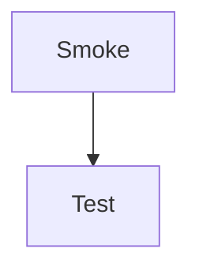

# Plugin Smoke Tests

One smoke entry per plugin under docs/_plugins.


## Coding Plugins

### inline-highlight.js

`print("hi")`(python)


### kotlin-runner.js ([tests](tests/kotlin.md))

```kotlin run
println("smoke")
```

### primm.js ([tests](tests/primm.md))

<primm>

```python
print("Predict me")
```

</primm>


### pseudo-highlighter.js ([tests](tests/pseudo.md))

```pseudo
start
show "smoke"
end
```

### python-runner.js ([tests](tests/python.md))

```python run
print("smoke")
```

### python-test.js ([tests](tests/coverage.md))

```python test
def grade(x):
    if x >= 50:
        return "P"
    return "F"

# Tests
49 -> "F"
50 -> "P"
```

### scratch-blocks.js ([tests](tests/scratch.md))

```scratch
when green flag clicked
say [Smoke test]
```

### scratch-stage.js ([tests](tests/scratch.md))

```scratch-stage
stage space #1a1a2e
  sprite rocket1 0 0 100 0 1 ""
endstage
```

### web-playground.js ([tests](tests/_components.md))

<div
    class="web-playground"
    data-height="10em"
></div>


## Content Plugins

### callouts.js ([tests](tests/callouts.md))

> [!NOTE]
> Smoke note.

### captions.js ([tests](tests/captions.md))

<captioned>

<p>Smoke caption</p>
</captioned>

### cards.js ([tests](tests/cards.md))

<cards>

### Card A

Smoke body

</cards>

### img-notes.js ([tests](tests/img-notes.md))


- Note one
</img-notes>

### speech.js ([tests](tests/speech.md))

<speak>


Smoke

</speak>

### tables.js ([tests](tests/tables.md))

| A | B |
|---|---|
| 1 | 2 |

### videos.js ([tests](tests/video-embed.md))

<videoembed id="dQw4w9WgXcQ">


## Core Plugins

### definitions.js ([tests](tests/definitions.md))

<definition term="CPU">Central Processing Unit</definition>


### lucide-icons.js ([tests](tests/_components.md))

<i data-lucide="cpu"></i>


### tooltips.js ([tests](tests/_components.md))

<span data-tooltip="Smoke tip">hover me</span>


## Database Plugins

### database.js ([tests](tests/dbs.md))

<db-schema>

| users |       |         |
| ----- | ----- | ------- |
| PK    | id    | INTEGER |
|       | name  | TEXT    |

</db-schema>


### sql-runner.js ([tests](tests/sql.md))

```sql run
SELECT 1 AS smoke;
```


## Graphics Plugins

### excalidraw.js ([tests](tests/excalidraw.md))

<excalidraw src="tests/_assets/test.excalidraw"></excalidraw>


### svg-zoom.js ([tests](tests/mermaid.md))




## Interactive Plugins

### accessibility.js ([tests](tests/accessibility.md))

<accessibility></accessibility>


### algo-race.js ([tests](tests/algo-race.md))

<algo-race></algo-race>


### big-o-chart.js ([tests](tests/big-o-chart.md))

<big-o-chart></big-o-chart>


### big-o.js ([tests](tests/big-o.md))

<big-o></big-o>


### bin-packing.js ([tests](tests/bin-packing.md))

<bin-packing></bin-packing>


### calc.js ([tests](tests/calc.md))

<calc></calc>


### colours.js ([tests](tests/colours.md))

<colours></colours>


### convertor.js ([tests](tests/convertor.md))

<convertor></convertor>


### diffie-hellman.js ([tests](tests/diffie-hellman.md))

<diffie-hellman></diffie-hellman>


### digital-sig.js ([tests](tests/digital-sig.md))

<digital-sig></digital-sig>


### drag-drop.js ([tests](tests/drag-drop.md))

<drag-drop></drag-drop>


### erd.js ([tests](tests/erd.md))

<erd>

```sql
CREATE TABLE authors (
  id INTEGER PRIMARY KEY,
  name TEXT NOT NULL
);
```

</erd>


### flash-cards.js ([tests](tests/flash-cards.md))

<flash-cards></flash-cards>


### frequency.js ([tests](tests/frequency.md))

<frequency></frequency>


### hasher.js ([tests](tests/hasher.md))

<hasher></hasher>


### knapsack.js ([tests](tests/knapsack.md))

<knapsack></knapsack>


### modulus.js ([tests](tests/modulus.md))

<modulus></modulus>


### p-np.js ([tests](tests/p-np.md))

<p-np></p-np>


### quizzes.js ([tests](tests/quiz.md))

<quiz></quiz>


### rainbow.js ([tests](tests/rainbow.md))

<rainbow></rainbow>


### rolling-code.js ([tests](tests/rolling-code.md))

<rolling-code></rolling-code>


### slides.js ([tests](tests/slides.md))

<slides></slides>


### sub-cypher.js ([tests](tests/sub-cypher.md))

<sub-cypher></sub-cypher>


### sym-asym.js ([tests](tests/sym-asym.md))

<sym-asym></sym-asym>


### tls.js ([tests](tests/tls.md))

<tls></tls>


### trace-table.js ([tests](tests/trace-table.md))

```python trace
a = 1
b = 2
print(a + b)
```

### tsp.js ([tests](tests/tsp.md))

<tsp></tsp>


### wifi.js ([tests](tests/wifi.md))

<wifi></wifi>


## Visualisation Plugins

### computers.js ([tests](tests/computers.md))

<computer label="Smoke"></computer>


### cpu-sim.js ([tests](tests/cpu-sim.md))

```cpu-sim
LOAD R0, 1
ADD R0, 2
```


### data.js ([tests](tests/binary.md))

```data
show dec 255 as hex-bytes
```


### file-trees.js ([tests](tests/file-list.md))

<filetree>

- src/
  - main.js

</filetree>


### hierarchies.js ([tests](tests/hierarchy.md))

<hierarchy>

- Root
  - Child

</hierarchy>


### logic.js ([tests](tests/logic.md))

```logic
GATE None AND A B OUT
```

### memory-sim.js ([tests](tests/memory-sim.md))

```memory-sim
val x = 1
```

### oop-sim.js ([tests](tests/oop-sim.md))

```oop-sim
class Person(val name: String)
val p = Person("Sam")
```

### requests.js ([tests](tests/requests.md))

<requests>

- Left: **A**

- Right: **B**

- Requests:

  1. L ---> R : Smoke

</requests>


### sequences.js ([tests](tests/sequences.md))

```sequence
A->B: smoke
```

### structures.js ([tests](tests/structure.md))

<structure>

- Top
  - Leaf

</structure>


### timelines.js ([tests](tests/timeline.md))

```timeline
2026 | Smoke milestone
```
