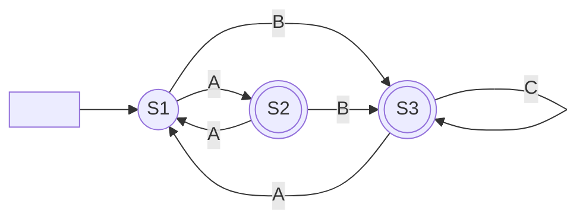
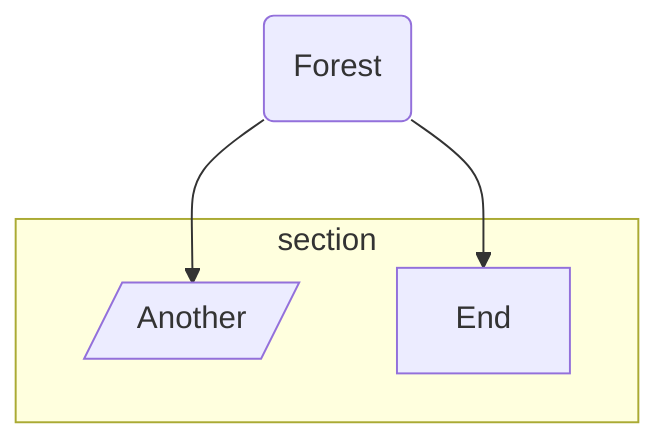
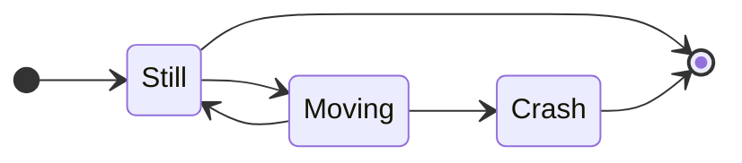
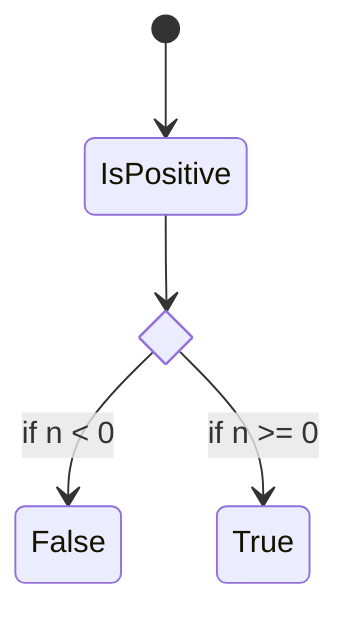
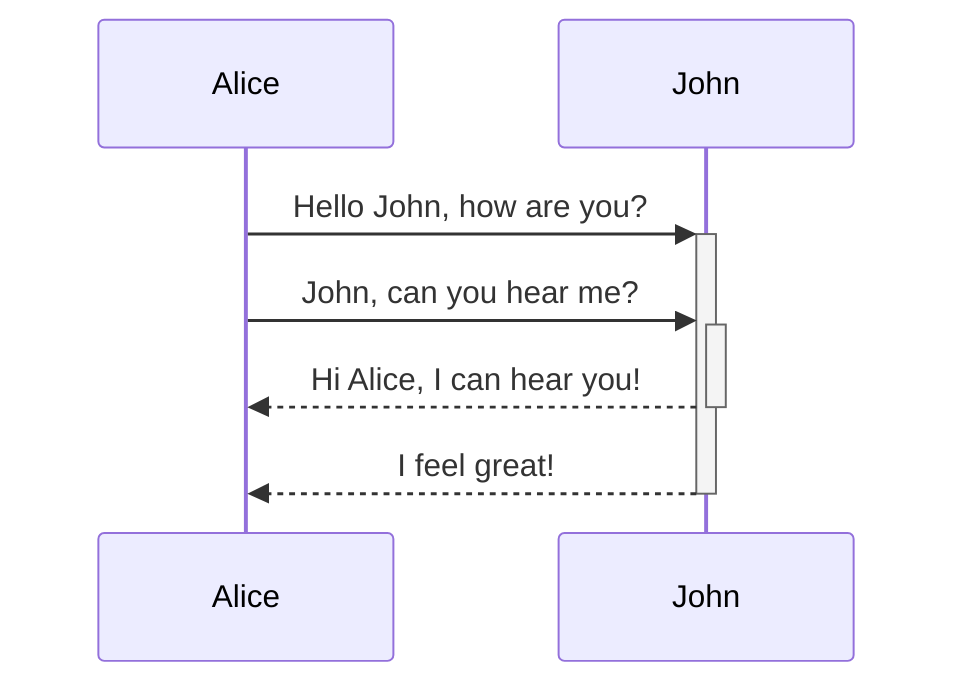

# Mermaid

## DFA Flowchart

```mermaid
flowchart LR

S0[ ]
S1((S1))
S2(((S2)))
S3(((S3)))

S0 --> S1
S1 --A--> S2
S1 --B--> S3
S2 --A--> S1
S2 --B--> S3
S3 --A--> S1
S3 --B--> S3
S3 --C--> S3

class S0 start
```

## Graph TD

```mermaid
graph TD
A(Forest) --> B[/Another/]
A --> C[End]
  subgraph section
  B
  C
  end
```

## State Diagrams

```mermaid
stateDiagram-v2
    direction LR

    [*] --> Still
    Still --> [*]

    Still --> Moving
    Moving --> Still
    Moving --> Crash
    Crash --> [*]
```

```mermaid
stateDiagram-v2
    state if_state <<choice>>
    [*] --> IsPositive
    IsPositive --> if_state
    if_state --> False: if n < 0
    if_state --> True : if n >= 0
```

## Sequence Diagram

```mermaid
sequenceDiagram
    Alice->>+John: Hello John, how are you?
    Alice->>+John: John, can you hear me?
    John-->>-Alice: Hi Alice, I can hear you!
    John-->>-Alice: I feel great!
```
