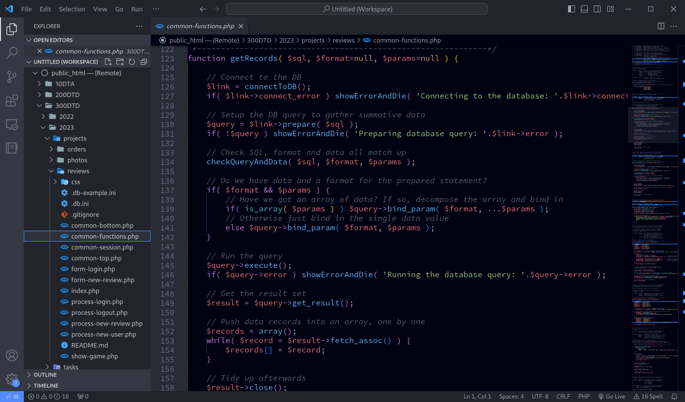
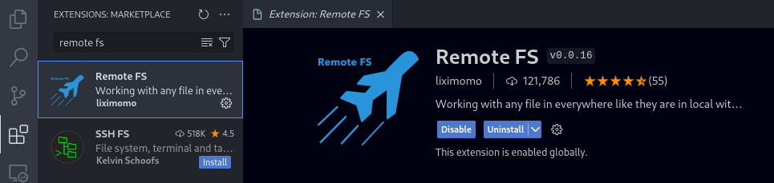
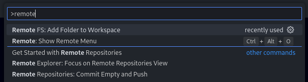
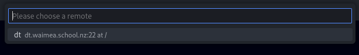
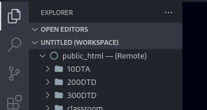

# Connecting VS Code

For the most part, you will be using the [VisualStudio Code][code] editor to create and edit files on the DT Server. This is a highly popular and very configurable code editor with lots of great features to help you write solid code.



## Install VS Code

Download the editor from [here][code] and install it on your computer.

Run VS Code and go through the initial setup. If you need any help, checkout the [documentation and guides][help].

## Remote FS Extension

We connect to the server using [SFTP][sftp] (Secure File Transfer Protocol). This system allows transfer of files between computers. A VS Code extension called '**Remote FS**' (Remote File System) uses SFTP to let you view and access files on the server as if they are on your computer.

Install the **Remote FS** extension from the **Extensions side panel**...



## Extension Settings

You now need to setup the connection details in the extension settings:

1. Open the VS Code **settings** (via the sidebar gear icon, or by pressing <kbd>Ctrl</kbd> + <kbd>,</kbd>)
2. Go to the **Extensions** section
3. Go to **remote-fs configuration**
4. Click the **edit in settings.json** link

The VS Code settings file should open. Find the section with the name `"remotefs.remote"`...

### Before

```json
{
    // There may be other settings here

    "remotefs.remote": {
        // <------------------YOU WILL ADD YOUR CODE HERE
    }
}
```

Inside this section, add the details of the connection. We will give it the name **dt**...

### After

```json
{
    // Other settings

    "remotefs.remote": {
        "dt": {
            "scheme":   "sftp",
            "host":     "dt.waimea.school.nz",
            "rootPath": "/public_html",
            "username": "jsmith",
            "password": "secret123"
        }
    }
}
```

These settings are:

- **SFTP** - the connection method
- **dt.waimea.school.nz** - the server's address
- **/public_html** - the directory in your home folder where web pages are servered from
- **Username** and **password** - These should be **your username** and **your password**!


## Connect to the Server

You now need to tell VS Code to use the above settings to connect to the DT Server...

1. Switch back to the **File Explorer side panel**
2. Open the **Command Palette** by pressing <kbd>Ctrl</kbd> + <kbd>Shift</kbd> + <kbd>P</kbd>
3. Start typing `remotefs` until you see the command **Remote FS: Add Folder to Workspace** appear and then select this command

   

4. Select the '**dt**' connection that you created earlier

   

5. Wait for a few seconds whilst the connection is made. You should see your server home directory and its files

   

You are now ready to go!

!> If you make a mistake and the connection fails, you will need to **right-click the folder** that you added select **Remove from workspace**, before fixing the issue and trying again.


[code]: https://code.visualstudio.com
[help]: https://code.visualstudio.com/docs/getstarted/introvideos
[sftp]: https://www.integrate.io/blog/the-whats-hows-and-whys-of-sftp/


